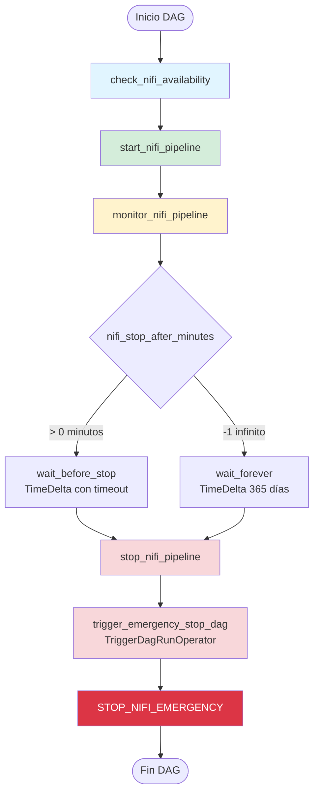
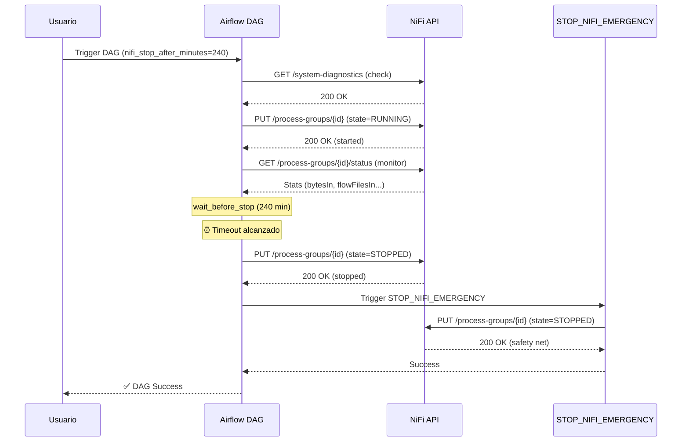
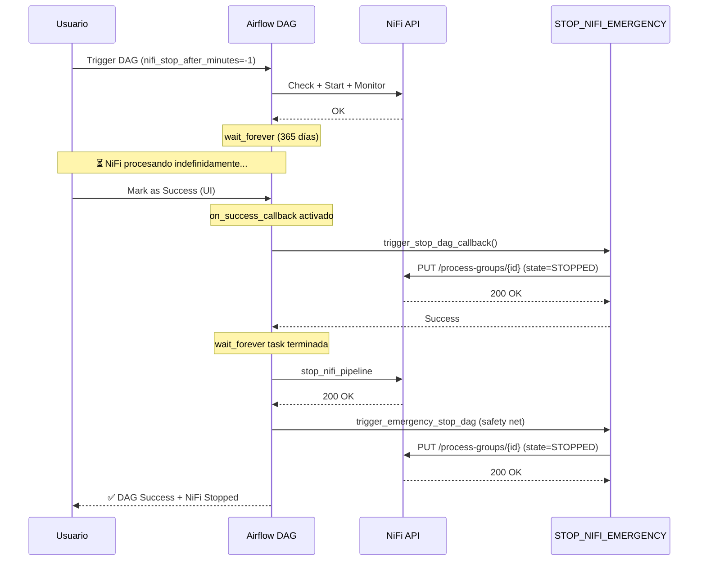
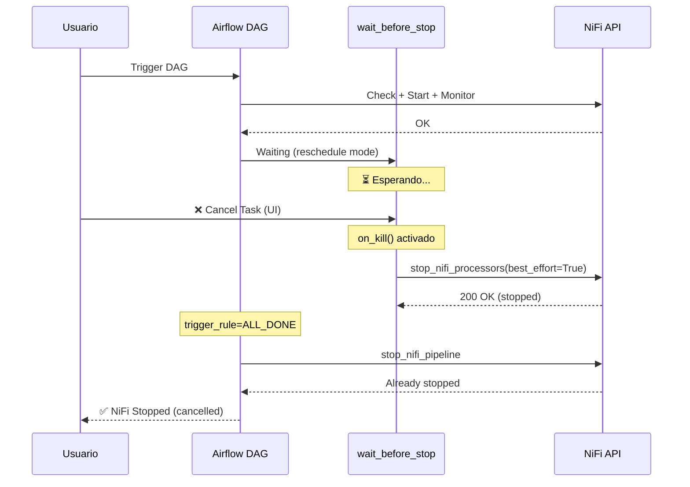

# DAG_TSUPREME_001_TPIAGENT_UPLOADS

## 📋 Resumen Ejecutivo

DAG principal de Airflow para gestionar el ciclo de vida completo de los Process Groups de Apache NiFi del proyecto TSuPreMe. Este DAG inicia, monitorea y detiene automáticamente los flujos de NiFi con múltiples mecanismos de seguridad para garantizar que **siempre se detengan los procesadores**, sin importar cómo termine la ejecución.

### Características Principales

- ✅ **Inicio automático** de Process Groups de NiFi
- ✅ **Monitoreo de actividad** para verificar que los flujos están procesando datos
- ✅ **Parada automática** con timeout configurable o modo infinito
- ✅ **4 capas de seguridad** para garantizar que NiFi se detenga al finalizar
- ✅ **Integración automática** con DAG de emergencia (`STOP_NIFI_EMERGENCY`)
- ✅ **Filtrado de Process Groups** por nombre o ejecución de todos

---

## 🏗️ Arquitectura del DAG



---

## 🛡️ Arquitectura de Seguridad Multinivel

El DAG implementa **4 capas independientes** para garantizar la parada de NiFi:


### Capa 1: Task Explícita de Stop
```python
stop_nifi_pipeline = PythonOperator(
    task_id='stop_nifi_pipeline',
    python_callable=stop_nifi_processors_task_wrapper,
    trigger_rule=TriggerRule.ALL_DONE,  # Se ejecuta SIEMPRE
    dag=dag,
)
```
**Cuándo actúa**: Al finalizar la espera (timeout o manual)

### Capa 2: Trigger del DAG de Emergencia
```python
trigger_emergency_stop = TriggerDagRunOperator(
    task_id='trigger_emergency_stop_dag',
    trigger_dag_id='STOP_NIFI_EMERGENCY',
    trigger_rule=TriggerRule.ALL_DONE,  # Se ejecuta SIEMPRE
    wait_for_completion=True,  # Espera confirmación
    dag=dag,
)
```
**Cuándo actúa**: Después de `stop_nifi_pipeline`, como safety net

### Capa 3: Callbacks del DAG
```python
dag = DAG(
    ...,
    on_success_callback=trigger_stop_dag_callback,
    on_failure_callback=trigger_stop_dag_callback,
)
```
**Cuándo actúa**: Si el usuario marca el DAG como Success/Failed manualmente

### Capa 4: Sensor on_kill()
```python
class StopNiFiOnKillTimeDeltaSensor(TimeDeltaSensor):
    def on_kill(self) -> None:
        stop_nifi_processors(best_effort=True, source='sensor_on_kill')
```
**Cuándo actúa**: Si el usuario cancela una task en ejecución

---

## 📊 Diagramas de Flujo

### Flujo Normal con Timeout



### Flujo con Modo Infinito (Parada Manual)



### Flujo con Cancelación de Task



---

## 🔧 Configuración

### 1. Conexión NiFi

Crear la conexión `nifi_default` en Airflow:

**Desde la UI de Airflow:**
```
Admin > Connections > Create

Connection ID:   nifi_default
Connection Type: HTTP
Host:           https://nifi.example.com:8443
Login:          admin
Password:       ********
```

**Desde CLI:**
```bash
airflow connections add nifi_default \
  --conn-type http \
  --conn-host https://nifi.example.com:8443 \
  --conn-login admin \
  --conn-password 'your-password'
```

**Formato de prueba:**
```python
# Test de conexión manual
from airflow.hooks.base import BaseHook
connection = BaseHook.get_connection('nifi_default')
print(f"Host: {connection.host}")
print(f"Login: {connection.login}")
```

### 2. Variables de Airflow

#### Variable: `nifi_stop_after_minutes`

Controla el timeout de ejecución del DAG.

**Valores posibles:**
- `-1`: Modo infinito (NiFi corre hasta parada manual)
- `> 0`: Minutos hasta parada automática

**Ejemplos:**

```bash
# Parada automática después de 4 horas
airflow variables set nifi_stop_after_minutes 240

# Parada automática después de 30 minutos (útil para pruebas)
airflow variables set nifi_stop_after_minutes 30

# Modo infinito (solo parada manual)
airflow variables set nifi_stop_after_minutes -1

# Parada automática después de 8 horas (turno completo)
airflow variables set nifi_stop_after_minutes 480
```

**Desde Python:**
```python
from airflow.models import Variable
Variable.set('nifi_stop_after_minutes', 240)
```

**Ver valor actual:**
```bash
airflow variables get nifi_stop_after_minutes
```

#### Variable: `nifi_process_group_names` (Opcional)

Filtra qué Process Groups controlar. Si no está configurada, controla **todos** los PGs bajo root.

**Formato:** Lista JSON de nombres de Process Groups

**Ejemplos:**

```bash
# Controlar solo Process Groups específicos
airflow variables set nifi_process_group_names '["TSuPreMe Pipeline", "Data Ingestion"]'

# Formato alternativo (string separado por comas)
airflow variables set nifi_process_group_names "TSuPreMe Pipeline, Data Ingestion"

# Controlar TODOS los Process Groups (eliminar variable)
airflow variables delete nifi_process_group_names
```

**Desde Python:**
```python
from airflow.models import Variable
Variable.set('nifi_process_group_names', ["TSuPreMe Pipeline", "Data Ingestion"])
```

**Estructura en NiFi:**
```
root (Process Group)
├── TSuPreMe Pipeline        ← Será controlado
├── Data Ingestion           ← Será controlado
├── Other Pipeline           ← Ignorado
└── Test Environment         ← Ignorado
```

---

## 🚀 Casos de Uso

### Caso 1: Procesamiento Batch Programado

**Escenario:** Ejecutar flujo de NiFi todas las noches durante 4 horas

**Configuración:**
```bash
airflow variables set nifi_stop_after_minutes 240
airflow variables set nifi_process_group_names '["TSuPreMe Nightly Batch"]'
```

**Ejecución:**
```bash
# Desde CLI
airflow dags trigger DAG_TSUPREME_001_TPIAGENT_UPLOADS

# O programar con schedule
# En el DAG, cambiar: schedule='0 2 * * *'  # 2 AM diario
```

**Resultado esperado:**
```
02:00 - DAG inicia
02:00 - NiFi Process Group arranca
02:01 - Monitor verifica actividad
02:01 - Espera 240 minutos...
06:01 - Timeout alcanzado
06:01 - NiFi se detiene (stop_nifi_pipeline)
06:01 - Safety net ejecuta (STOP_NIFI_EMERGENCY)
06:02 - DAG termina exitosamente
```

### Caso 2: Modo Desarrollo 24/7

**Escenario:** Dejar NiFi corriendo indefinidamente, parar cuando sea necesario

**Configuración:**
```bash
airflow variables set nifi_stop_after_minutes -1
# Sin filtro de PGs = todos los Process Groups
```

**Ejecución:**
```bash
airflow dags trigger DAG_TSUPREME_001_TPIAGENT_UPLOADS
```

**Para detener:**
```
Opción 1: Marcar DAG como Success/Failed en UI
Opción 2: Ejecutar STOP_NIFI_EMERGENCY manualmente
Opción 3: Cancelar la task wait_forever
```

**Resultado esperado:**
```
10:00 - DAG inicia
10:00 - NiFi arranca
10:01 - wait_forever (365 días)
...
15:30 - Usuario marca como Success
15:30 - Callback dispara STOP_NIFI_EMERGENCY
15:30 - NiFi se detiene
15:31 - DAG termina
```

### Caso 3: Parada de Emergencia

**Escenario:** NiFi está corriendo y necesitas detenerlo YA

**Opción A: Desde el DAG principal**
```
1. Ir a UI de Airflow
2. Buscar DAG_TSUPREME_001_TPIAGENT_UPLOADS
3. Buscar el run activo
4. Click en "Mark Success" o "Mark Failed"
5. ✅ Automáticamente dispara STOP_NIFI_EMERGENCY
```

**Opción B: Directamente el DAG de emergencia**
```bash
airflow dags trigger STOP_NIFI_EMERGENCY
```

**Resultado esperado:**
```
[LOG] EMERGENCY STOP - Deteniendo todos los Process Groups de NiFi
[LOG] ✓ Stopped process group: abc123-456-789
[LOG] ✓ Stopped process group: def456-789-012
[LOG] EMERGENCY STOP COMPLETED - Stopped: 2 process groups
```

### Caso 4: Procesamiento con Filtrado

**Escenario:** Solo controlar ciertos Process Groups, dejar otros corriendo

**Configuración:**
```bash
airflow variables set nifi_stop_after_minutes 120
airflow variables set nifi_process_group_names '["TSuPreMe Upload Agent"]'
```

**Estructura NiFi:**
```
root
├── TSuPreMe Upload Agent     ← Se controla (start/stop)
├── Monitoring Dashboard       ← Sigue corriendo
└── Data Quality Checks        ← Sigue corriendo
```

**Resultado esperado:**
```
- Solo "TSuPreMe Upload Agent" se inicia y detiene
- Otros Process Groups no son afectados
- Ideal para entornos compartidos
```

---

## 🔍 Funciones Helper Compartidas

### `get_nifi_token() -> str`

Obtiene un token de autenticación de NiFi usando las credenciales de la conexión.

**Uso interno:**
```python
token = get_nifi_token()
headers = {'Authorization': f'Bearer {token}'}
```

**Request HTTP:**
```http
POST https://nifi.example.com:8443/nifi-api/access/token
Content-Type: application/x-www-form-urlencoded

username=admin&password=secret
```

**Response exitosa:**
```
Status: 201 Created
Body: eyJhbGciOiJIUzI1NiIsInR5cCI6IkpXVCJ9...
```

**Errores comunes:**
```python
# Error 401: Credenciales incorrectas
Exception: Failed to get NiFi token: 401 - Unauthorized

# Error 403: Usuario sin permisos
Exception: Failed to get NiFi token: 403 - Forbidden

# Error de red
Exception: Failed to get NiFi token: Connection refused
```

### `get_nifi_process_group_ids(token, nifi_base_url) -> list[str]`

Obtiene los IDs de los Process Groups bajo root, opcionalmente filtrados por nombres.

**Uso interno:**
```python
token = get_nifi_token()
connection = BaseHook.get_connection('nifi_default')
pg_ids = get_nifi_process_group_ids(token=token, nifi_base_url=connection.host)
# Resultado: ['abc123', 'def456']
```

**Request HTTP:**
```http
GET https://nifi.example.com:8443/nifi-api/flow/process-groups/root
Authorization: Bearer {token}
```

**Response de NiFi:**
```json
{
  "processGroupFlow": {
    "flow": {
      "processGroups": [
        {
          "component": {
            "id": "abc123-456-789",
            "name": "TSuPreMe Pipeline"
          }
        },
        {
          "component": {
            "id": "def456-789-012",
            "name": "Data Ingestion"
          }
        }
      ]
    }
  }
}
```

**Filtrado por nombre:**
```python
# Variable: nifi_process_group_names = ["TSuPreMe Pipeline"]
# Resultado: ['abc123-456-789']  (solo el que coincide)

# Variable: no configurada
# Resultado: ['abc123-456-789', 'def456-789-012']  (todos)
```

**Logs:**
```
INFO - Resolved process group IDs (count=2): ['abc123-456-789', 'def456-789-012']
```

**Errores:**
```python
# No hay Process Groups bajo root
ValueError: No se encontraron Process Groups bajo root en NiFi

# Nombres no coinciden
ValueError: No se encontraron Process Groups... (o no coinciden con nifi_process_group_names)
```

### `stop_nifi_processors(best_effort, source) -> dict`

Para todos los Process Groups configurados.

**Parámetros:**
- `best_effort` (bool): Si es True, no lanza excepción en errores (útil para on_kill)
- `source` (str): Identificador para logs (ej: 'explicit_stop_task', 'sensor_on_kill')

**Uso interno:**
```python
# Parada normal (lanza excepción si falla)
result = stop_nifi_processors(best_effort=False, source='explicit_stop_task')

# Parada best-effort (swallows errors)
result = stop_nifi_processors(best_effort=True, source='sensor_on_kill:wait_forever')
```

**Request HTTP:**
```http
PUT https://nifi.example.com:8443/nifi-api/flow/process-groups/abc123
Authorization: Bearer {token}
Content-Type: application/json

{
  "id": "abc123-456-789",
  "state": "STOPPED"
}
```

**Response exitosa:**
```json
{
  "id": "abc123-456-789",
  "state": "STOPPED"
}
```

**Resultado de la función:**
```python
# Success
{
  'abc123-456-789': {'status': 'stop requested'},
  'def456-789-012': {'status': 'stop requested'}
}

# Con errores (best_effort=True)
{
  'stopped': ['abc123-456-789'],
  'errors': {
    'def456-789-012': '409 - Process group is not in a valid state'
  }
}
```

**Logs:**
```
WARNING - [NiFi][STOP] Stopping NiFi processors... source='explicit_stop_task' best_effort=False
WARNING - [NiFi][STOP] ✓ Stopped 2 process groups successfully
```

---

## 📈 Tabla de Escenarios de Parada

| Escenario | Mecanismo Activado | ¿Se Para NiFi? | Tiempo Aproximado |
|-----------|-------------------|----------------|-------------------|
| **Timeout alcanzado** | stop_nifi_pipeline → trigger_emergency_stop | ✅ SÍ | ~10 segundos |
| **Mark as Success (UI)** | on_success_callback → trigger_emergency_stop | ✅ SÍ | ~15 segundos |
| **Mark as Failed (UI)** | on_failure_callback → trigger_emergency_stop | ✅ SÍ | ~15 segundos |
| **Cancel task wait_before_stop** | on_kill() → stop_nifi_pipeline → trigger_emergency_stop | ✅ SÍ | ~10 segundos |
| **Cancel task wait_forever** | on_kill() → stop_nifi_pipeline → trigger_emergency_stop | ✅ SÍ | ~10 segundos |
| **Error en start_nifi** | trigger_rule=ALL_DONE → trigger_emergency_stop | ✅ SÍ | ~10 segundos |
| **Error de red con NiFi** | trigger_emergency_stop (best_effort) | ⚠️ Intenta | ~30 segundos (timeout) |
| **STOP_NIFI_EMERGENCY manual** | emergency_stop_nifi() | ✅ SÍ | ~5 segundos |

---

## 🐛 Troubleshooting

### Error: "Failed to get NiFi token: 401"

**Causa:** Credenciales incorrectas en la conexión `nifi_default`

**Solución:**
```bash
# Verificar conexión
airflow connections get nifi_default

# Actualizar credenciales
airflow connections delete nifi_default
airflow connections add nifi_default \
  --conn-type http \
  --conn-host https://nifi.example.com:8443 \
  --conn-login admin \
  --conn-password 'correct-password'
```

**Verificación:**
```python
# Test manual en Python Operator
from airflow.hooks.base import BaseHook
import requests

conn = BaseHook.get_connection('nifi_default')
resp = requests.post(
    f"{conn.host}/nifi-api/access/token",
    data={'username': conn.login, 'password': conn.password},
    verify=False
)
print(f"Status: {resp.status_code}")
print(f"Token: {resp.text[:50]}...")
```

### Error: "No se encontraron Process Groups bajo root"

**Causa:** La variable `nifi_process_group_names` no coincide con los nombres reales en NiFi

**Solución:**
```bash
# Opción 1: Ver qué hay en NiFi (manualmente en UI)
# Ir a: https://nifi.example.com:8443/nifi/
# Ver nombres exactos de Process Groups bajo root

# Opción 2: Eliminar filtro para controlar todos
airflow variables delete nifi_process_group_names

# Opción 3: Actualizar nombres exactos
airflow variables set nifi_process_group_names '["Nombre Exacto Del PG"]'
```

**Logs útiles:**
```
# Buscar en logs de check_nifi_availability o start_nifi_pipeline
INFO - Resolved process group IDs (count=0): []
ERROR - ValueError: No se encontraron Process Groups...

# Si sale count=0, el filtro es incorrecto o no hay PGs
```

### Error: "dag_id STOP_NIFI_EMERGENCY not found"

**Causa:** El DAG de emergencia no está instalado o Airflow no lo detectó

**Solución:**
```bash
# Verificar que existe el archivo
ls /opt/airflow/dags/STOP_NIFI_EMERGENCY.py

# Si no existe, copiarlo
cp STOP_NIFI_EMERGENCY.py /opt/airflow/dags/

# Esperar que Airflow lo detecte (30-60 segundos)
# O forzar re-scan
airflow dags list | grep STOP_NIFI_EMERGENCY

# Ver si tiene errores de sintaxis
airflow dags list-import-errors
```

**Workaround temporal:**
```python
# Si el trigger falla, los otros mecanismos deberían funcionar:
# - stop_nifi_pipeline (task explícita)
# - on_kill() del sensor
```

### Warning: "Monitor finished with no activity"

**Causa:** Los Process Groups no muestran actividad (bytesIn, flowFilesIn = 0)

**¿Es un problema?** No necesariamente. Significa que NiFi arrancó pero no procesó datos en los primeros 100 segundos.

**Verificación:**
```bash
# Ver logs de monitor_nifi_pipeline
airflow tasks logs DAG_TSUPREME_001_TPIAGENT_UPLOADS monitor_nifi_pipeline <run_id>

# Buscar líneas como:
# INFO - Monitor attempt 1/10 remaining=['abc123']
# INFO - Monitor attempt 10/10 remaining=['abc123']
# WARNING - Monitor finished with no activity in PGs=['abc123']. Continuing.
```

**Posibles causas:**
1. NiFi no tiene datos de entrada configurados
2. Los procesadores necesitan configuración adicional
3. Es normal si el flujo depende de eventos externos

**Solución:** El DAG continúa normalmente. Verificar en la UI de NiFi si los procesadores están realmente corriendo.

### Error: "wait_for_completion requires deferrable to be True"

**Causa:** En algunas versiones de Airflow 3.x, `wait_for_completion=True` requiere `deferrable=True`

**Solución:**
```python
# Opción 1: Habilitar deferrable (recomendado)
trigger_emergency_stop = TriggerDagRunOperator(
    task_id='trigger_emergency_stop_dag',
    trigger_dag_id='STOP_NIFI_EMERGENCY',
    trigger_rule=TriggerRule.ALL_DONE,
    deferrable=True,  # Agregar esta línea
    wait_for_completion=True,
    dag=dag,
)

# Opción 2: No esperar completion
trigger_emergency_stop = TriggerDagRunOperator(
    task_id='trigger_emergency_stop_dag',
    trigger_dag_id='STOP_NIFI_EMERGENCY',
    trigger_rule=TriggerRule.ALL_DONE,
    wait_for_completion=False,  # Cambiar a False
    dag=dag,
)
```

### NiFi sigue corriendo después de "Mark as Success"

**Causa:** Los callbacks no se ejecutaron o fallaron silenciosamente

**Verificación:**
```bash
# Ver logs del DAG run completo
airflow dags backfill DAG_TSUPREME_001_TPIAGENT_UPLOADS --start-date 2026-02-05 --end-date 2026-02-05

# Buscar en logs:
# "[DAG][callback] Triggering STOP_NIFI_EMERGENCY as safety net..."
# "[DAG][callback] ✓ Successfully triggered STOP_NIFI_EMERGENCY"
```

**Solución inmediata:**
```bash
# Ejecutar manualmente el DAG de emergencia
airflow dags trigger STOP_NIFI_EMERGENCY
```

**Verificar task trigger_emergency_stop_dag:**
```bash
# Esta task SIEMPRE debería ejecutarse
airflow tasks state DAG_TSUPREME_001_TPIAGENT_UPLOADS trigger_emergency_stop_dag <run_id>

# Si está "success", NiFi debería estar parado
# Ver sus logs:
airflow tasks logs DAG_TSUPREME_001_TPIAGENT_UPLOADS trigger_emergency_stop_dag <run_id>
```

---

## 📝 Ejemplos de Logs

### Ejecución Exitosa Completa

```
[2026-02-05 10:00:00] INFO - check_nifi_availability: NiFi is available
[2026-02-05 10:00:01] INFO - start_nifi_pipeline: [NiFi] Started 2 process groups
[2026-02-05 10:00:01] INFO - start_nifi_pipeline: Resolved process group IDs (count=2): ['abc123', 'def456']
[2026-02-05 10:00:02] INFO - monitor_nifi_pipeline: Monitor attempt 1/10 remaining={'abc123', 'def456'}
[2026-02-05 10:00:12] INFO - monitor_nifi_pipeline: Monitor attempt 2/10 remaining=set()
[2026-02-05 10:00:12] INFO - monitor_nifi_pipeline: All process groups showing activity
[2026-02-05 10:00:13] INFO - wait_before_stop: Waiting for timedelta of 4:00:00
[2026-02-05 14:00:13] INFO - wait_before_stop: Success criteria met. Exiting.
[2026-02-05 14:00:14] WARNING - stop_nifi_pipeline: [NiFi][STOP] Stopping NiFi processors... source='explicit_stop_task' best_effort=False
[2026-02-05 14:00:15] WARNING - stop_nifi_pipeline: [NiFi][STOP] ✓ Stopped 2 process groups successfully
[2026-02-05 14:00:16] INFO - trigger_emergency_stop_dag: Triggering DAG: STOP_NIFI_EMERGENCY
[2026-02-05 14:00:17] INFO - trigger_emergency_stop_dag: Waiting for STOP_NIFI_EMERGENCY to complete...
[2026-02-05 14:00:20] WARNING - [STOP_NIFI_EMERGENCY] EMERGENCY STOP - Deteniendo todos los Process Groups de NiFi
[2026-02-05 14:00:21] INFO - [STOP_NIFI_EMERGENCY] ✓ Stopped process group: abc123
[2026-02-05 14:00:21] INFO - [STOP_NIFI_EMERGENCY] ✓ Stopped process group: def456
[2026-02-05 14:00:22] WARNING - [STOP_NIFI_EMERGENCY] EMERGENCY STOP COMPLETED - Stopped: 2 process groups
[2026-02-05 14:00:23] INFO - trigger_emergency_stop_dag: STOP_NIFI_EMERGENCY completed successfully
[2026-02-05 14:00:23] INFO - DAG Run success
```

### Parada Manual (Mark as Success)

```
[2026-02-05 10:00:00] INFO - DAG started
[2026-02-05 10:00:15] INFO - wait_forever: Waiting for timedelta of 365 days
[2026-02-05 10:00:15] INFO - wait_forever: Rescheduling task for future execution
[2026-02-05 15:30:00] INFO - User marked DAG as Success
[2026-02-05 15:30:01] WARNING - [DAG][callback] Triggering STOP_NIFI_EMERGENCY as safety net...
[2026-02-05 15:30:02] WARNING - [DAG][callback] ✓ Successfully triggered STOP_NIFI_EMERGENCY
[2026-02-05 15:30:03] WARNING - [STOP_NIFI_EMERGENCY] EMERGENCY STOP - Deteniendo todos los Process Groups de NiFi
[2026-02-05 15:30:04] INFO - [STOP_NIFI_EMERGENCY] ✓ Stopped process group: abc123
[2026-02-05 15:30:05] WARNING - [STOP_NIFI_EMERGENCY] EMERGENCY STOP COMPLETED - Stopped: 1 process groups
```

### Cancelación de Task

```
[2026-02-05 10:00:00] INFO - DAG started
[2026-02-05 10:00:15] INFO - wait_before_stop: Waiting for timedelta of 4:00:00
[2026-02-05 10:30:00] WARNING - wait_before_stop: Task received SIGTERM, executing on_kill()
[2026-02-05 10:30:01] WARNING - [NiFi][on_kill] Task wait_before_stop KILLED. Stopping NiFi...
[2026-02-05 10:30:02] WARNING - [NiFi][STOP] Stopping NiFi processors... source='sensor_on_kill:wait_before_stop' best_effort=True
[2026-02-05 10:30:03] WARNING - [NiFi][STOP] ✓ Stopped 2 process groups successfully
[2026-02-05 10:30:04] INFO - stop_nifi_pipeline: trigger_rule=ALL_DONE, executing anyway
[2026-02-05 10:30:05] WARNING - stop_nifi_pipeline: [NiFi][STOP] Stopping NiFi processors... source='explicit_stop_task' best_effort=False
[2026-02-05 10:30:06] INFO - trigger_emergency_stop_dag: Triggering STOP_NIFI_EMERGENCY...
```

---

## 🎯 Mejores Prácticas

### 1. Configurar Timeout Razonable
```bash
# Para producción: 4-8 horas
airflow variables set nifi_stop_after_minutes 480

# Para desarrollo/pruebas: 30-60 minutos
airflow variables set nifi_stop_after_minutes 30
```

### 2. Usar Filtrado en Entornos Compartidos
```bash
# Solo controlar tu Process Group
airflow variables set nifi_process_group_names '["TSuPreMe Upload Agent"]'
```

### 3. Monitorear Ejecuciones
```bash
# Ver historial de runs
airflow dags list-runs -d DAG_TSUPREME_001_TPIAGENT_UPLOADS --state success --limit 10

# Ver runs del DAG de emergencia (deberían coincidir)
airflow dags list-runs -d STOP_NIFI_EMERGENCY --state success --limit 10
```

### 4. Verificar Que STOP_NIFI_EMERGENCY Existe
```bash
# Antes de cada despliegue
airflow dags list | grep -E "(DAG_TSUPREME_001|STOP_NIFI_EMERGENCY)"

# Deberías ver ambos:
# DAG_TSUPREME_001_TPIAGENT_UPLOADS
# STOP_NIFI_EMERGENCY
```

### 5. Revisar Logs en Caso de Problemas
```bash
# Ver logs del DAG completo
airflow dags backfill DAG_TSUPREME_001_TPIAGENT_UPLOADS \
  --start-date 2026-02-05 --end-date 2026-02-05 \
  --verbose

# Buscar palabras clave:
# - "EMERGENCY STOP"
# - "✓ Stopped"
# - "[callback]"
# - "[on_kill]"
```

---

## 📚 Referencias

- **DAG de Emergencia:** [STOP_NIFI_EMERGENCY.md](./STOP_NIFI_EMERGENCY.md)
- **Documentación NiFi API:** https://nifi.apache.org/docs/nifi-docs/rest-api/
- **Airflow TriggerDagRunOperator:** https://airflow.apache.org/docs/apache-airflow/stable/howto/operator/trigger_dagrun.html
- **Airflow Variables:** https://airflow.apache.org/docs/apache-airflow/stable/howto/variable.html
- **Airflow Connections:** https://airflow.apache.org/docs/apache-airflow/stable/howto/connection.html

---

## 📞 Soporte

Para problemas o preguntas sobre este DAG:

1. **Verificar logs** de las tasks fallidas
2. **Revisar variables** de Airflow están configuradas correctamente
3. **Probar conexión** a NiFi manualmente
4. **Ejecutar STOP_NIFI_EMERGENCY** manualmente si NiFi no se detiene
5. **Verificar versión** de Airflow (compatible con 2.x y 3.x)

---

**Última actualización:** 2026-02-05  
**Versión del DAG:** Integrada (con trigger automático de STOP_NIFI_EMERGENCY)  
**Compatibilidad:** Apache Airflow 2.x / 3.x, Apache NiFi 1.x+
