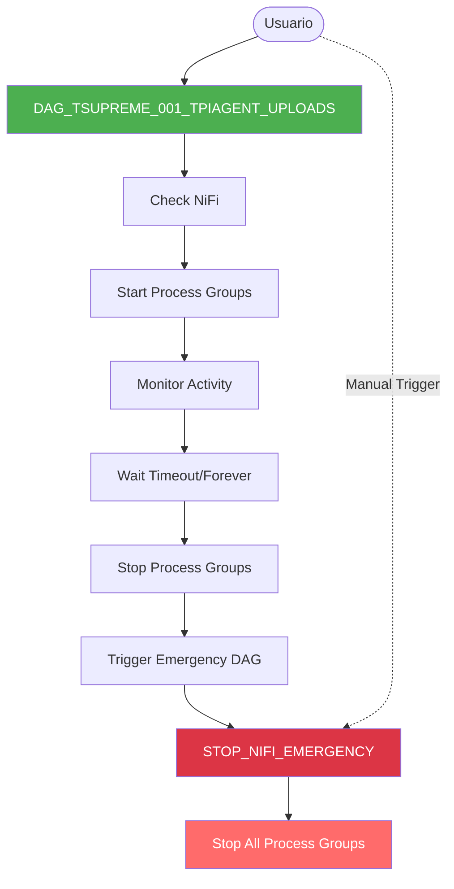

# Documentación de DAGs de NiFi

Documentación completa de los DAGs de Apache Airflow para la gestión del ciclo de vida de los Process Groups de Apache NiFi en el proyecto TSuPreMe.

## 📚 Contenido

### [DAG_TSUPREME_001_TPIAGENT_UPLOADS.md](./DAG_TSUPREME_001_TPIAGENT_UPLOADS.md)

**DAG Principal** - Gestiona el ciclo completo de inicio, monitoreo y parada de Process Groups de NiFi.

**Temas cubiertos:**
- ✅ Arquitectura del DAG con diagramas Mermaid
- ✅ 4 capas de seguridad multinivel para garantizar parada de NiFi
- ✅ Configuración de variables Airflow (`nifi_stop_after_minutes`, `nifi_process_group_names`)
- ✅ Configuración de conexión `nifi_default`
- ✅ Casos de uso prácticos (batch programado, modo desarrollo 24/7, emergencia)
- ✅ Diagramas de flujo (normal, timeout, infinito, cancelación)
- ✅ Funciones helper compartidas (`get_nifi_token`, `get_nifi_process_group_ids`, `stop_nifi_processors`)
- ✅ Tabla completa de escenarios de parada
- ✅ Troubleshooting con ejemplos de logs
- ✅ Mejores prácticas

### [STOP_NIFI_EMERGENCY.md](./STOP_NIFI_EMERGENCY.md)

**DAG de Emergencia** - Para detener inmediatamente todos los Process Groups de NiFi.

**Temas cubiertos:**
- 🚨 Propósito y casos de uso (parada urgente, cleanup, workaround Airflow 3.0+)
- 🚨 Arquitectura simple (1 task)
- 🚨 Integración automática con DAG principal (3 mecanismos)
- 🚨 Ejecución manual desde UI y CLI con ejemplos
- 🚨 Payloads JSON personalizados
- 🚨 Análisis de resultados (exitoso, parcial, error fatal)
- 🚨 Diagramas de secuencia Mermaid
- 🚨 Troubleshooting específico
- 🚨 Ejemplos completos de logs

## 🎯 Inicio Rápido

### Instalación

```bash
# 1. Copiar ambos DAGs a la carpeta de DAGs de Airflow
cp DAG_TSUPREME_001_TPIAGENT_UPLOADS.py /opt/airflow/dags/
cp STOP_NIFI_EMERGENCY.py /opt/airflow/dags/

# 2. Configurar conexión NiFi
airflow connections add nifi_default \
  --conn-type http \
  --conn-host https://nifi.example.com:8443 \
  --conn-login admin \
  --conn-password 'your-password'

# 3. Configurar timeout (opcional)
airflow variables set nifi_stop_after_minutes 240  # 4 horas

# 4. Verificar que los DAGs se cargaron
airflow dags list | grep -E "(DAG_TSUPREME_001|STOP_NIFI_EMERGENCY)"
```

### Uso Básico

```bash
# Iniciar el flujo de NiFi (con timeout de 4 horas)
airflow dags trigger DAG_TSUPREME_001_TPIAGENT_UPLOADS

# Parar NiFi inmediatamente (emergencia)
airflow dags trigger STOP_NIFI_EMERGENCY
```

## 🏗️ Arquitectura General



## 🛡️ Sistema de Seguridad Multinivel

El sistema garantiza que NiFi **siempre se detenga** mediante 4 capas independientes:

| Capa | Mecanismo | Activación | Prioridad |
|------|-----------|------------|-----------|
| **1** | Task explícita `stop_nifi_pipeline` | Al finalizar wait | Alta |
| **2** | `TriggerDagRunOperator` → STOP_NIFI_EMERGENCY | Después de stop | Alta |
| **3** | Callbacks del DAG (`on_success`, `on_failure`) | Mark as Success/Failed | Media |
| **4** | Sensor `on_kill()` | Cancelación de task | Baja |

Cualquier capa que se active garantiza la parada de NiFi. Si una falla, las otras respaldan.

## 📖 Guías por Escenario

### Procesamiento Batch Programado
**Ver:** [DAG_TSUPREME_001 - Caso 1](./DAG_TSUPREME_001_TPIAGENT_UPLOADS.md#caso-1-procesamiento-batch-programado)

### Modo Desarrollo 24/7
**Ver:** [DAG_TSUPREME_001 - Caso 2](./DAG_TSUPREME_001_TPIAGENT_UPLOADS.md#caso-2-modo-desarrollo-247)

### Parada de Emergencia
**Ver:** [DAG_TSUPREME_001 - Caso 3](./DAG_TSUPREME_001_TPIAGENT_UPLOADS.md#caso-3-parada-de-emergencia)  
**Ver:** [STOP_NIFI_EMERGENCY - Caso 1](./STOP_NIFI_EMERGENCY.md#caso-1-parada-manual-urgente)

### Cleanup Después de Fallo
**Ver:** [STOP_NIFI_EMERGENCY - Caso 2](./STOP_NIFI_EMERGENCY.md#caso-2-cleanup-después-de-fallo)

## 🔧 Configuración

### Variables de Airflow Requeridas

| Variable | Tipo | Default | Descripción |
|----------|------|---------|-------------|
| `nifi_stop_after_minutes` | int | -1 | Timeout en minutos. `-1` = infinito, `>0` = parada automática |
| `nifi_process_group_names` | list[str] | null | Filtro opcional de Process Groups. Si no está configurada, controla **todos** |

### Conexión de Airflow Requerida

| Connection ID | Tipo | Campos |
|---------------|------|--------|
| `nifi_default` | HTTP | Host: URL de NiFi<br>Login: Usuario NiFi<br>Password: Contraseña NiFi |

**Ejemplo:**
```
Host: https://nifi.example.com:8443
Login: admin
Password: ********
```

## 🔍 Troubleshooting Rápido

| Problema | Solución Rápida | Documentación |
|----------|-----------------|---------------|
| "Failed to get NiFi token: 401" | Verificar credenciales en `nifi_default` | [DAG_TSUPREME_001 - Error 401](./DAG_TSUPREME_001_TPIAGENT_UPLOADS.md#error-failed-to-get-nifi-token-401) |
| "No se encontraron Process Groups" | Verificar `nifi_process_group_names` o eliminarla | [DAG_TSUPREME_001 - No PGs](./DAG_TSUPREME_001_TPIAGENT_UPLOADS.md#error-no-se-encontraron-process-groups-bajo-root) |
| "dag_id STOP_NIFI_EMERGENCY not found" | Instalar `STOP_NIFI_EMERGENCY.py` | [DAG_TSUPREME_001 - DAG not found](./DAG_TSUPREME_001_TPIAGENT_UPLOADS.md#error-dag_id-stop_nifi_emergency-not-found) |
| NiFi sigue corriendo después de Success | Ejecutar `STOP_NIFI_EMERGENCY` manualmente | [DAG_TSUPREME_001 - NiFi sigue corriendo](./DAG_TSUPREME_001_TPIAGENT_UPLOADS.md#nifi-sigue-corriendo-después-de-mark-as-success) |
| "409 - Process group not in valid state" | Esperar 30s y reintentar, o parar desde NiFi UI | [STOP_NIFI_EMERGENCY - Error 409](./STOP_NIFI_EMERGENCY.md#error-409---process-group-is-not-in-a-valid-state) |

## 📊 Diagramas Principales

### Flujo Completo (Modo Timeout)
**Ver:** [DAG_TSUPREME_001 - Flujo Normal con Timeout](./DAG_TSUPREME_001_TPIAGENT_UPLOADS.md#flujo-normal-con-timeout)

### Flujo Modo Infinito (Parada Manual)
**Ver:** [DAG_TSUPREME_001 - Flujo con Modo Infinito](./DAG_TSUPREME_001_TPIAGENT_UPLOADS.md#flujo-con-modo-infinito-parada-manual)

### Integración Automática
**Ver:** [STOP_NIFI_EMERGENCY - Integración con DAG Principal](./STOP_NIFI_EMERGENCY.md#caso-3-integración-automática-safety-net)

## 🎓 Conceptos Clave

### Modo Timeout vs Modo Infinito

**Modo Timeout** (`nifi_stop_after_minutes > 0`):
- NiFi se para automáticamente después de X minutos
- Ideal para procesamiento batch programado
- Task: `wait_before_stop`

**Modo Infinito** (`nifi_stop_after_minutes = -1`):
- NiFi corre hasta parada manual
- Ideal para desarrollo o procesamiento continuo
- Task: `wait_forever` (365 días)

### Safety Net (Red de Seguridad)

Concepto de redundancia donde múltiples mecanismos independientes garantizan el mismo resultado (parada de NiFi). Si uno falla, los otros respaldan.

**Ejemplo:**
```
stop_nifi_pipeline (explícito)
    ↓ si falla
trigger_emergency_stop_dag (safety net)
    ↓ si falla
on_success_callback (safety net)
    ↓ si falla
on_kill() (safety net final)
```

### Best Effort Mode

Modo en funciones donde los errores no lanzan excepción, solo se registran en logs. Usado en `on_kill()` para evitar que una excepción interrumpa la cancelación de la task.

```python
stop_nifi_processors(best_effort=True)  # No lanza excepción
stop_nifi_processors(best_effort=False) # Lanza excepción si falla
```

## 📈 Métricas y Monitoreo

### Queries Útiles

```bash
# Ver tasa de éxito del DAG principal
airflow dags list-runs -d DAG_TSUPREME_001_TPIAGENT_UPLOADS --state success --limit 50 | wc -l
airflow dags list-runs -d DAG_TSUPREME_001_TPIAGENT_UPLOADS --state failed --limit 50 | wc -l

# Ver si STOP_NIFI_EMERGENCY se está ejecutando correctamente
airflow dags list-runs -d STOP_NIFI_EMERGENCY --state success --limit 20

# Ver duración promedio de ejecución
airflow dags list-runs -d DAG_TSUPREME_001_TPIAGENT_UPLOADS --output json | \
  jq '.[] | {run_id, duration: .end_date - .start_date}'
```

### Alertas Recomendadas

1. **STOP_NIFI_EMERGENCY failed** → Investigar inmediatamente, NiFi puede seguir corriendo
2. **DAG_TSUPREME_001 sin ejecutar STOP_NIFI_EMERGENCY** → Verificar integración
3. **Multiple retries en check_nifi_availability** → NiFi puede estar caído
4. **stop_nifi_pipeline failed + STOP_NIFI_EMERGENCY failed** → Parada manual urgente necesaria

## 🔗 Enlaces Útiles

- **NiFi API Documentation:** https://nifi.apache.org/docs/nifi-docs/rest-api/
- **Airflow Documentation:** https://airflow.apache.org/docs/
- **Airflow TriggerDagRunOperator:** https://airflow.apache.org/docs/apache-airflow/stable/howto/operator/trigger_dagrun.html
- **Airflow Callbacks:** https://airflow.apache.org/docs/apache-airflow/stable/howto/callbacks.html

## 📝 Changelog

### Versión Actual (2026-02-05)

**DAG_TSUPREME_001_TPIAGENT_UPLOADS:**
- ✅ Integración con STOP_NIFI_EMERGENCY vía TriggerDagRunOperator
- ✅ Callbacks del DAG (on_success, on_failure)
- ✅ Sensor personalizado con on_kill()
- ✅ Soporte para modo timeout e infinito
- ✅ Filtrado de Process Groups por nombre

**STOP_NIFI_EMERGENCY:**
- ✅ DAG simple de 1 task
- ✅ Manejo robusto de errores parciales
- ✅ Logging detallado con resumen
- ✅ Compatible con trigger manual y automático

## 📞 Soporte y Contribuciones

Para reportar problemas o sugerir mejoras:

1. **Revisar documentación completa** en este directorio
2. **Verificar logs** de Airflow para entender el problema
3. **Probar STOP_NIFI_EMERGENCY** manualmente como workaround
4. **Documentar el issue** con logs y pasos para reproducir

---

**Última actualización:** 2026-02-05  
**Mantenedor:** Equipo TSuPreMe  
**Versión de Airflow:** 2.x / 3.x  
**Versión de NiFi:** 1.x+
