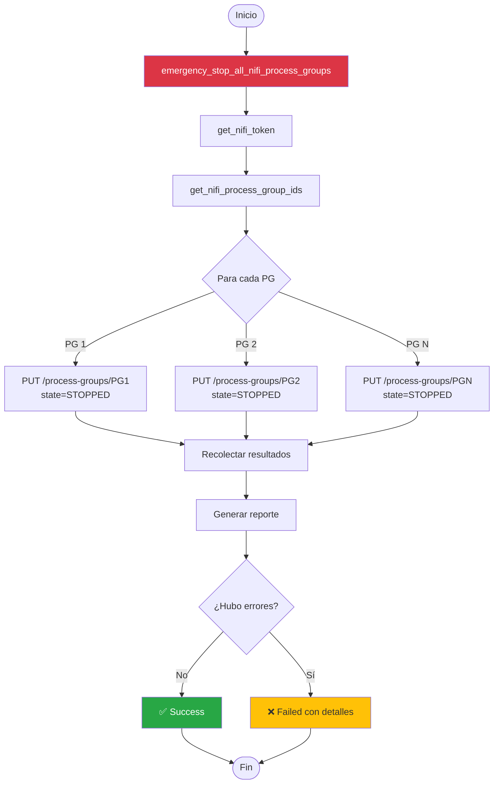
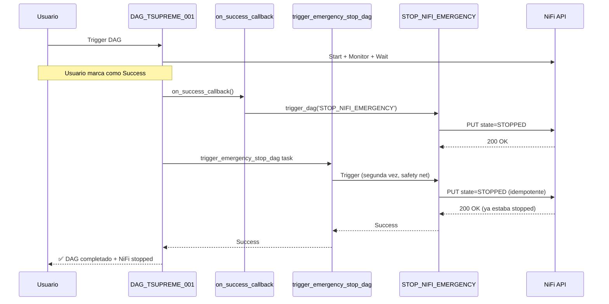
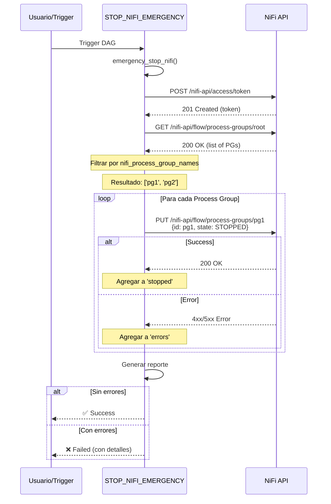
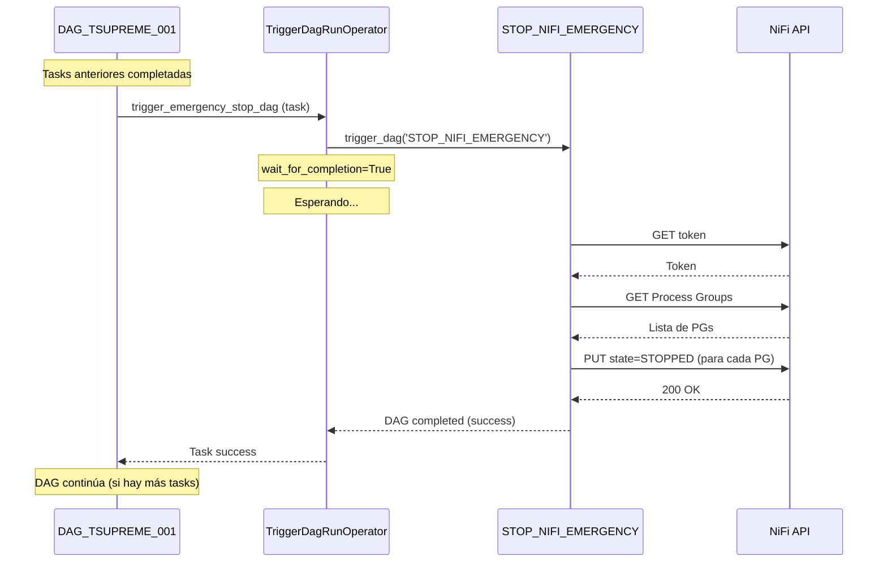

# STOP_NIFI_EMERGENCY

## 📋 Resumen Ejecutivo

DAG de emergencia para **detener inmediatamente** todos los Process Groups de Apache NiFi. Diseñado como safety net y workaround para situaciones donde necesitas parar NiFi urgentemente o cuando el DAG principal no puede hacerlo por sí mismo.

### ¿Por Qué Existe Este DAG?

En Apache Airflow 3.0+, marcar un DAG como "Success" o "Failed" manualmente no siempre detiene las tasks en ejecución (especialmente sensors en modo `reschedule`). Este DAG garantiza que NiFi se detenga **siempre**, sin importar el estado del DAG principal.

### Características Principales

- 🚨 **Parada inmediata** de todos los Process Groups configurados
- ✅ **Ejecución simple** (1 sola task)
- 🔄 **Integración automática** con `DAG_TSUPREME_001_TPIAGENT_UPLOADS`
- 🛡️ **Manejo robusto de errores** (informa éxitos y fallos)
- 📊 **Logging detallado** con resumen de resultados
- 🎯 **Trigger manual** disponible en cualquier momento

---

## 🏗️ Arquitectura



---

## 🎯 Casos de Uso

### Caso 1: Parada Manual Urgente

**Escenario:** Necesitas detener NiFi inmediatamente por alguna razón (mantenimiento, problema detectado, etc.)

**Ejecución desde UI:**
```
1. Ir a Airflow UI: http://airflow.example.com
2. Buscar DAG: STOP_NIFI_EMERGENCY
3. Click en el botón "Trigger DAG" (▶️)
4. Confirmar
5. ✅ NiFi se detiene en ~5-10 segundos
```

**Ejecución desde CLI:**
```bash
airflow dags trigger STOP_NIFI_EMERGENCY
```

**Resultado esperado:**
```
[LOG] ================================================================================
[LOG] EMERGENCY STOP - Deteniendo todos los Process Groups de NiFi
[LOG] ================================================================================
[LOG] ✓ Stopped process group: abc123-456-789
[LOG] ✓ Stopped process group: def456-789-012
[LOG] ================================================================================
[LOG] EMERGENCY STOP COMPLETED
[LOG] Stopped: 2 process groups
[LOG] Errors: 0 process groups
[LOG] ================================================================================
```

### Caso 2: Cleanup Después de Fallo

**Escenario:** El DAG principal falló pero NiFi sigue corriendo

**Síntomas:**
- DAG_TSUPREME_001_TPIAGENT_UPLOADS muestra estado "failed"
- En NiFi UI, los Process Groups siguen en estado RUNNING
- Los logs muestran que stop_nifi_pipeline no se ejecutó

**Solución:**
```bash
# Verificar estado en NiFi
curl -k -H "Authorization: Bearer $TOKEN" \
  https://nifi.example.com:8443/nifi-api/flow/process-groups/root

# Ejecutar parada de emergencia
airflow dags trigger STOP_NIFI_EMERGENCY

# Verificar resultado
airflow dags list-runs -d STOP_NIFI_EMERGENCY --state success --limit 1
```

### Caso 3: Integración Automática (Safety Net)

**Escenario:** El DAG principal siempre ejecuta este DAG al terminar (automático)

**Flujo:**


**Ventaja:** Redundancia máxima. Incluso si un mecanismo falla, el otro lo respalda.

### Caso 4: Workaround para Airflow 3.0+

**Problema conocido en Airflow 3.0+:**
```
Cuando marcas un DAG como Success/Failed manualmente,
las tasks en estado "running" o "reschedule" NO se detienen automáticamente.
```

**Impacto en nuestro caso:**
```
DAG_TSUPREME_001_TPIAGENT_UPLOADS
├── wait_before_stop [running]  ← Esta task sigue corriendo
└── NiFi Process Groups [RUNNING]  ← NiFi sigue procesando
```

**Solución con este DAG:**
```python
# El callback se ejecuta inmediatamente al marcar el DAG
dag = DAG(
    ...,
    on_success_callback=trigger_stop_dag_callback,  # ← Dispara STOP_NIFI_EMERGENCY
)
```

**Resultado:**
```
1. Usuario marca DAG como Success
2. Callback dispara STOP_NIFI_EMERGENCY (instantáneo)
3. NiFi se detiene antes de que la task wait_before_stop termine
4. ✅ Problema resuelto
```

---

## 🚀 Ejecución Manual

### Desde Airflow UI

**Paso a paso:**
```
1. Abrir Airflow UI: http://airflow.example.com
2. En la lista de DAGs, buscar: STOP_NIFI_EMERGENCY
3. Click en el nombre del DAG (abre la vista de detalle)
4. Click en el botón "Trigger DAG" (▶️ arriba a la derecha)
5. (Opcional) Agregar configuración en JSON
6. Click "Trigger"
7. Ver el progreso en "Graph" o "Grid"
8. Cuando termine, estado será "success" ✅
```

**Captura conceptual:**
```
┌─────────────────────────────────────────────────┐
│ STOP_NIFI_EMERGENCY                    [▶️ Trigger DAG] │
├─────────────────────────────────────────────────┤
│ Graph   Grid   Calendar   Code   ...           │
├─────────────────────────────────────────────────┤
│                                                 │
│   [emergency_stop_all_nifi_process_groups]     │
│              ↓                                  │
│            ✅ success                           │
│                                                 │
└─────────────────────────────────────────────────┘
```

### Desde CLI

**Ejecución simple:**
```bash
airflow dags trigger STOP_NIFI_EMERGENCY
```

**Con configuración personalizada:**
```bash
airflow dags trigger STOP_NIFI_EMERGENCY \
  --conf '{"reason": "Manual maintenance", "requested_by": "admin"}'
```

**Ver resultado:**
```bash
# Ver último run
airflow dags list-runs -d STOP_NIFI_EMERGENCY --state success --limit 1

# Ver logs
RUN_ID=$(airflow dags list-runs -d STOP_NIFI_EMERGENCY --state success --limit 1 --output json | jq -r '.[0].run_id')
airflow tasks logs STOP_NIFI_EMERGENCY emergency_stop_all_nifi_process_groups $RUN_ID
```

### Con Payload JSON Personalizado

**Ejemplo 1: Incluir razón de la parada**
```json
{
  "reason": "Mantenimiento programado",
  "requested_by": "equipo-ops",
  "timestamp": "2026-02-05T15:30:00Z"
}
```

**Desde UI:**
```
Trigger DAG > Configuration JSON:
{
  "reason": "Mantenimiento programado",
  "requested_by": "equipo-ops"
}
```

**Desde CLI:**
```bash
airflow dags trigger STOP_NIFI_EMERGENCY \
  --conf '{"reason": "Mantenimiento programado", "requested_by": "equipo-ops"}'
```

**Nota:** Actualmente el DAG no usa esta configuración, pero queda registrada en los logs del DAG Run para auditoría.

---

## 🔧 Integración Automática

### Integración con DAG Principal

El DAG `DAG_TSUPREME_001_TPIAGENT_UPLOADS` dispara este DAG automáticamente mediante **3 mecanismos**:

#### Mecanismo 1: Task Explícita (TriggerDagRunOperator)

```python
trigger_emergency_stop = TriggerDagRunOperator(
    task_id='trigger_emergency_stop_dag',
    trigger_dag_id='STOP_NIFI_EMERGENCY',
    trigger_rule=TriggerRule.ALL_DONE,  # Siempre se ejecuta
    wait_for_completion=True,           # Espera a que termine
    poke_interval=10,
    conf={
        'triggered_by': 'DAG_TSUPREME_001_TPIAGENT_UPLOADS',
        'source': 'trigger_task',
        'reason': 'automatic_safety_net'
    },
    dag=dag,
)
```

**Cuándo se activa:** Al final del DAG principal, después de `stop_nifi_pipeline`

**Logs esperados:**
```
[2026-02-05 14:00:16] INFO - trigger_emergency_stop_dag: Triggering DAG: STOP_NIFI_EMERGENCY
[2026-02-05 14:00:17] INFO - trigger_emergency_stop_dag: Waiting for STOP_NIFI_EMERGENCY to complete...
[2026-02-05 14:00:23] INFO - trigger_emergency_stop_dag: STOP_NIFI_EMERGENCY completed successfully
```

#### Mecanismo 2: Callbacks del DAG

```python
def trigger_stop_dag_callback(context):
    from airflow.api.common.trigger_dag import trigger_dag
    
    trigger_dag(
        dag_id='STOP_NIFI_EMERGENCY',
        run_id=f"auto_triggered_by_{context['dag_run'].run_id}",
        conf={
            'triggered_by': 'DAG_TSUPREME_001_TPIAGENT_UPLOADS',
            'source': 'dag_callback',
            'reason': 'safety_net'
        },
    )

dag = DAG(
    ...,
    on_success_callback=trigger_stop_dag_callback,
    on_failure_callback=trigger_stop_dag_callback,
)
```

**Cuándo se activa:** Cuando el usuario marca el DAG como Success o Failed manualmente

**Logs esperados:**
```
[2026-02-05 15:30:01] WARNING - [DAG][callback] Triggering STOP_NIFI_EMERGENCY as safety net...
[2026-02-05 15:30:02] WARNING - [DAG][callback] ✓ Successfully triggered STOP_NIFI_EMERGENCY
```

#### Mecanismo 3: Indirecto (on_kill del Sensor)

```python
class StopNiFiOnKillTimeDeltaSensor(TimeDeltaSensor):
    def on_kill(self) -> None:
        stop_nifi_processors(best_effort=True, source='sensor_on_kill')
```

**Cuándo se activa:** Cuando el usuario cancela la task `wait_before_stop` o `wait_forever`

**Nota:** Este mecanismo no dispara el DAG de emergencia, pero llama directamente a `stop_nifi_processors()`

---

## 🔍 Análisis de Resultados

### Resultado Exitoso

**Logs:**
```
[2026-02-05 15:30:20,123] WARNING - ================================================================================
[2026-02-05 15:30:20,124] WARNING - EMERGENCY STOP - Deteniendo todos los Process Groups de NiFi
[2026-02-05 15:30:20,125] WARNING - ================================================================================
[2026-02-05 15:30:20,456] INFO - ✓ Stopped process group: abc123-456-789
[2026-02-05 15:30:20,567] INFO - ✓ Stopped process group: def456-789-012
[2026-02-05 15:30:20,568] WARNING - ================================================================================
[2026-02-05 15:30:20,569] WARNING - EMERGENCY STOP COMPLETED
[2026-02-05 15:30:20,570] WARNING - Stopped: 2 process groups
[2026-02-05 15:30:20,571] WARNING - Errors: 0 process groups
[2026-02-05 15:30:20,572] WARNING - ================================================================================
[2026-02-05 15:30:20,573] INFO - Successfully stopped: ['abc123-456-789', 'def456-789-012']
```

**Return value de la función:**
```python
{
    'stopped': ['abc123-456-789', 'def456-789-012'],
    'errors': {},
    'total_attempted': 2,
    'success_count': 2,
    'error_count': 0
}
```

**Estado del DAG:** ✅ Success

### Resultado con Errores Parciales

**Logs:**
```
[2026-02-05 15:30:20,123] WARNING - EMERGENCY STOP - Deteniendo todos los Process Groups de NiFi
[2026-02-05 15:30:20,456] INFO - ✓ Stopped process group: abc123-456-789
[2026-02-05 15:30:21,234] ERROR - ✗ Failed to stop process group def456-789-012: 409 - Process group is not in a valid state
[2026-02-05 15:30:21,235] WARNING - EMERGENCY STOP COMPLETED
[2026-02-05 15:30:21,236] WARNING - Stopped: 1 process groups
[2026-02-05 15:30:21,237] WARNING - Errors: 1 process groups
[2026-02-05 15:30:21,238] INFO - Successfully stopped: ['abc123-456-789']
[2026-02-05 15:30:21,239] ERROR - Failed to stop: {'def456-789-012': '409 - Process group is not in a valid state'}
[2026-02-05 15:30:21,240] ERROR - Exception: Failed to stop 1 process groups. Details: {
  "def456-789-012": "409 - Process group is not in a valid state"
}
```

**Return value antes de la excepción:**
```python
{
    'stopped': ['abc123-456-789'],
    'errors': {
        'def456-789-012': '409 - Process group is not in a valid state'
    },
    'total_attempted': 2,
    'success_count': 1,
    'error_count': 1
}
```

**Estado del DAG:** ❌ Failed (pero algunos PGs sí se detuvieron)

**Interpretación:**
- El DAG falla si **al menos un** Process Group no se pudo detener
- Los Process Groups que sí se detuvieron están listados en `stopped`
- Los errores específicos están en `errors` para debugging

### Resultado con Error Fatal

**Logs:**
```
[2026-02-05 15:30:20,123] WARNING - EMERGENCY STOP - Deteniendo todos los Process Groups de NiFi
[2026-02-05 15:30:20,456] ERROR - Exception: Failed to get NiFi token: 401 - Unauthorized
[2026-02-05 15:30:20,457] ERROR - Failed to stop 0 process groups. Details: {
  "_fatal": "Failed to get NiFi token: 401 - Unauthorized"
}
```

**Return value:**
```python
{
    'stopped': [],
    'errors': {
        '_fatal': 'Failed to get NiFi token: 401 - Unauthorized'
    },
    'total_attempted': 0,
    'success_count': 0,
    'error_count': 1
}
```

**Estado del DAG:** ❌ Failed

**Causas comunes:**
- Credenciales incorrectas en `nifi_default`
- NiFi no disponible (red, servidor caído)
- Permisos insuficientes del usuario NiFi

---

## 📊 Diagramas de Secuencia

### Secuencia de Ejecución Normal



### Secuencia Disparada por DAG Principal



---

## 🐛 Troubleshooting

### Error: "Failed to get NiFi token: 401"

**Logs:**
```
ERROR - Exception: Failed to get NiFi token: 401 - Unauthorized
```

**Causa:** Credenciales incorrectas en la conexión `nifi_default`

**Solución:**
```bash
# Verificar conexión actual
airflow connections get nifi_default

# Actualizar credenciales
airflow connections delete nifi_default
airflow connections add nifi_default \
  --conn-type http \
  --conn-host https://nifi.example.com:8443 \
  --conn-login admin \
  --conn-password 'correct-password'

# Verificar manualmente
curl -k -X POST https://nifi.example.com:8443/nifi-api/access/token \
  -d "username=admin&password=correct-password" \
  -H "Content-Type: application/x-www-form-urlencoded"
```

### Error: "No se encontraron Process Groups bajo root"

**Logs:**
```
ERROR - ValueError: No se encontraron Process Groups bajo root en NiFi (o no coinciden con nifi_process_group_names).
```

**Causa 1:** Filtro `nifi_process_group_names` no coincide con nombres reales

**Solución:**
```bash
# Ver configuración actual
airflow variables get nifi_process_group_names

# Eliminar filtro (controlar todos los PGs)
airflow variables delete nifi_process_group_names

# O actualizar con nombres correctos
airflow variables set nifi_process_group_names '["Nombre Exacto en NiFi"]'
```

**Causa 2:** No hay Process Groups bajo root en NiFi

**Verificación:**
```bash
# Verificar en NiFi API
TOKEN=$(curl -k -X POST https://nifi.example.com:8443/nifi-api/access/token \
  -d "username=admin&password=pass" \
  -H "Content-Type: application/x-www-form-urlencoded")

curl -k -H "Authorization: Bearer $TOKEN" \
  https://nifi.example.com:8443/nifi-api/flow/process-groups/root | jq '.processGroupFlow.flow.processGroups'
```

### Error: "409 - Process group is not in a valid state"

**Logs:**
```
ERROR - ✗ Failed to stop process group def456: 409 - Process group is not in a valid state
```

**Causa:** El Process Group tiene componentes en estados transitorios (STARTING, STOPPING)

**Solución:**
```bash
# Opción 1: Esperar 30 segundos y volver a ejecutar
sleep 30
airflow dags trigger STOP_NIFI_EMERGENCY

# Opción 2: Parar manualmente desde NiFi UI
# 1. Ir a NiFi UI
# 2. Right-click en el Process Group
# 3. Stop

# Opción 3: Force stop desde NiFi API (avanzado)
# Primero detener procesadores individuales, luego el PG
```

**Prevención:** El DAG intenta parar todos los PGs en secuencia. Si alguno falla, continúa con los demás.

### Warning: DAG se ejecuta dos veces seguidas

**Observación en logs:**
```
[2026-02-05 14:00:17] INFO - Triggered by: trigger_task (DAG_TSUPREME_001)
[2026-02-05 14:00:23] INFO - Triggered by: dag_callback (DAG_TSUPREME_001)
```

**¿Es un problema?** No, es intencional. Es parte de la redundancia.

**Explicación:**
1. Primera ejecución: `trigger_emergency_stop_dag` task
2. Segunda ejecución: `on_success_callback` (safety net)

**Resultado:** Ambas ejecuciones detienen NiFi. Si la primera funciona, la segunda encuentra que NiFi ya está parado (operación idempotente).

**Si quieres evitar la duplicación:**
```python
# Opción 1: Eliminar callbacks (menos seguro)
dag = DAG(
    ...,
    # on_success_callback=trigger_stop_dag_callback,  # Comentar
    # on_failure_callback=trigger_stop_dag_callback,  # Comentar
)

# Opción 2: Agregar lógica para detectar si ya se ejecutó
# (más complejo, requiere verificar estado en Variable o XCom)
```

### DAG no se dispara automáticamente desde DAG principal

**Síntomas:**
- DAG_TSUPREME_001 completa exitosamente
- STOP_NIFI_EMERGENCY no tiene runs recientes
- NiFi sigue corriendo

**Verificación:**
```bash
# Ver runs del DAG de emergencia
airflow dags list-runs -d STOP_NIFI_EMERGENCY --limit 10

# Ver logs de la task trigger_emergency_stop_dag
RUN_ID=$(airflow dags list-runs -d DAG_TSUPREME_001_TPIAGENT_UPLOADS --state success --limit 1 --output json | jq -r '.[0].run_id')
airflow tasks logs DAG_TSUPREME_001_TPIAGENT_UPLOADS trigger_emergency_stop_dag $RUN_ID
```

**Causas comunes:**
1. STOP_NIFI_EMERGENCY no está instalado
2. Error en el trigger (permisos, configuración)
3. La task `trigger_emergency_stop_dag` falló silenciosamente

**Solución:**
```bash
# 1. Verificar que STOP_NIFI_EMERGENCY existe
airflow dags list | grep STOP_NIFI_EMERGENCY

# 2. Si no existe, instalarlo
cp STOP_NIFI_EMERGENCY.py /opt/airflow/dags/

# 3. Verificar permisos de la API de Airflow
# (El trigger usa airflow.api.common.trigger_dag)

# 4. Ejecutar manualmente como workaround
airflow dags trigger STOP_NIFI_EMERGENCY
```

---

## 📝 Ejemplos de Logs Completos

### Ejecución Exitosa Completa

```
[2026-02-05, 15:30:20 UTC] {taskinstance.py:1234} INFO - Starting task emergency_stop_all_nifi_process_groups
[2026-02-05, 15:30:20 UTC] {python.py:177} INFO - Executing python callable: emergency_stop_nifi
[2026-02-05, 15:30:20 UTC] {STOP_NIFI_EMERGENCY.py:123} WARNING - ================================================================================
[2026-02-05, 15:30:20 UTC] {STOP_NIFI_EMERGENCY.py:124} WARNING - EMERGENCY STOP - Deteniendo todos los Process Groups de NiFi
[2026-02-05, 15:30:20 UTC] {STOP_NIFI_EMERGENCY.py:125} WARNING - ================================================================================
[2026-02-05, 15:30:20 UTC] {STOP_NIFI_EMERGENCY.py:40} INFO - Obtaining NiFi token...
[2026-02-05, 15:30:20 UTC] {STOP_NIFI_EMERGENCY.py:95} INFO - Resolved process group IDs (count=2): ['abc123-456-789', 'def456-789-012']
[2026-02-05, 15:30:20 UTC] {STOP_NIFI_EMERGENCY.py:143} INFO - ✓ Stopped process group: abc123-456-789
[2026-02-05, 15:30:20 UTC] {STOP_NIFI_EMERGENCY.py:143} INFO - ✓ Stopped process group: def456-789-012
[2026-02-05, 15:30:20 UTC] {STOP_NIFI_EMERGENCY.py:156} WARNING - ================================================================================
[2026-02-05, 15:30:20 UTC] {STOP_NIFI_EMERGENCY.py:157} WARNING - EMERGENCY STOP COMPLETED
[2026-02-05, 15:30:20 UTC] {STOP_NIFI_EMERGENCY.py:158} WARNING - Stopped: 2 process groups
[2026-02-05, 15:30:20 UTC] {STOP_NIFI_EMERGENCY.py:159} WARNING - Errors: 0 process groups
[2026-02-05, 15:30:20 UTC] {STOP_NIFI_EMERGENCY.py:160} WARNING - ================================================================================
[2026-02-05, 15:30:20 UTC] {STOP_NIFI_EMERGENCY.py:163} INFO - Successfully stopped: ['abc123-456-789', 'def456-789-012']
[2026-02-05, 15:30:20 UTC] {python.py:183} INFO - Done. Returned value was: {'stopped': ['abc123-456-789', 'def456-789-012'], 'errors': {}, 'total_attempted': 2, 'success_count': 2, 'error_count': 0}
[2026-02-05, 15:30:20 UTC] {taskinstance.py:1456} INFO - Marking task as SUCCESS
```

### Ejecución con Errores

```
[2026-02-05, 15:30:20 UTC] {STOP_NIFI_EMERGENCY.py:124} WARNING - EMERGENCY STOP - Deteniendo todos los Process Groups de NiFi
[2026-02-05, 15:30:20 UTC] {STOP_NIFI_EMERGENCY.py:143} INFO - ✓ Stopped process group: abc123-456-789
[2026-02-05, 15:30:21 UTC] {STOP_NIFI_EMERGENCY.py:146} ERROR - ✗ Failed to stop process group def456-789-012: 409 - Process group is not in a valid state
[2026-02-05, 15:30:21 UTC] {STOP_NIFI_EMERGENCY.py:158} WARNING - Stopped: 1 process groups
[2026-02-05, 15:30:21 UTC] {STOP_NIFI_EMERGENCY.py:159} WARNING - Errors: 1 process groups
[2026-02-05, 15:30:21 UTC] {STOP_NIFI_EMERGENCY.py:165} ERROR - Failed to stop: {'def456-789-012': '409 - Process group is not in a valid state'}
[2026-02-05, 15:30:21 UTC] {STOP_NIFI_EMERGENCY.py:176} ERROR - Exception: Failed to stop 1 process groups. Details: {
  "def456-789-012": "409 - Process group is not in a valid state"
}
[2026-02-05, 15:30:21 UTC] {taskinstance.py:1678} ERROR - Task failed with exception
[2026-02-05, 15:30:21 UTC] {taskinstance.py:1456} INFO - Marking task as FAILED
```

---

## 🎯 Mejores Prácticas

### 1. Siempre Tener Este DAG Instalado

```bash
# Verificar en cada despliegue
airflow dags list | grep STOP_NIFI_EMERGENCY

# Si no aparece, instalarlo inmediatamente
cp STOP_NIFI_EMERGENCY.py /opt/airflow/dags/
```

### 2. No Modificar el DAG Sin Necesidad

Este DAG es intencionalmente simple (1 task, sin dependencias). Mantenerlo así garantiza que siempre funcione.

### 3. Usar Para Debugging

```bash
# Si sospechas que NiFi está en mal estado
airflow dags trigger STOP_NIFI_EMERGENCY

# Ver los logs para entender qué PGs se detuvieron y cuáles no
```

### 4. Auditoría de Ejecuciones

```bash
# Ver historial completo
airflow dags list-runs -d STOP_NIFI_EMERGENCY --output json

# Filtrar solo ejecuciones manuales vs automáticas
# (Ver el campo 'conf' en el JSON para distinguir)
```

### 5. Coordinación con DAG Principal

No necesitas ejecutar este DAG manualmente si el DAG principal está funcionando correctamente. El trigger automático debería ser suficiente.

**Ejecuta manualmente solo si:**
- El DAG principal falló y NiFi sigue corriendo
- Necesitas parar NiFi urgentemente
- Estás haciendo troubleshooting

---

## 📚 Referencias

- **DAG Principal:** [DAG_TSUPREME_001_TPIAGENT_UPLOADS.md](./DAG_TSUPREME_001_TPIAGENT_UPLOADS.md)
- **Documentación NiFi API - Stop Process Group:** https://nifi.apache.org/docs/nifi-docs/rest-api/index.html#/process-groups
- **Airflow API - trigger_dag:** https://airflow.apache.org/docs/apache-airflow/stable/python-api-ref.html#airflow.api.common.trigger_dag.trigger_dag

---

## 📞 Soporte

**¿Cuándo usar este DAG?**
- ✅ Parada manual urgente de NiFi
- ✅ Cleanup después de fallos del DAG principal
- ✅ Debugging de problemas con Process Groups
- ❌ **NO** como parte del flujo normal (el DAG principal ya lo dispara)

**¿Qué hacer si falla?**
1. Ver logs detallados del task
2. Identificar qué Process Groups fallaron (en `errors`)
3. Verificar estado en NiFi UI
4. Parar manualmente desde NiFi UI si es necesario
5. Reportar el error si es recurrente

---

**Última actualización:** 2026-02-05  
**Versión del DAG:** 1.0  
**Compatibilidad:** Apache Airflow 2.x / 3.x, Apache NiFi 1.x+  
**Dependencias:** Requiere conexión `nifi_default` configurada
