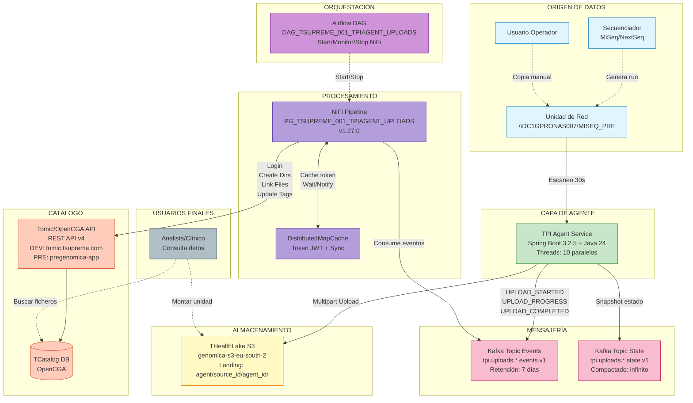
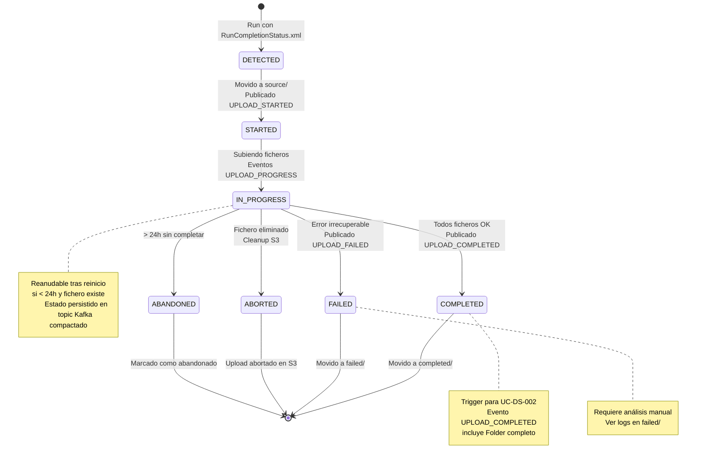
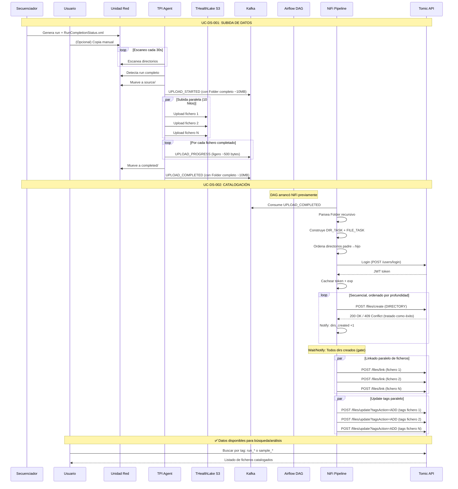
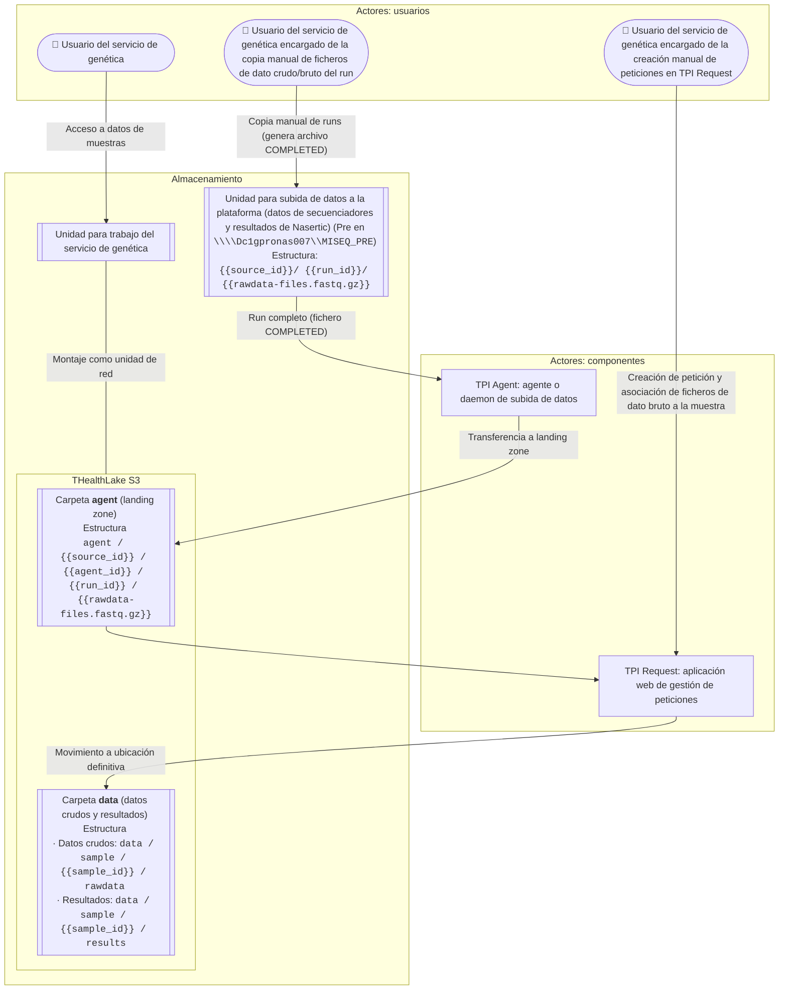
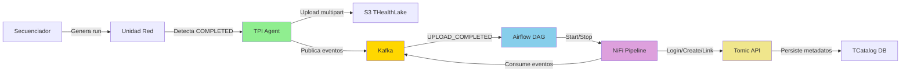
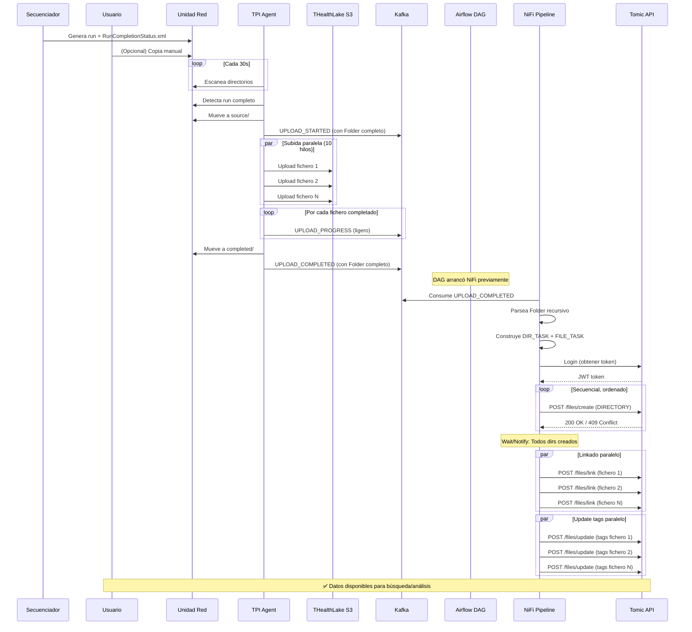
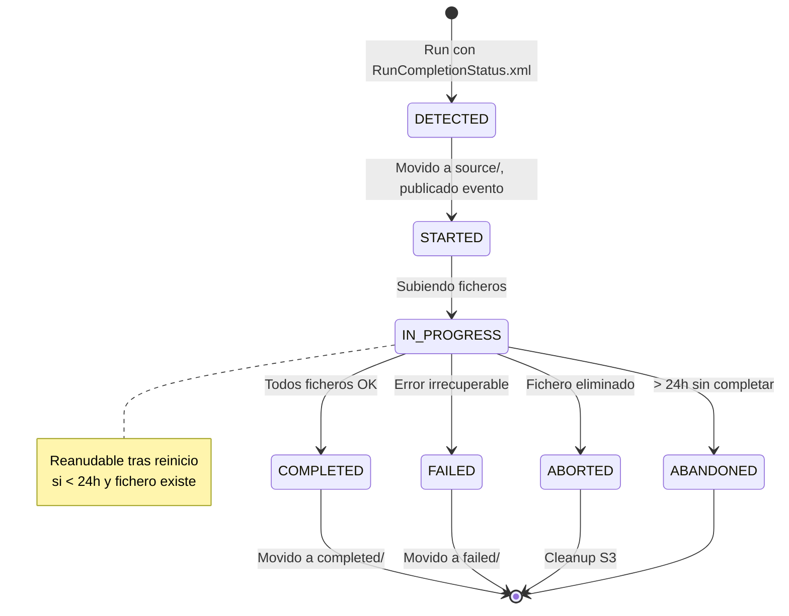
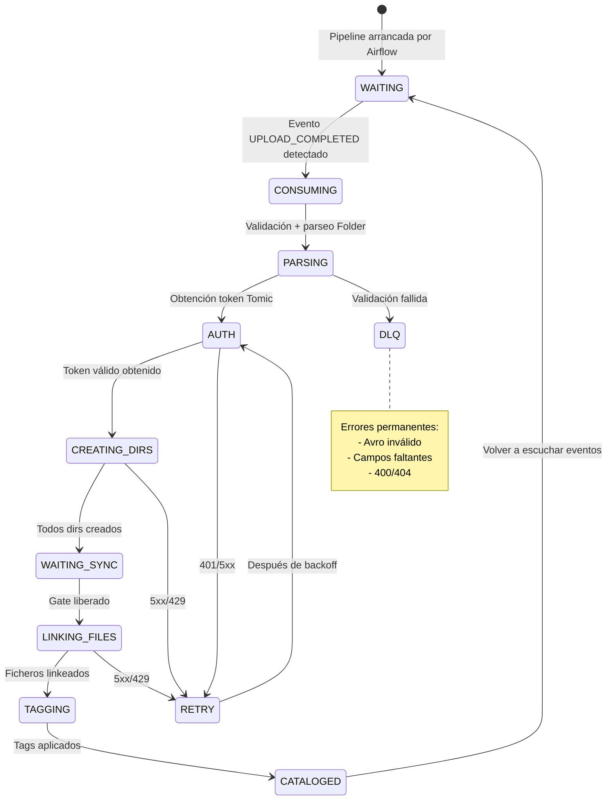

# Subida de datos de secuenciación

<!-- TOC -->
* [Subida de datos de secuenciación](#subida-de-datos-de-secuenciación)
  * [Resumen Ejecutivo](#resumen-ejecutivo)
  * [Actores del Sistema](#actores-del-sistema)
  * [Arquitectura General](#arquitectura-general)
  * [UC-DS-001: Subida de datos a la landing zone](#uc-ds-001-subida-de-datos-a-la-landing-zone)
  * [UC-DS-002: Catalogación de ficheros](#uc-ds-002-catalogación-de-ficheros)
  * [UC-DS-003: Asociación de ficheros a peticiones](#uc-ds-003-asociación-de-ficheros-a-peticiones)
  * [UC-DS-004: Transformación de resultados provenientes de Nasertic](#uc-ds-004-transformación-de-resultados-provenientes-de-nasertic)
  * [UC-DS-005: Movimiento de ficheros de landing zone a ubicación definitiva en THealthLake](#uc-ds-005-movimiento-de-ficheros-de-landing-zone-a-ubicación-definitiva-en-thealthlake)
  * [UC-DS-006: Creación de caso clínico, pacientes/individuos, muestras](#uc-ds-006-creación-de-caso-clínico-pacientesindividuos-muestras)
  * [UC-DS-007: Errores en identificadores de la muestra asociada a un paciente y petición](#uc-ds-007-errores-en-identificadores-de-la-muestra-asociada-a-un-paciente-y-petición)
  * [Modelo de Procesos](#modelo-de-procesos)
    * [PR-DS-001: Transferencia de datos a la landing zone](#pr-ds-001-transferencia-de-datos-a-la-landing-zone)
    * [PR-DS-002: Catalogación inicial de ficheros, runs y carpetas de resultados](#pr-ds-002-catalogación-inicial-de-ficheros-runs-y-carpetas-de-resultados)
    * [PR-DS-003: Asociación de ficheros a peticiones](#pr-ds-003-asociación-de-ficheros-a-peticiones)
    * [PR-DS-004: Transformación de resultados provenientes de Nasertic](#pr-ds-004-transformación-de-resultados-provenientes-de-nasertic)
    * [PR-DS-005: Movimiento de ficheros desde landing zone a ubicación definitiva](#pr-ds-005-movimiento-de-ficheros-desde-landing-zone-a-ubicación-definitiva)
    * [PR-DS-006: Creación de caso clínico, pacientes/individuos, muestras](#pr-ds-006-creación-de-caso-clínico-pacientesindividuos-muestras)
  * [Flujo Completo](#flujo-completo)
  * [Referencias](#referencias)
<!-- TOC -->

## Resumen Ejecutivo

Este documento describe el proceso completo de **gestión de datos genómicos** en la plataforma TSuPreMe, desde la subida inicial hasta su asociación a casos clínicos:

**Casos de Uso Principales:**

- **UC-DS-001**: Subida automatizada de runs desde secuenciadores a THealthLake (S3)
- **UC-DS-002**: Catalogación automática en TomicEngine para búsqueda y trazabilidad
- **UC-DS-003**: Asociación de ficheros catalogados a peticiones clínicas
- **UC-DS-004**: Transformación de resultados de Nasertic (⚠️ OBSOLETO)
- **UC-DS-005**: Movimiento de ficheros desde landing zone a ubicación definitiva
- **UC-DS-006**: Creación de casos clínicos, pacientes/individuos y muestras
- **UC-DS-007**: Gestión de errores en identificadores de muestras

**Componentes clave**: TPI Agent, THealthLake (S3), Kafka, Airflow, NiFi, TomicEngine/TCatalog, TPI Request

**Flujo completo**: Secuenciador → TPI Agent → S3 (landing zone) → Catalogación → TPI Request → Asociación a peticiones → Movimiento a ubicación definitiva → Creación de casos clínicos

## Actores del Sistema

| Actor | Rol |
|-------|-----|
| **Usuario operador** | Coloca runs en unidad de red compartida |
| **TPI Agent** | Servicio automatizado que monitoriza y sube datos |
| **Airflow DAG** | Orquesta la ejecución de pipelines NiFi |
| **NiFi Pipeline** | Procesa eventos y cataloga en Tomic |
| **Analista** | Consulta datos catalogados |

---

## Arquitectura General



### Flujo de Datos

1. **Secuenciador** genera run con fichero `RunCompletionStatus.xml`
2. **TPI Agent** detecta run completo y lo sube a **S3** (`agent/{source_id}/{agent_id}/{run_id}/`)
3. **Agent** publica eventos **Kafka** (UPLOAD_STARTED, UPLOAD_PROGRESS, UPLOAD_COMPLETED)
4. **Airflow** gestiona el ciclo de vida de **NiFi**
5. **NiFi** consume eventos Kafka y cataloga en **Tomic**
6. **Usuarios** consultan ficheros desde Tomic o acceden directamente a S3

### Estructura de Almacenamiento en S3

**Landing Zone** (zona temporal):
```
agent/
└── {source_id}/              # Identificador del origen (ej: MiSeq)
    └── {agent_id}/           # Identificador del agente (ej: tsupreme-agent-001)
        └── {run_id}/         # Identificador del run
            ├── Data/
            │   └── Intensities/
            │       └── BaseCalls/
            │           ├── Sample123_S1_R1.fastq.gz
            │           └── Sample123_S1_R2.fastq.gz
            └── ...
```

**Ejemplo real**:
```
s3://genomica-s3/agent/MiSeq/tsupreme-agent-001/M05089_155_000000000-CT8YM/Data/Intensities/BaseCalls/Sample123_S1_R1.fastq.gz
```

> **Nota**: La estructura preserva exactamente los paths del run original (excepto `RunCompletionStatus.xml` que se ignora).

---

## UC-DS-001: Subida de datos a la landing zone

### Objetivo

Transferir automáticamente runs completos desde unidades de red a THealthLake (S3), generando eventos de trazabilidad.

### Trigger

Presencia del fichero **`RunCompletionStatus.xml`** en la carpeta del run.

### Actores

- Usuario operador (coloca runs en unidad red)
- TPI Agent Service (daemon automatizado)

### Flujo Principal

1. **Detección** (cada 30s):
   - Agent escanea unidad de red
   - Detecta carpetas con `RunCompletionStatus.xml`

2. **Preparación**:
   - Mueve run a zona de trabajo (`source/`)
   - Lista todos los ficheros recursivamente
   - Calcula bytes totales

3. **Subida a S3**:
   - Publica evento `UPLOAD_STARTED` en Kafka
   - Sube ficheros en paralelo (10 hilos concurrentes)
   - Por cada fichero completado: publica `UPLOAD_PROGRESS`
   - Al finalizar: publica `UPLOAD_COMPLETED`

4. **Finalización**:
   - Mueve run a `completed/` (éxito) o `failed/` (error)

### Estrategias de Upload

- **Ficheros vacíos (0 bytes)**: Upload simple
- **Ficheros < 64 MB**: Single-part upload
- **Ficheros ≥ 64 MB**: Multipart upload con reintentos

### Ubicación en S3

```
s3://{bucket}/agent/{source_id}/{agent_id}/{run_id}/{path_relativo}
```

### Eventos Kafka Publicados

| Evento | Cuándo | Contiene Catálogo |
|--------|--------|-------------------|
| `UPLOAD_STARTED` | Al iniciar run | ✅ Sí (~10 MB) |
| `UPLOAD_PROGRESS` | Por cada fichero | ❌ No (~500 bytes) |
| `UPLOAD_COMPLETED` | Al finalizar run | ✅ Sí (~10 MB) |
| `UPLOAD_FAILED` | Si falla | ✅ Sí |

### Estados del Upload



- **STARTED**: Upload iniciado
- **IN_PROGRESS**: Subiendo ficheros (reanudable < 24h)
- **COMPLETED**: Finalizado exitosamente
- **FAILED**: Error tras reintentos
- **ABORTED**: Fichero eliminado
- **ABANDONED**: > 24h sin completar

### Criterios de Aceptación

- ✅ Run detectado en ≤ 30 segundos tras aparecer `RunCompletionStatus.xml`
- ✅ Todos los ficheros subidos con paths idénticos al origen
- ✅ Eventos Kafka publicados correctamente
- ✅ Upload reanudable tras reinicio del agente (< 24h)
- ✅ Run de 20 GB / 60k ficheros completa en < 2.5 horas

> **Detalles técnicos**: Ver [system_design/subida_de_datos.md - PARTE A](../system_design/subida_de_datos.md#parte-a-diseño-tpi-agent-service-uc-ds-001)

---

## UC-DS-002: Catalogación de ficheros

### Objetivo

Replicar la estructura de S3 en el catálogo Tomic, añadiendo tags para búsqueda por run y muestra.

### Trigger

Evento Kafka `UPLOAD_COMPLETED` del UC-DS-001.

### Actores

- Airflow DAG (orquestador)
- NiFi Pipeline (procesador)
- Tomic API (catálogo destino)

### Flujo Principal

1. **Orquestación** (Airflow):
   - Inicia pipeline NiFi
   - Monitorea actividad
   - Detiene tras timeout o manual

2. **Consumo evento** (NiFi):
   - Consume `UPLOAD_COMPLETED` desde Kafka
   - Valida campos obligatorios
   - Parsea estructura `Folder` recursiva

3. **Autenticación**:
   - Login en Tomic (obtiene token JWT)
   - Cachea token para reutilizar

4. **Creación de directorios** (secuencial):
   - Construye lista ordenada padre→hijo
   - Por cada directorio: `POST /files/create` (type=DIRECTORY)
   - Aplica tags según nivel

5. **Link de ficheros** (paralelo):
   - Por cada fichero: `POST /files/link`
   - URI apunta a S3: `s3://{bucket}/agent/{source_id}/{agent_id}/{run_id}/...`

6. **Aplicación de tags** (paralelo):
   - Por cada fichero: `POST /files/update?tagsAction=ADD`
   - Tags: `run_{runId}` + `sample_{sampleId}` (si aplica)

### Jerarquía de Directorios en Tomic

```
agent/
└── {source_id}/                              [sin tags]
    └── {agent_id}/                           [sin tags]
        └── {run_id}/                         [tags: run_*]
            └── [subcarpetas]/                [tags: run_*, sample_*]
```

### Extracción de sampleId

| Nombre Fichero | Patrón | SampleId |
|----------------|--------|----------|
| `Sample123_S1_L001_R1.fastq.gz` | `^(.+?)_S\d+_` | `Sample123` |
| `Sample456_aligned.bam` | Antes de primer `_` | `Sample456` |
| `README.txt` | Sin `_` | `null` (sin tag sample) |

### Tags por Entidad

**Directorios**:
- `agent/{source_id}`: Sin tags
- `agent/{source_id}/{agent_id}`: Sin tags
- `agent/{source_id}/{agent_id}/{runId}`: `["run_{runId}"]`
- Subcarpetas: `["run_{runId}", "sample_*", ...]` (samples de ficheros descendientes)

**Ficheros**:
- Siempre: `run_{runId}`
- Si tiene sampleId: `sample_{sampleId}`

### Búsquedas en Tomic

- Por run: `run_M05089_155_000000000-CT8YM` → Todos los ficheros/dirs del run
- Por muestra: `sample_Sample123` → Todos los ficheros de esa muestra
- Por path: `agent/MiSeq/tsupreme-agent-001/M05089*` → Wildcards

### Criterios de Aceptación

- ✅ Paths en Tomic idénticos a keys en S3
- ✅ Directorios creados en orden padre→hijo
- ✅ Ficheros no se linkean hasta que directorios existen (sincronización)
- ✅ Tags aplicados correctamente
- ✅ Reprocesar evento no causa errores (idempotencia)
- ✅ Run con 100 ficheros cataloga en < 2 minutos

> **Detalles técnicos**: Ver [system_design/subida_de_datos.md - PARTE B](../system_design/subida_de_datos.md#parte-b-pipeline-de-catalogación-uc-ds-002)

---

## Flujo Completo



### Timeline Típico (Run 5 GB, 100 ficheros)

| Tiempo | Evento | Componente |
|--------|--------|-----------|
| T+0s | Secuenciador completa | Secuenciador |
| T+30s | Agente detecta run | TPI Agent |
| T+31s | `UPLOAD_STARTED` publicado | TPI Agent |
| T+32s - T+10m | Subida a S3 | TPI Agent |
| T+10m | `UPLOAD_COMPLETED` publicado | TPI Agent |
| T+10m+1s | NiFi consume evento | NiFi Pipeline |
| T+10m+10s | Directorios creados | NiFi Pipeline |
| T+10m+20s | Ficheros linkeados + tags | NiFi Pipeline |
| **T+12m** | **✅ Disponible en catálogo** | Sistema |

---

## Referencias

### Documentos Relacionados

- **Diseño Técnico**: [system_design/subida_de_datos.md](../system_design/subida_de_datos.md)
- **Componente TPI Agent**: [TPIAGENT_SERVICE.md](https://setools.t-systems.es/gitlab/health/genomica/tsupreme/tpi/tpi-agent-service/-/blob/main/README.md?ref_type=heads)
- **DAG Airflow**: [DAG_TSUPREME_001_TPIAGENT_UPLOADS.md](https://setools.t-systems.es/gitlab/health/genomica/commons/infra/airflow/-/blob/main/src/main/helm/charts/airflow/dag_docs/DAG_TSUPREME_001_TPIAGENT_UPLOADS.md?ref_type=heads)
- **Pipeline NiFi**: [PG_TSUPREME_001_TPIAGENT_UPLOADS.md](https://setools.t-systems.es/gitlab/health/genomica/commons/infra/nifi/-/blob/main/src/main/helm/charts/nifi/pipelines/sns-o/PG_TSUPREME_001_TPIAGENT_UPLOADS.md?ref_type=heads)

### Diagramas

Los diagramas están embebidos en este documento utilizando sintaxis Mermaid:
- Componentes del sistema: Ver sección "Arquitectura General"
- Flujo end-to-end: Ver sección "Flujo Completo"
- Estados de upload: Ver sección "UC-DS-001: Estados del Upload"

Archivos fuente disponibles en: [diagrams/](diagrams/)

---

**Fecha**: 2026-02-05  
**Versión**: 1.0  
**Estado**: ✅ Operativo en DEV y PRE

### Actores Principales

| Actor | Rol | Interacción |
|-------|-----|-------------|
| **Usuario del servicio de genética** | Operador de secuenciadores | Copia manual de datos a unidad de red, genera fichero `RunCompletionStatus.xml` |
| **TPI Agent (daemon)** | Sistema automatizado | Monitoriza unidad de red, transfiere datos a S3, publica eventos Kafka |
| **DAG Airflow** | Orquestador | Gestiona ciclo de vida de pipeline NiFi |
| **Pipeline NiFi** | Procesador de eventos | Consume eventos Kafka, cataloga en Tomic |
| **Usuario consultor** | Analista/clínico | Consulta datos catalogados desde unidad de red montada en THealthLake |

### Sistemas Externos

- **Secuenciadores**: MiSeq, NextSeq (generan runs con `RunCompletionStatus.xml`)
- **Unidad de red**: `\\Dc1gpronas007\MISEQ_PRE` (compartida con SNS-O)
- **THealthLake**: Almacenamiento S3 compatible
- **TCatalog**: Tomic/OpenCGA REST API v4

## Descripción de sistemas de almacenamiento e interacción con los usuarios

### Diagrama de Interacción



### Estructura de Almacenamiento en THealthLake

#### Landing Zone (zona temporal)

Ubicación: `agent/`

```
agent/
└── {source_id}/                   # Identificador del origen (ej: MiSeq, Nasertic)
    └── {agent_id}/                # Identificador único del agente (ej: tsupreme-agent-001-pre)
        └── {run_id}/              # Identificador del run (ej: M05089_155_000000000-CT8YM)
            ├── RunCompletionStatus.xml (ignorado en subida)
            ├── SampleSheetUsed.csv
            └── Data/
                └── Intensities/
                    └── BaseCalls/
                        ├── Sample123_S1_L001_R1_001.fastq.gz
                        ├── Sample123_S1_L001_R2_001.fastq.gz
                        └── ...
```

**Características**:
- Path exacto replicado desde origen
- Estructura recursiva preservada
- URLs S3: `s3://{bucket}/agent/{source_id}/{agent_id}/{run_id}/...`

#### Almacenamiento Definitivo (futuro)

Ubicación: `data/`

```
data/
└── sample/
    └── {sample_id}/
        ├── rawdata/              # Datos crudos (fastq.gz)
        └── results/              # Resultados de análisis (bam, vcf)
```

**Nota**: La transición de `agent/` a `data/` se realizará en casos de uso posteriores (UC-DS-005) tras asociación a peticiones.

### Interacción del Usuario con los Datos

#### 1. Subida Manual (Operador)

1. Secuenciador completa run → genera `RunCompletionStatus.xml`
2. Usuario copia carpeta completa a unidad de red (opcional: crear fichero `COMPLETED`)
3. TPI Agent detecta run completo por presencia de `RunCompletionStatus.xml`

#### 2. Consulta de Datos (Analista)

1. Usuario monta unidad de red que apunta a THealthLake
2. Navega estructura de carpetas desde `agent/` o `data/`
3. Accede directamente a ficheros para visualización/análisis

## Arquitectura de Alto Nivel



### Componentes Clave

| Componente | Tecnología | Responsabilidad |
|------------|-----------|-----------------|
| **TPI Agent** | Spring Boot 3.2.5 + Java 24 | Monitorización, upload S3, eventos Kafka |
| **Kafka** | Apache Kafka 3.x | Bus de eventos (topics: events, state) |
| **Airflow** | Apache Airflow 2.x/3.x | Orquestación de pipelines NiFi |
| **NiFi** | Apache NiFi 1.27.0 | Consumo Kafka, catalogación Tomic |
| **Tomic** | OpenCGA REST API v4 | Catálogo de ficheros y metadatos |

## Casos de Uso


### UC-DS-001 Subida de datos a la landing zone

**Identificador único del caso de uso:** UC-DS-001

**Requerimientos que satisface:** REQ-DS-001

**Componente responsable:** TPI Agent Service (Spring Boot 3.2.5 + Java 24)

---

#### Actores Involucrados

- **Usuario operador**: Encargado de colocar runs en la unidad de red compartida
- **TPI Agent Service**: Daemon automatizado de monitorización y subida
- **Secuenciadores**: Illumina MiSeq, NextSeq (generan `RunCompletionStatus.xml`)

---

#### Activación o Desencadenante

**Condición de completitud**: Presencia del fichero **`RunCompletionStatus.xml`** dentro de la carpeta del run.

**Ubicación monitorizada**:
- Unidad de red: `\\Dc1gpronas007\MISEQ_PRE` (ejemplo PRE)
- Directorio configurado: Variable `AGENT_SOURCE_DIR`

**Frecuencia de escaneo**: Cada 30 segundos (configurable via `AGENT_SCAN_INTERVAL_MS`)

---

#### Descripción Funcional

El TPI Agent Service es un servicio automatizado que:

1. **Escanea periódicamente** el directorio configurado buscando carpetas de runs
2. **Valida completitud** verificando la existencia de `RunCompletionStatus.xml`
3. **Mueve el run** a zona de trabajo para procesamiento sin interferencias
4. **Lista recursivamente** todos los ficheros del run y calcula bytes totales
5. **Sube a S3** usando estrategia single-part o multipart según tamaño
6. **Publica eventos Kafka** para trazabilidad y triggering de catalogación
7. **Organiza resultados** moviendo runs exitosos a `completed/` o fallidos a `failed/`

---

#### Flujo Principal del Caso de Uso

##### 1. Escaneo y Detección

```
[Scheduler] → Escaneo cada 30s
           → Detecta carpetas en {AGENT_SOURCE_DIR}
           → Valida presencia de RunCompletionStatus.xml
           → [Run completo] → Continuar
```

**Criterios de validación**:
- ✅ Es un directorio (no fichero suelto)
- ✅ Contiene `RunCompletionStatus.xml` en raíz o subcarpetas
- ✅ No tiene upload activo previo (no duplicar)

##### 2. Movimiento a Zona de Trabajo

```
{AGENT_SOURCE_DIR}/{run_id}
  ↓ [move]
{AGENT_SOURCE_DIR}/{agent_id}/source/{run_id}
```

**Propósito**: Aislar el run para procesamiento sin riesgo de modificaciones concurrentes.

##### 3. Listado Recursivo y Cálculo

```
Recorrer árbol completo:
  - Por cada fichero: obtener tamaño
  - Sumar bytes totales
  - Construir modelo Folder recursivo
  - Ignorar RunCompletionStatus.xml
```

**Resultado**: Estructura `Folder` con:
- `folders[]`: Subcarpetas recursivas
- `files[]`: Referencias a ficheros con URL S3 futura

##### 4. Publicación de Evento UPLOAD_STARTED

```
Kafka Topic: tpi.uploads.{agent-id}.events.v1
EventType: UPLOAD_STARTED

Payload incluye:
  - uploadId (UUID único)
  - agentId, runId
  - s3Bucket, s3Key (base path)
  - bytesTotal
  - folder (catálogo completo recursivo) ← Pesado (~10 MB)
```

**Optimización**: Solo `UPLOAD_STARTED` y `UPLOAD_COMPLETED` incluyen catálogo completo.

##### 5. Subida Paralela de Ficheros

```
Thread Pool (10 hilos concurrentes):
  Por cada fichero:
    - Decidir estrategia: single-part vs multipart
    - Single-part: < umbral (default 64 MB) o archivo vacío
    - Multipart: ≥ umbral, subida por partes con reintentos
    
  Al completar fichero:
    → Publicar UPLOAD_PROGRESS (ligero, sin catálogo)
```

**Estrategias de subida**:

| Tamaño Fichero | Estrategia | Método S3 |
|----------------|-----------|----------|
| 0 bytes | Single-part especial | `PutObject` con `RequestBody.fromBytes(new byte[0])` |
| < 64 MB (configurable) | Single-part | `PutObject` directo |
| ≥ 64 MB | Multipart | `CreateMultipartUpload` + `UploadPart` + `CompleteMultipartUpload` |

**Evento UPLOAD_PROGRESS** (por fichero):
```json
{
  "eventType": "UPLOAD_PROGRESS",
  "uploadId": "...",
  "itemRelativePath": "Data/Sample123_S1_L001_R1_001.fastq.gz",
  "bytesUploaded": 1234567890,
  "bytesTotal": 5000000000,
  "progressPercentage": 24.69
}
```

**Sin catálogo Folder** → Tamaño ~500 bytes (reducción 99.995% vs evento completo)

##### 6. Gestión de Reintentos y Reanudación

**Reintentos por parte fallida**:
- Máximo 3 intentos por defecto (`AGENT_MAX_RETRIES`)
- Backoff exponencial: 1s → 2s → 4s → 8s
- Jitter aleatorio para evitar "thundering herd"

**Reanudación tras reinicio**:
```
Topic Kafka compactado: tpi.uploads.{agent-id}.state.v1
  → Guarda snapshot de cada upload
  → Al arrancar: recupera uploads IN_PROGRESS
  → Si upload < 24h y fichero existe: reanuda
  → Si upload > 24h: marca ABANDONED
  → Si fichero eliminado: aborta upload en S3
```

**Estados de upload**:
- `STARTED` → Upload iniciado
- `IN_PROGRESS` → Subida en curso
- `COMPLETED` → Finalizado exitosamente
- `FAILED` → Error irrecuperable
- `ABORTED` → Cancelado (fichero eliminado)
- `ABANDONED` → Demasiado antiguo para reanudar

##### 7. Finalización y Organización

**Si todos los ficheros se suben correctamente**:

```
1. Publicar evento UPLOAD_COMPLETED (con catálogo completo)
2. Mover run: source/{run_id} → completed/{run_id}
```

**Si hay errores irrecuperables**:

```
1. Abortar uploads multipart pendientes en S3
2. Publicar evento UPLOAD_FAILED
3. Mover run: source/{run_id} → failed/{run_id}
```

---

#### Estructura de Eventos Kafka

##### Topic de Eventos (retención 7 días)

`tpi.uploads.{agent-id}.events.v1`

**Eventos publicados**:

| Evento | Frecuencia | Incluye Folder | Tamaño Aprox |
|--------|-----------|----------------|--------------|
| `UPLOAD_STARTED` | 1 por run | ✅ Sí | ~10 MB |
| `UPLOAD_PROGRESS` | 1 por fichero | ❌ No | ~500 bytes |
| `UPLOAD_COMPLETED` | 1 por run | ✅ Sí | ~10 MB |
| `UPLOAD_FAILED` | 1 por run (si falla) | ✅ Sí | ~10 MB |

**Reducción de tráfico**: Para run con 59,541 ficheros:
- Antes (eventos por parte): ~30 TB
- Ahora (eventos por fichero): ~70 MB
- **Mejora: 99.9997%**

##### Topic de Estado (compactado, retención infinita)

`tpi.uploads.{agent-id}.state.v1`

**Propósito**: Base de datos distribuida para reanudación.

**Configuración**:
```properties
cleanup.policy = compact
retention.ms = -1 (infinito)
min.compaction.lag.ms = 60000
```

---

#### Ubicación Resultante en S3

**Estructura final en THealthLake**:

```
s3://{bucket}/agent/{source_id}/{agent_id}/{run_id}/
├── SampleSheetUsed.csv
├── Data/
│   └── Intensities/
│       └── BaseCalls/
│           ├── Sample123_S1_L001_R1_001.fastq.gz
│           ├── Sample123_S1_L001_R2_001.fastq.gz
│           └── ...
└── [subcarpetas recursivas preservadas]
```

**Características**:
- Path idéntico a origen (excepto `RunCompletionStatus.xml` ignorado)
- URLs canónicas: `s3://{bucket}/agent/{source_id}/{agent_id}/{run_id}/{relativePath}`
- Permisos: Configurados según políticas IAM del bucket

---

#### Rendimiento y Optimizaciones

**Subida paralela** (desde versión con optimización):
- **10 hilos concurrentes** por defecto (`AGENT_CONCURRENT_UPLOADS`)
- Run grande típico (59,541 ficheros, 20 GB):
  - Tiempo antes (secuencial): ~5 horas
  - Tiempo después (paralelo): ~1.5-2 horas
  - **Mejora: 60-70% más rápido**

**Recomendaciones por ancho de banda**:

| Conexión | Hilos Recomendados |
|----------|-------------------|
| < 50 Mbps | 5 hilos |
| 50-200 Mbps | 10 hilos (default) |
| > 200 Mbps | 15-20 hilos |

---

#### Criterios de Aceptación

**CA-1**: Dado un run con `RunCompletionStatus.xml`, el agente lo detecta en el siguiente escaneo (≤ 30s).

**CA-2**: Todos los ficheros del run (excepto `RunCompletionStatus.xml`) se suben a S3 con paths idénticos a origen.

**CA-3**: Se publican eventos `UPLOAD_STARTED`, `UPLOAD_PROGRESS` (1 por fichero) y `UPLOAD_COMPLETED` en Kafka.

**CA-4**: El evento `UPLOAD_COMPLETED` incluye estructura `Folder` recursiva completa con todos los ficheros y subcarpetas.

**CA-5**: Si se reinicia el agente con upload `IN_PROGRESS`, reanuda desde último fichero completado (idempotencia).

**CA-6**: Si el upload falla tras agotar reintentos, el run se mueve a `failed/` y se publica `UPLOAD_FAILED`.

**CA-7**: Ficheros de 0 bytes se suben correctamente usando `PutObject` (no multipart).

**CA-8**: Para run de 20 GB con 60,000 ficheros, tiempo de subida < 2.5 horas en conexión 200 Mbps.

---

#### Condiciones de Error y Recuperación

| Error | Causa | Recuperación Automática |
|-------|-------|-------------------------|
| **Red inestable** | Timeouts, conexión perdida | ✅ Reintentos con backoff |
| **Credenciales S3 inválidas** | IAM expirado, mal configurado | ❌ Requiere reconfiguración |
| **Bucket S3 no existe** | Configuración incorrecta | ❌ Requiere corrección |
| **Disco lleno** | Sin espacio en servidor agente | ❌ Requiere liberar espacio |
| **Fichero eliminado durante upload** | Usuario elimina de origen | ✅ Aborta upload, marca ABORTED |
| **Upload > 24h antiguo** | Servidor apagado días | ✅ Marca ABANDONED, no reanuda |

---

#### Seguridad

**Autenticación S3**:
- AWS IAM credentials: `AWS_ACCESS_KEY_ID`, `AWS_SECRET_ACCESS_KEY`
- Permisos requeridos: `s3:PutObject`, `s3:CreateMultipartUpload`, `s3:AbortMultipartUpload`

**Kafka**:
- Conexión PLAINTEXT (sin TLS) en entorno actual
- Topic privado por agente: `tpi.uploads.{agent-id}.*`

**Datos sensibles**:
- No se envían credenciales en eventos Kafka
- Paths de ficheros considerados no sensibles (metadatos técnicos)

---

#### Trazabilidad y Observabilidad

**Logs del agente**:
```
Ubicación: {AGENT_SOURCE_DIR}/{agent_id}/logs/tpi-agent-service.log
Rotación: Diaria
Nivel: INFO (configurable a DEBUG)
```

**Ejemplo de log exitoso**:
```
2026-02-05 10:00:00 INFO  [scheduler] Scan found 1 completed run(s)
2026-02-05 10:00:01 INFO  [scheduler] Moved to source: M05089_155_000000000-CT8YM
2026-02-05 10:00:02 INFO  [upload] UPLOAD_STARTED: uploadId=550e8400-..., files=59541
2026-02-05 10:00:03 INFO  [worker-1] ✓ Uploaded file (1.2 GB): Sample123_R1.fastq.gz
2026-02-05 11:45:30 INFO  [upload] UPLOAD_COMPLETED: 59541 files, 20 GB in 1h 45m
2026-02-05 11:45:31 INFO  [scheduler] Moved to completed: M05089_155_000000000-CT8YM
```

**Métricas Kafka**:
- Latencia publicación eventos: p99 < 100 ms
- Tamaño evento `UPLOAD_PROGRESS`: ~500 bytes
- Tamaño evento `UPLOAD_COMPLETED`: ~10 MB

---

#### Notas de Implementación

**Tecnologías**:
- Java 24, Spring Boot 3.2.5
- AWS SDK for Java 2.25.60
- Spring Kafka (cliente 3.x compatible)

**Configuración clave**:
```properties
agent.upload.agent-id = tsupreme-agent-001-pre
agent.upload.source-directory = \\Dc1gpronas007\MISEQ_PRE
agent.upload.part-size-mi-b = 64
agent.upload.concurrent-uploads = 10
agent.upload.scan-interval-ms = 30000

aws.s3.bucket = genomica-s3-eu-south-2
aws.s3.base-path = agent/
aws.region = eu-south-2

kafka.bootstrap.servers = kafka-tls-kafka-bootstrap:9092
agent.upload.events-topic = tpi.uploads.tsupreme-agent-001-pre.events.v1
```

**Despliegue**:
- Windows Service (instalador Inno Setup)
- Múltiples entornos: DEV, PRE, PRO
- 1 agente por secuenciador recomendado

> **Documentación técnica detallada**: Ver [system_design/subida_de_datos.md](../system_design/subida_de_datos.md#diseño-tpi-agent-service)

### UC-DS-002 Catalogación inicial de ficheros, runs y carpetas de resultados en la plataforma

**Identificador único del caso de uso:** UC-DS-002

**Requerimientos que satisface:** REQ-DS-002

**Componentes responsables:** 
- Apache Airflow (DAG `DAG_TSUPREME_001_TPIAGENT_UPLOADS`)
- Apache NiFi (Process Group `PG_TSUPREME_001_TPIAGENT_UPLOADS`)

---

#### Actores Involucrados

- **DAG Airflow**: Orquestador que inicia/monitorea/detiene pipeline NiFi
- **Pipeline NiFi**: Consumidor de eventos Kafka y ejecutor de catalogación
- **Tomic/OpenCGA API**: Sistema de catálogo (TCatalog) destino

---

#### Activación o Desencadenante

**Trigger automático**: Evento Kafka `UPLOAD_COMPLETED` en topic `tpi.uploads.{agent-id}.events.v1`

**Condiciones de procesamiento**:
- ✅ `eventType == "UPLOAD_COMPLETED"`
- ✅ Campos obligatorios presentes: `uploadId`, `agentId`, `runId`, `folder`
- ✅ Estructura `folder` contiene al menos 1 fichero

**Orquestación**: 
1. DAG Airflow arranca pipeline NiFi al inicio (manual o programado)
2. Pipeline NiFi queda escuchando eventos en Kafka continuamente
3. Por cada `UPLOAD_COMPLETED` → procesa catalogación
4. DAG detiene pipeline tras timeout o parada manual

---

#### Descripción Funcional

El proceso de catalogación replica la estructura de ficheros y carpetas desde S3 hacia el catálogo Tomic, añadiendo metadatos para búsqueda y trazabilidad. **El objetivo es mantener isomorfismo completo** entre almacenamiento físico (S3) y lógico (catálogo).

**Principios**:
- **Paths idénticos**: `s3://bucket/agent/{source_id}/{agent_id}/{run_id}/file` ↔ `agent/{source_id}/{agent_id}/{run_id}/file` en catálogo
- **Tags semánticos**: Cada fichero etiquetado con `run_*` y `sample_*`
- **Jerarquía completa**: Directorios intermedios creados automáticamente
- **Idempotencia**: Reprocesar evento no causa errores (409 Conflict tratado como éxito)

---

#### Flujo Principal del Caso de Uso

##### 1. Orquestación por Airflow DAG

```
Usuario/Schedule → Trigger DAG_TSUPREME_001_TPIAGENT_UPLOADS
                 ↓
   [check_nifi_availability] → Verificar NiFi responde
                 ↓
   [start_nifi_pipeline] → Arrancar Process Groups configurados
                 ↓
   [monitor_nifi_pipeline] → Verificar actividad (100s, 10 intentos)
                 ↓
   [wait_before_stop] → Esperar timeout o infinito
                 ↓
   [stop_nifi_pipeline] → Detener Process Groups
                 ↓
   [trigger_emergency_stop_dag] → Safety net (STOP_NIFI_EMERGENCY)
```

**Variables de configuración Airflow**:

| Variable | Valores | Propósito |
|----------|---------|-----------|
| `nifi_stop_after_minutes` | `-1` (infinito), `> 0` (minutos) | Timeout de ejecución |
| `nifi_process_group_names` | JSON list o no definida | Filtrar PGs específicos o todos |

**Conexión NiFi**: `nifi_default` (HTTP, host/login/password)

**Mecanismos de seguridad multinivel** (garantizan parada de NiFi):
1. Task explícita `stop_nifi_pipeline` (trigger_rule=ALL_DONE)
2. Trigger de `STOP_NIFI_EMERGENCY` DAG (safety net)
3. Callbacks `on_success`/`on_failure` del DAG
4. Método `on_kill()` en sensores Wait

##### 2. Consumo de Eventos en NiFi

```
ConsumeKafkaRecord (Avro) → Kafka topic
           ↓
NormalizeAndExtract → Convertir a JSON, extraer atributos
           ↓
RouteOnAttribute → Filtrar UPLOAD_COMPLETED
```

**Validaciones**:
- Schema Avro `UploadEvent.avsc` cumplido
- Campos obligatorios no vacíos
- `folder != null` y contiene datos

**Salida**: FlowFile JSON con atributos: `uploadId`, `agentId`, `runId`, `s3Bucket`, `s3Key`

##### 3. Construcción de Tareas de Catalogación

```
ExecuteScript (Groovy) → BuildCatalogTasks
           ↓
Recorre recursivamente folder.folders[]
           ↓
Genera 3 tipos de FlowFiles:
  1. DIR_TASK (1 por directorio, ordenado padre→hijo)
  2. FILE_TASK (1 por fichero)
  3. GATE (1 para sincronización)
```

**Algoritmo recursivo**:
```groovy
función recorrer(nodo, ruta_relativa):
  por cada fichero en nodo.files:
    - Extraer path desde FileRef.url o construir con s3Key
    - Extraer sampleId desde nombre (regex ^(.+?)_S\d+_)
    - Agregar a lista_ficheros con tags [run_X, sample_Y]
  
  por cada subcarpeta en nodo.folders:
    - Agregar directorio a lista_directorios
    - recorrer(subcarpeta, ruta + "/" + subcarpeta.name)
```

**Directorios generados** (siempre):
- `agent`
- `agent/{source_id}`
- `agent/{source_id}/{agentId}`
- `agent/{source_id}/{agentId}/{runId}`
- Subcarpetas según árbol recursivo

**Ordenamiento crítico**: Por profundidad (cantidad de `/`) para crear padres antes que hijos.

**Deduplicación**: Uso de `Set` para evitar directorios duplicados.

**Extracción de sampleId**:

| Patrón Fichero | Regex | SampleId Extraído |
|----------------|-------|-------------------|
| `Sample123_S1_L001_R1_001.fastq.gz` | `^(.+?)_S\d+_` | `Sample123` |
| `Sample456_aligned.bam` | Fallback `_` | `Sample456` |
| `README.txt` | Sin `_` | `null` (sin tag sample) |

##### 4. Autenticación con Cache de Token

```
FetchDistributedMapCache → Buscar token cacheado
           ↓
ValidateCachedToken → ¿exp > now + 60s?
           ↓
   Sí: Reutilizar token
   No: Login en Tomic
           ↓
ExtractToken → responses[0].results[0].token
           ↓
DecodeJwtExpAndBuildCacheValue → Extraer exp del payload JWT
           ↓
PutDistributedMapCache → Cachear {token, exp}
```

**Optimización**: Un token puede servir para múltiples runs sin re-autenticar.

**Cache key**: `tomic:{url}:{user}:{organization}`

**Renovación automática**: Si 401 Unauthorized → renovar token y reintentar.

##### 5. Creación Secuencial de Directorios

```
Por cada DIR_TASK (en orden padre→hijo):
           ↓
  EnsureToken → Obtener token válido
           ↓
  InvokeHTTP → POST /files/create
    Body: {"path": "...", "type": "DIRECTORY", "tags": [...]}
           ↓
  RouteOnAttribute:
    - 2xx: Success
    - 409 Conflict: Tratado como success (ya existe)
    - 401: Renovar token, reintentar
    - 5xx/429: Reintento con backoff
           ↓
  Notify → Incrementar contador dirs_created
```

**Tags por nivel**:

| Directorio | Tags |
|-----------|------|
| `agent` | `[]` |
| `agent/{agentId}` | `[]` |
| `agent/{agentId}/{runId}` | `["run_{runId}"]` |
| Subcarpetas | `["run_{runId}", "sample_X", "sample_Y", ...]` |

**Subcarpetas**: Tags de samples solo de ficheros en esa carpeta o descendientes.

##### 6. Sincronización Wait/Notify (Gate)

```
GATE FlowFile → Wait Processor
  Signal: dirs_created
  Target: dir_count (total directorios)
           ↓
  [Espera hasta que todos los directorios estén creados]
           ↓
  Al liberar: Notify files_gate con file_count señales
           ↓
FILE_TASK FlowFiles → Wait Processor
  Signal: files_gate
  Target: 1 (consume 1 señal)
           ↓
  [Cada fichero procesa en paralelo tras liberar]
```

**Propósito**: Garantizar que directorios padres existan antes de linkear ficheros.

**DistributedMapCache**: Servidor y cliente configurados para coordinación.

##### 7. Link de Ficheros (Paralelo)

```
Por cada FILE_TASK (tras gate):
           ↓
  EnsureToken → Obtener token válido
           ↓
  InvokeHTTP → POST /files/link
    Body: {"path": "agent/.../file.bam", "uri": "s3://bucket/agent/.../file.bam"}
           ↓
  RouteOnAttribute:
    - 2xx/409: Success
    - 401: Renovar token
    - 5xx: Reintento
```

**Paralelización**: Múltiples ficheros se linkean concurrentemente (Concurrent Tasks > 1).

##### 8. Aplicación de Tags

```
Por cada fichero linkeado:
           ↓
  Construir fileRef: path con / → :
    "agent/X/Y/file.bam" → "agent:X:Y:file.bam"
           ↓
  InvokeHTTP → POST /files/update?tagsAction=ADD&files={fileRef}
    Body: {"tags": ["run_{runId}", "sample_{sampleId}"]}
           ↓
  RouteOnAttribute: 2xx/409 → Success
```

**Tags por fichero**:
- Siempre: `run_{runId}`
- Si tiene sampleId: `sample_{sampleId}`

**Idempotencia**: `tagsAction=ADD` no duplica tags existentes.

---

#### Estructura Resultante en Catálogo Tomic

**Jerarquía creada** (ejemplo):

```
agent/
└── tsupreme-agent-001-pre/
    └── M05089_155_000000000-CT8YM/        [tags: run_M05089_155_000000000-CT8YM]
        ├── SampleSheetUsed.csv            [tags: run_..., (sin sample)]
        └── Data/                          [tags: run_..., sample_S1365399822]
            └── Intensities/
                └── BaseCalls/
                    ├── S1365399822_S1_L001_R1_000.fastq.gz  [tags: run_..., sample_S1365399822]
                    └── S1365399822_S1_L001_R2_000.fastq.gz  [tags: run_..., sample_S1365399822]
```

**Propiedades de cada entidad**:

| Tipo | Campos Clave | Búsqueda Habilitada |
|------|-------------|---------------------|
| DIRECTORY | path, tags | Por run, sample en subcarpetas |
| FILE | path, uri, tags, size | Por run, sample, nombre |

**Búsquedas típicas en Tomic UI**:
- Por tag: `run_M05089_155_000000000-CT8YM` → Todos los ficheros/dirs del run
- Por tag: `sample_S1365399822` → Todos los ficheros de la muestra
- Por path: `agent/tsupreme-agent-001-pre/M05089_155_*` → Wildcards

---

#### Rendimiento y Latencias

**Catalogación típica** (run con 100 ficheros):

| Fase | Tiempo Esperado |
|------|----------------|
| Consumo Kafka + Construcción tareas | < 5 s |
| Login Tomic (si no cacheado) | < 500 ms |
| Creación directorios (secuencial) | 3-10 directorios × 200 ms = 0.6-2 s |
| Sincronización Wait/Notify | < 1 s |
| Link ficheros (paralelo) | 100 ficheros ÷ N hilos × 300 ms |
| Update tags (paralelo) | 100 ficheros ÷ N hilos × 200 ms |
| **Total** | **< 2 minutos** |

**Run grande** (59,541 ficheros):
- Tiempo estimado: 5-10 minutos
- Limitado por throughput API Tomic

---

#### Criterios de Aceptación

**CA-1**: Dado evento `UPLOAD_COMPLETED`, la pipeline crea en Tomic:
- Directorios `agent`, `agent/{agentId}`, `agent/{agentId}/{runId}` y subcarpetas
- Ficheros linkados con path exacto a S3 key
- Tags `run_*` en todos los directorios/ficheros del run
- Tags `sample_*` en ficheros y directorios que los contienen

**CA-2**: Si se reprocesa el mismo evento (Kafka offset duplicado), no falla por `409 Conflict`.

**CA-3**: El token JWT se reutiliza entre múltiples ficheros del mismo run (no 1 login por fichero).

**CA-4**: Los directorios se crean en orden padre→hijo (no falla por "parent not found").

**CA-5**: Los ficheros no se linkean hasta que todos sus directorios padres estén creados (gate funciona).

**CA-6**: Para run con estructura recursiva de 5 niveles, se crean correctamente todos los directorios intermedios.

**CA-7**: Ficheros sin sampleId extraíble (ej: `README.txt`) se catalogan solo con tag `run_*`.

**CA-8**: Si Tomic retorna 5xx, la pipeline reintenta hasta 5 veces con backoff exponencial.

---

#### Condiciones de Error y Recuperación

| Error | Causa | Recuperación |
|-------|-------|--------------|
| **401 Unauthorized** | Token expirado | ✅ Renovación automática |
| **409 Conflict** | Ya existe | ✅ Tratado como éxito |
| **5xx Server Error** | Tomic sobrecargado | ✅ Reintentos con backoff |
| **429 Too Many Requests** | Rate limit | ✅ Reintentos |
| **Timeout red** | Latencia alta | ✅ Reintentos |
| **400 Bad Request** | Payload inválido | ❌ Enviar a DLQ |
| **404 Not Found** | Estudio no existe | ❌ Error configuración |
| **Validación Avro** | Mensaje corrupto | ❌ Enviar a DLQ |

**DLQ (Dead Letter Queue)**:
- Topic: `tpi.uploads.tpi-tcatalog.dlq.v1`
- Incluye payload original + motivo rechazo
- Requiere análisis manual

---

#### Seguridad

**Autenticación Tomic**:
```properties
tomic.user = demo / snso        (sensitive)
tomic.password = ***            (sensitive)
tomic.organization = demo
```

**Permisos requeridos en Tomic**:
- `files.create` (DIRECTORY)
- `files.link` (FILE)
- `files.update` (tags)

**Kafka**:
- PLAINTEXT (sin TLS en entorno actual)
- Consumer Group: `nifi-consumer-group`

---

#### Trazabilidad y Observabilidad

**Logs NiFi**:
- Nivel procesador: Success/Failure/Retry
- Atributos FlowFile: `uploadId`, `agentId`, `runId`, `dir_count`, `file_count`

**Métricas clave**:
- Contador `dirs_created` en DistributedMapCache
- Contador `files_gate` para sincronización
- Latencias por operación HTTP (InvokeHTTP stats)

**Eventos Kafka consumidos**:
- Topic: `tpi.uploads.tpi-tcatalog-pre.events.v1`
- Consumer Group offset commit tras éxito
- At-least-once semantics

---

#### Configuración por Entorno

##### DEV

```properties
tomic.url = https://tomic.tsupreme.com/tomic
tomic.study = demo@demo_health_service_grch38:clinical_cases
tomic.user = demo
tomic.password = Demo_P4ss

kafka.bootstrap = kafka-tls-kafka-bootstrap:9092
kafka.topic = tpi.uploads.tpi-tcatalog-pre.events.v1
```

##### PRE

```properties
tomic.url = https://pregenomica-app.admon-cfnavarra.es/tomic
tomic.study = demo@SNSO:casos
tomic.user = snso
tomic.password = Snso2025_

kafka.bootstrap = kafka-tls-kafka-bootstrap:9092
kafka.topic = tpi.uploads.tpi-tcatalog-pre.events.v1
```

---

#### Notas de Implementación

**Tecnologías**:
- Apache NiFi 1.27.0
- Groovy scripts en ExecuteScript processors
- DistributedMapCache (server + client)
- AvroReader con Schema Text (UploadEvent.avsc)

**Procesadores clave**:
- `ConsumeKafkaRecord_2_6`
- `ExecuteScript` (Groovy)
- `InvokeHTTP`
- `Wait` / `Notify`
- `RouteOnAttribute`

**Controller Services**:
- AvroReader (Schema Text)
- JsonRecordSetWriter
- DistributedMapCacheServer
- DistributedMapCacheClientService

> **Documentación técnica detallada**: Ver [system_design/subida_de_datos.md](../system_design/subida_de_datos.md#pipeline-de-catalogación-nifi)

---

## Flujo End-to-End

### Visión General del Proceso Completo



### Timeline Típico (Run de 100 ficheros, 5 GB)

| Tiempo | Evento | Componente |
|--------|--------|-----------|
| T+0s | Secuenciador completa, genera `RunCompletionStatus.xml` | Secuenciador |
| T+30s | Agente detecta run completo en siguiente escaneo | TPI Agent |
| T+31s | Publicado `UPLOAD_STARTED` en Kafka | TPI Agent |
| T+32s - T+10m | Subida paralela de ficheros a S3 | TPI Agent |
| T+10m | Publicado `UPLOAD_COMPLETED` en Kafka | TPI Agent |
| T+10m+1s | NiFi consume evento y parsea Folder | NiFi Pipeline |
| T+10m+5s | Login Tomic + creación directorios | NiFi Pipeline |
| T+10m+10s | Link de ficheros + update tags | NiFi Pipeline |
| T+12m | ✅ Catalogación completa | Sistema |

**Total: ~12 minutos** desde fin de secuenciación hasta disponibilidad en catálogo.

---

## Estados y Transiciones

### Estados del Upload (TPI Agent)



**Persistencia de estados**: Topic Kafka compactado `state.v1`

### Estados de la Catalogación (NiFi Pipeline)



---

## Requisitos Funcionales

### RF-001: Monitorización Automatizada

**Descripción**: El sistema debe monitorizar automáticamente directorios compartidos detectando runs completos.

**Criterio de completitud**: Presencia de fichero `RunCompletionStatus.xml`

**Frecuencia de escaneo**: Configurable, por defecto 30 segundos

**Prioridad**: ALTA

---

### RF-002: Subida Fiable a S3

**Descripción**: El sistema debe transferir runs completos a S3 THealthLake preservando estructura recursiva.

**Estrategias**:
- Single-part: Ficheros < 64 MB o vacíos
- Multipart: Ficheros ≥ 64 MB

**Reintentos**: Hasta 3 intentos por parte con backoff exponencial

**Reanudación**: Uploads < 24h reanudables tras reinicio

**Prioridad**: ALTA

---

### RF-003: Trazabilidad por Eventos

**Descripción**: Cada operación significativa debe generar evento Kafka trazable.

**Eventos obligatorios**:
- `UPLOAD_STARTED`: Al iniciar run
- `UPLOAD_PROGRESS`: Por cada fichero completado
- `UPLOAD_COMPLETED`: Al finalizar run exitosamente
- `UPLOAD_FAILED`: Si falla tras agotar reintentos

**Persistencia**: Topic compactado para estado, topic temporal para eventos

**Prioridad**: ALTA

---

### RF-004: Orquestación de Pipeline

**Descripción**: Airflow DAG debe gestionar ciclo de vida completo de pipeline NiFi.

**Operaciones**:
- Inicio de Process Groups configurados
- Monitorización de actividad
- Parada tras timeout o manual
- Safety net de emergencia

**Garantía**: Pipeline NiFi siempre se detiene al finalizar DAG (4 mecanismos)

**Prioridad**: ALTA

---

### RF-005: Catalogación Isomorfa

**Descripción**: El catálogo Tomic debe replicar exactamente la estructura S3.

**Regla fundamental**: `path_tomic == s3_key` (sin prefijo bucket)

**Directorios obligatorios**:
- `agent`
- `agent/{agentId}`
- `agent/{agentId}/{runId}`
- Subcarpetas según Folder recursivo

**Ordenamiento**: Directorios creados padre→hijo

**Prioridad**: ALTA

---

### RF-006: Extracción de Metadatos

**Descripción**: El sistema debe extraer automáticamente sampleId de nombres de ficheros.

**Regla principal**: Regex `^(.+?)_S\d+_` (patrón Illumina)

**Fallback**: Substring antes de primer `_`

**Si no aplica**: sampleId = null (sin tag sample)

**Prioridad**: MEDIA

---

### RF-007: Etiquetado Semántico

**Descripción**: Ficheros y directorios deben etiquetarse para búsqueda.

**Tags obligatorios**:
- Directorios run: `run_{runId}`
- Ficheros: `run_{runId}` + `sample_{sampleId}` (si aplica)
- Subdirectorios: `run_{runId}` + samples de sus ficheros descendientes

**Operación**: `tagsAction=ADD` (idempotente)

**Prioridad**: ALTA

---

### RF-008: Idempotencia

**Descripción**: Reprocesar eventos no debe causar errores o inconsistencias.

**Comportamiento ante duplicados**:
- 409 Conflict (ya existe) → Tratado como éxito
- Tags duplicados → No se añaden (ADD es idempotente)
- Upload con mismo runId → No reintenta si ya en completed/

**Prioridad**: ALTA

---

### RF-009: Reintentos Inteligentes

**Descripción**: Errores transitorios deben reintentarse automáticamente.

**Errores reintentables**:
- 5xx Server Error
- 429 Too Many Requests
- Timeouts de red
- 401 Unauthorized (renovar token)

**Errores permanentes** (DLQ):
- 400 Bad Request
- 404 Not Found
- Validación Avro fallida
- Campos obligatorios faltantes

**Prioridad**: ALTA

---

### RF-010: Gestión de Token JWT

**Descripción**: El sistema debe minimizar logins reutilizando tokens JWT.

**Estrategia**:
- Cache distribuido con clave: `tomic:{url}:{user}:{org}`
- Reutilizar si `exp > now + 60s`
- Renovar automáticamente si 401

**Beneficio**: 1 login puede servir para múltiples runs

**Prioridad**: MEDIA

---

### RF-011: Sincronización de Fases

**Descripción**: Los ficheros no deben linkearse hasta que sus directorios padres existan.

**Mecanismo**: Patrón Wait/Notify con DistributedMapCache

**Contadores**:
- `dirs_created`: Incremento por cada dir exitoso
- `files_gate`: Liberado cuando dirs_created == dir_count

**Timeout**: Configurable (default 60 min)

**Prioridad**: ALTA

---

### RF-012: Rendimiento Paralelo

**Descripción**: El sistema debe maximizar throughput usando paralelización.

**Paralelización en Upload**:
- 10 hilos concurrentes (configurable)
- Pool de threads para subida de ficheros

**Paralelización en Catalogación**:
- Directorios: Secuencial (ordenamiento crítico)
- Ficheros: Paralelo (Concurrent Tasks > 1)

**Objetivo**: Run 20 GB / 60k ficheros en < 2.5 horas

**Prioridad**: MEDIA

---

## UC-DS-003: Asociación de ficheros a peticiones

**Identificador único del caso de uso:** UC-DS-003

**Requerimientos que satisface:** REQ-DS-003

**Actores involucrados:**

- Usuario del servicio de genética encargado de la creación manual de peticiones (TPI Request)
- TPI Request
- TCatalog

**Activación o desencadenante:**

- Acción del usuario en TPI Request para vincular/asociar ficheros a una petición.

**Seguridad:**

- Acceso autenticado a TPI Request / TCatalog.

**Descripción:**

- TPI Request consulta en TCatalog los ficheros asociados a la muestra incluida en la petición y muestra el listado.
- El usuario selecciona los ficheros a asociar con la petición.

**Flujo principal del caso de uso:**

1. Usuario crea/abre una petición en TPI Request.
2. TPI Request consulta TCatalog para obtener ficheros candidatos, a partir de identificador de muestra, o mediante búsqueda
   a partir de run de secuenciación si así lo considera el usuario.
3. El usuario selecciona ficheros y confirma asociación.
4. Se desencadenan procesos posteriores: UC-DS-005 (Movimiento de ficheros) y UC-DS-006 (Creación de caso clínico).

**Criterios de aceptación:**

- ✅ Búsqueda de ficheros por tag `sample_{sampleId}` funciona correctamente
- ✅ Búsqueda de ficheros por tag `run_{runId}` funciona correctamente
- ✅ Usuario puede seleccionar múltiples ficheros para asociar
- ✅ Asociación persiste en TCatalog
- ✅ Desencadena procesos posteriores automáticamente

---

## UC-DS-004: Transformación de resultados provenientes de Nasertic

**NOTA**: Este caso de uso se considera **OBSOLETO** y se ha trasladado a Nasertic. Ellos procederán a cambiar los identificadores de muestra empleados para hacer uso de los identificadores de SNS-O.

**Identificador único del caso de uso:** UC-DS-004

**Requerimientos que satisface:** REQ-DS-004

**Actores involucrados:**

- Pipeline de transformación (TWOK)
- Usuario/operativa de carga de resultados externalizados a Nasertic

**Activación o desencadenante:**

- Disponibilidad de resultados provenientes de Nasertic y necesidad de reemplazar identificadores de muestra para alinearlos con los de SNS-O.

**Seguridad:**

- Control de acceso según políticas de la plataforma.

**Descripción:**

- Se reemplazan identificadores de muestra de Nasertic por los identificadores del SNS-O en cabeceras/metadatos de ficheros (bam/vcf/etc.) para permitir su carga y vinculación correcta en TSuPreMe.

**Flujo principal del caso de uso:**

1. Obtener tabla relacional (Excel) Nasertic↔SNS-O.
2. Ejecutar pipeline TWOK para reemplazo de identificadores.
3. Tras éxito, desencadenar movimiento desde landing zone a ubicación definitiva.

**Estado actual:** 

⚠️ **OBSOLETO** - Se ha consensuado con Nasertic el empleo de los identificadores de muestra del SNS-O en los ficheros de resultados generados, por lo que este caso de uso NO será necesario. Se implementará dentro del requerimiento/funcionalidad de migración de datos históricos del SNS-O a TSuPreMe si fuera necesario.

---

## UC-DS-005: Movimiento de ficheros de landing zone a ubicación definitiva en THealthLake

**Identificador único del caso de uso:** UC-DS-005

**Requerimientos que satisface:** REQ-DS-005

**Actores involucrados:**

- TPI Request / componente de movimiento
- THealthLake (S3)
- TCatalog

**Activación o desencadenante:**

- Asociación de ficheros a petición (UC-DS-003) o finalización de transformación de Nasertic (UC-DS-004).

**Seguridad:**

- Control de acceso a S3 según políticas de la plataforma.
- Actualización de metadatos en TCatalog requiere autenticación.

**Descripción:**

Los ficheros se mueven desde la carpeta de *landing zone* (carpeta `agent`) hacia la estructura definitiva (en carpeta `data`) definida para el servicio de genética (por muestra/paciente/caso, etc.). 

**Estructura objetivo**:
- Datos crudos/brutos (rawdata): `data/sample/{sample_id}/rawdata/`
- Resultados de análisis secundarios y terciarios: `data/sample/{sample_id}/results/`

**Flujo principal del caso de uso:**

1. Identificar ficheros a mover desde landing zone (`agent/{source_id}/{agent_id}/{run_id}/`).
2. Calcular destino definitivo según estructura acordada:
   - Datos raw: `data/sample/{sample_id}/rawdata/`
   - Resultados: `data/sample/{sample_id}/results/`
3. Ejecutar operación de movimiento/copia en S3.
4. Verificar integridad (checksum/ETag).
5. Actualizar referencias en TCatalog:
   - Actualizar campo `uri` con nueva ubicación
   - Mantener tags existentes (`run_*`, `sample_*`)
   - Añadir metadata de movimiento (timestamp, origen, destino)

**Criterios de aceptación:**

- ✅ Movimiento preserva integridad de ficheros
- ✅ Referencias en TCatalog se actualizan correctamente
- ✅ No se pierden tags o metadata existentes
- ✅ Ficheros originales en landing zone se eliminan tras verificación
- ✅ Política de retención aplicada según tipo de dato (rawdata vs results)

**Consideraciones técnicas:**

- Operación puede ser `COPY + DELETE` o `RENAME` según capacidades S3
- Gestión de errores con reintentos
- Log de trazabilidad completo

---

## UC-DS-006: Creación de caso clínico, pacientes/individuos, muestras

**Identificador único del caso de uso:** UC-DS-006

**Requerimientos que satisface:** REQ-DS-006

**Actores involucrados:**

- TPI Request
- TCatalog (y/o servicios de catálogo clínico del dominio)

**Activación o desencadenante:**

- Finalización de la asociación de ficheros a peticiones (UC-DS-003) y disponibilidad de información de petición/muestra.

**Seguridad:**

- Acceso autenticado a servicios de catálogo.
- Datos clínicos sensibles (protección RGPD).

**Descripción:**

Se crean las entidades de dominio (caso clínico, paciente/individuo, muestra) asociadas a la petición, para habilitar procesos posteriores del ciclo de vida del dato (análisis secundario, terciario, informes, etc.).

**Flujo principal del caso de uso:**

1. **Recopilar datos de la petición** y relaciones (muestra/paciente/individuo y ficheros).

2. **Crear payload (YAML/JSON) del caso clínico** a partir de la información de la petición:
   - El identificador del caso será el mismo que el de la petición.

3. **Mapeo de entidades** (petición → catálogo):

   **a) Muestra en catálogo** (`catalogSample`):
   - `id`: `request.sample.id`

   **b) Paciente/Individuo en catálogo** (`catalogIndividual`):
   - `id`: `request.patient.patientNhc`
   - `name`: `request.patient.patientName`
   - `sex`: `request.patient.patientSex`
   - `karyotypicSex`: `request.patient.patientKaryotypicSex`
   - `lifeStatus`: `request.patient.patientStatus`
   - `phenotypes`: `request.patient.patientPhenotypes` (mapear a catálogo)
   - `samples`: `[catalogSample]`

   **c) Caso clínico en catálogo** (`catalogCase`):
   - `id`: `request.requestId`
   - `genes`: `request.targetGenes`
   - `disorder`: primer elemento de `list(map(lambda x: OnlyId(id=x), request.diseaseUnderStudy))`
     - Nota: Probablemente no esté rellenado en la petición, en cuyo caso se dejará vacío.

4. **Crear entidades en catálogo** (según modelo objetivo):
   - Endpoint: `POST /analysis/clinical/create`
   - Por tratarse de casos SINGLE probablemente no sea necesario crear los pacientes/individuos previamente (si diese errores, deberán crearse explícitamente).

5. **Vincular ficheros de dato bruto y resultados a la muestra**:
   - Endpoint: `POST /files/update`
   - Parámetros:
     - `files`: ID del fichero en catálogo
     - `data`: `{'sampleIds': [sample.id]}`
     - `sampleIdsAction`: `'ADD'`
     - `study`: estudio TCatalog

6. **Vincular ficheros al caso clínico**:
   - Endpoint: `POST /clinical/update`
   - Parámetros:
     - `clinical_analyses`: ID del caso
     - `data`: payload del caso
     - `filesAction`: `'ADD'`
     - `study`: estudio TCatalog
     - `files`: ID del fichero en catálogo

7. **Actualizar URIs de ficheros** en TCatalog tras movimiento (UC-DS-005):
   - Endpoint: `POST /files/{file}/move`
   - Actualizar referencias a nuevas ubicaciones en `data/`

8. **Gestión de errores y reintentos**:
   - El proceso de catalogación puede durar varios segundos (< 1 minuto)
   - Implementar reintentos exponenciales en caso de errores transitorios
   - Log detallado para troubleshooting

**Criterios de aceptación:**

- ✅ Caso clínico creado correctamente en TCatalog
- ✅ Relaciones paciente-muestra-ficheros establecidas
- ✅ Ficheros accesibles desde el caso clínico
- ✅ Metadata completa y consistente
- ✅ Proceso completa en < 1 minuto para casos típicos
- ✅ Errores transitorios se recuperan automáticamente

---

## UC-DS-007: Errores en identificadores de la muestra asociada a un paciente y petición

**Identificador único del caso de uso:** UC-DS-007

**Requerimientos que satisface:** REQ-DS-007

**Actores involucrados:**

- Usuario del servicio de genética encargado de la gestión de peticiones (TPI Request)
- TPI Request
- TCatalog
- THealthLake (S3)

**Activación o desencadenante:**

Puede suceder que se analice un caso para un paciente con los datos de una muestra equivocada. Se asume que se tratará de un error de asociación de muestra a paciente, ya sea por:
- Cruce de muestras en la definición de la petición
- Error en laboratorio
- Error al dar de alta el run de secuenciación

**Seguridad:**

- Acceso autenticado a TPI Request / TCatalog.
- Trazabilidad completa de cambios (auditoría).

**Descripción:**

Gestión de errores en asociaciones muestra-paciente-petición, permitiendo corrección y reasociación de ficheros.

**Acciones consideradas:**

1. **Editar la petición y cambiar la muestra asociada**, o los ficheros de secuenciación asociados a la muestra:
   - Los ficheros podrían ya estar asociados a otra muestra → deben desasociarse primero.

2. **Renombrado de ficheros**:
   - ⚠️ **IMPORTANTE**: El cambio de nombre debe hacerse en la aplicación de catálogo (TCatalog), **NUNCA en la carpeta de trabajo** del servicio de genética.
   - Si modifican directamente en la carpeta, la plataforma perderá acceso al fichero.

**Flujo principal del caso de uso:**

1. El usuario del servicio de genética abre la petición en TPI Request.

2. El usuario edita la petición para cambiar:
   - La muestra asociada, o
   - Los ficheros asociados

3. TPI Request actualiza las asociaciones en TCatalog:
   - Desasocia ficheros de muestra/petición anterior (si aplica)
   - Asocia ficheros a nueva muestra/petición

4. **Validación de conflictos**:
   - Si la muestra o los ficheros ya estaban asociados a otra petición:
     - Notificar al usuario de la situación
     - Mostrar información de la otra petición/paciente
     - **NO permitir** que la misma muestra esté asociada a 2 pacientes/individuos diferentes
     - Solicitar confirmación explícita del usuario

5. **Confirmación y ejecución**:
   - Usuario confirma el cambio
   - Se desasocia muestra de la otra petición (si aplica)
   - Se actualiza asociación a nueva petición
   - Se registra en log de auditoría

6. **Notificación de cambios**:
   - Alertar a usuarios afectados (si hay otra petición involucrada)
   - Documentar cambio en historial de la petición

**Criterios de aceptación:**

- ✅ Usuario puede editar asociaciones en TPI Request
- ✅ Sistema detecta y notifica conflictos automáticamente
- ✅ No se permite duplicación de muestra en múltiples pacientes
- ✅ Cambios quedan registrados en log de auditoría
- ✅ Trazabilidad completa de modificaciones
- ✅ Notificaciones a usuarios afectados

**Gestión de errores:**

- Validar integridad de datos antes de aplicar cambios
- Rollback automático si falla alguna operación
- Log detallado de todos los cambios realizados

---

## Modelo de Procesos

### PR-DS-001: Transferencia de datos a la landing zone

**Identificador único del proceso:** PR-DS-001

**Nombre del proceso:** Transferencia de datos a la landing zone

**Descripción del proceso:**

Proceso encargado de la transferencia automatizada de datos de secuenciación desde las carpetas o unidades de red designadas a la *landing zone* en THealthLake.

**Flujo del proceso:**

1. **Monitorización** de la carpeta o unidad de red designada (escaneo cada 30s).
2. **Detección** de nueva carpeta/run completo:
   - Verificación del fichero `RunCompletionStatus.xml`
   - Validación de estructura de carpetas
3. **Movimiento a zona de trabajo** (`source/`).
4. **Inicio de transferencia** a S3:
   - Estrategia multipart para ficheros grandes
   - Upload paralelo (10 hilos concurrentes)
   - Gestión de checkpoints para reanudación
5. **Publicación de eventos** Kafka:
   - `UPLOAD_STARTED`: Al iniciar (incluye Folder completo)
   - `UPLOAD_PROGRESS`: Por cada fichero (ligero)
   - `UPLOAD_COMPLETED`: Al finalizar (incluye Folder completo)
6. **Persistencia de estado** en Kafka state topic (compactado).
7. **Movimiento a carpeta completed** tras éxito.

**Reglas de negocio asociadas al proceso:**

- La transferencia solo se inicia cuando se detecta `RunCompletionStatus.xml`
- Debe garantizarse integridad de datos (checksums, ETags)
- Eventos Kafka para cada etapa relevante (trazabilidad completa)
- Reanudación automática en caso de interrupción (< 24h)
- Ficheros > 64 MB usan multipart upload

**Tecnologías:**

- TPI Agent Service (Spring Boot 3.2.5 + Java 24)
- AWS SDK for Java 2.25.60
- Apache Kafka 3.x

---

### PR-DS-002: Catalogación inicial de ficheros, runs y carpetas de resultados

**Identificador único del proceso:** PR-DS-002

**Nombre del proceso:** Catalogación inicial de ficheros, runs y carpetas de resultados

**Descripción del proceso:**

Proceso encargado de crear entidades en TCatalog para runs/carpetas y ficheros subidos, incluyendo metadatos para trazabilidad y búsqueda.

**Flujo del proceso:**

1. **Login en TCatalog** para obtención de token JWT.
2. **Consumo de evento** `UPLOAD_COMPLETED` desde Kafka.
3. **Parseo de estructura** `folder` recursiva.
4. **Construcción de tareas**:
   - Lista de directorios (ordenados por profundidad)
   - Lista de ficheros con metadata
5. **Creación secuencial de directorios**:
   - Por cada carpeta/run: crear entidad DIRECTORY en TCatalog (`POST /files/create`)
   - Orden padre→hijo garantizado
6. **Sincronización** (Wait/Notify): esperar a que todos los directorios estén creados.
7. **Creación paralela de ficheros**:
   - Extracción de `sampleId` desde nombre del fichero
   - Creación de entidad FILE en TCatalog (`POST /files/link`)
   - Inclusión de tags: `run_{runId}`, `sample_{sampleId}`
8. **Update de tags** en paralelo (`POST /files/update?tagsAction=ADD`).

**Reglas de negocio asociadas al proceso:**

- El identificador de muestra se extrae del nombre del fichero según regla: `^(.+?)_S\d+_`
- Directorios se crean antes que ficheros (sincronización obligatoria)
- Conflictos 409 se tratan como éxito (idempotencia)
- Token JWT se cachea y renueva automáticamente
- Tipo/extensión se infiere automáticamente (lógica de tomic-engine)

**Tecnologías:**

- Apache NiFi 1.27.0
- Apache Airflow 2.x/3.x (orquestación)
- Tomic/OpenCGA REST API v4

---

### PR-DS-003: Asociación de ficheros a peticiones

**Identificador único del proceso:** PR-DS-003

**Nombre del proceso:** Asociación de ficheros a peticiones

**Descripción del proceso:**

Proceso por el que el usuario vincula ficheros (rawdata/resultados) catalogados a una petición y, por ende, a una muestra.

**Flujo del proceso:**

1. Crear/abrir petición en TPI Request.
2. Consultar TCatalog por ficheros asociados a la muestra de la petición:
   - Búsqueda por tag: `sample_{sampleId}`
   - Búsqueda alternativa por: `run_{runId}`
3. Presentar listado de ficheros candidatos al usuario.
4. Usuario selecciona ficheros a asociar.
5. Persistir asociación en TCatalog.
6. Desencadenar procesos posteriores:
   - PR-DS-005: Movimiento de ficheros
   - PR-DS-006: Creación de caso clínico

**Reglas de negocio asociadas al proceso:**

- Solo se presentan ficheros catalogados con `sampleId` extraído
- Usuario puede buscar por muestra o por run
- Asociación persiste en TCatalog antes de desencadenar procesos posteriores
- Validación de que ficheros no estén ya asociados a otra petición incompatible

---

### PR-DS-004: Transformación de resultados provenientes de Nasertic

**Identificador único del proceso:** PR-DS-004

**Nombre del proceso:** Transformación de resultados provenientes de Nasertic

**Estado:** ⚠️ **OBSOLETO**

**Descripción del proceso:**

Proceso de sustitución de identificadores de muestra en ficheros de resultados (bam/vcf/etc.) para alinearlos con los identificadores del SNS-O.

**Flujo del proceso:**

1. Obtener tabla relacional Nasertic↔SNS-O.
2. Ejecutar pipeline TWOK para reemplazo de identificadores en cabeceras/metadatos.
3. Validar resultado y consistencia.
4. Desencadenar movimiento a ubicación definitiva.

**Reglas de negocio asociadas al proceso:**

- El reemplazo debe garantizar que los ficheros sean utilizables por herramientas que dependen del identificador de muestra (p.ej. indexado de variantes).

**Nota:** Este proceso NO será implementado ya que Nasertic usará directamente los identificadores del SNS-O.

---

### PR-DS-005: Movimiento de ficheros desde landing zone a ubicación definitiva

**Identificador único del proceso:** PR-DS-005

**Nombre del proceso:** Movimiento de ficheros desde landing zone a ubicación definitiva

**Descripción del proceso:**

Proceso encargado de mover/copiar ficheros desde landing zone a la estructura definitiva de THealthLake.

**Flujo del proceso:**

1. **Determinar ficheros fuente** en landing zone:
   - Origen: `agent/{source_id}/{agent_id}/{run_id}/`
2. **Calcular rutas destino** definitivas según tipo:
   - Raw data: `data/sample/{sample_id}/rawdata/`
   - Resultados: `data/sample/{sample_id}/results/`
3. **Ejecutar operación S3**:
   - Operación: `COPY + DELETE` o `RENAME`
   - Verificar integridad (checksum/ETag)
4. **Actualizar metadata en TCatalog**:
   - Actualizar campo `uri` con nueva ubicación
   - Mantener tags y metadata existente
   - Añadir timestamp de movimiento
5. **Eliminar ficheros** en landing zone tras verificación exitosa.
6. **Log de trazabilidad** completo.

**Reglas de negocio asociadas al proceso:**

- Integridad garantizada (verificación de checksums)
- No duplicados (política según acuerdo)
- Metadata actualizada antes de eliminar origen
- Política de retención diferenciada (rawdata vs results)

---

### PR-DS-006: Creación de caso clínico, pacientes/individuos, muestras

**Identificador único del proceso:** PR-DS-006

**Nombre del proceso:** Creación de caso clínico, pacientes/individuos, muestras

**Descripción del proceso:**

Proceso de creación de entidades clínicas y su vinculación con la petición y los ficheros asociados.

**Flujo del proceso:**

1. **Recopilar datos** de petición/muestra/paciente.
2. **Mapear entidades** según modelo de catálogo.
3. **Crear entidades** en TCatalog:
   - Paciente/Individuo
   - Muestra
   - Caso clínico
4. **Vincular ficheros** a muestra y caso.
5. **Actualizar URIs** tras movimiento (PR-DS-005).
6. **Confirmar consistencia** para procesos posteriores.

**Reglas de negocio asociadas al proceso:**

- Las relaciones entre caso/paciente/muestra deben quedar persistidas antes de arrancar procesos posteriores (análisis secundario, indexado, etc.)
- Validación de datos antes de crear entidades
- Gestión de errores con reintentos
- Proceso debe completar en < 1 minuto

---

## Referencias Técnicas

### Documentos Relacionados

- **Diseño Técnico Detallado**: [system_design/subida_de_datos.md](../system_design/subida_de_datos.md)
- **Especificación TPIAGENT_SERVICE**: [TPIAGENT_SERVICE.md](subida%20de%20datos/TPIAGENT_SERVICE.md)
- **Especificación DAG Airflow**: [DAG_TSUPREME_001_TPIAGENT_UPLOADS.md](subida%20de%20datos/DAG_TSUPREME_001_TPIAGENT_UPLOADS.md)
- **Especificación Pipeline NiFi**: [PG_TSUPREME_001_TPIAGENT_UPLOADS.md](subida%20de%20datos/PG_TSUPREME_001_TPIAGENT_UPLOADS.md)

### Diagramas de Arquitectura

- **Componentes del Sistema**: [diagrama_componentes.mmd](subida%20de%20datos/diagrama_componentes.mmd)
- **Flujo End-to-End**: [diagrama_flujo_completo.mmd](subida%20de%20datos/diagrama_flujo_completo.mmd)
- **Estados de Upload**: [diagrama_estados_upload.mmd](subida%20de%20datos/diagrama_estados_upload.mmd)

### APIs y Esquemas

- **Tomic/OpenCGA REST API**: https://docs.opencga.opencb.org/
- **Esquema Avro UploadEvent**: Incluido en PG_TSUPREME_001_TPIAGENT_UPLOADS.md
- **AWS S3 Multipart API**: https://docs.aws.amazon.com/AmazonS3/latest/API/

### Tecnologías

| Componente | Tecnología | Versión |
|------------|-----------|---------|
| TPI Agent | Spring Boot + Java | 3.2.5 + Java 24 |
| Kafka | Apache Kafka | 3.x |
| Airflow | Apache Airflow | 2.x / 3.x |
| NiFi | Apache NiFi | 1.27.0 |
| Tomic | OpenCGA | REST API v4 |
| S3 | AWS S3 / Compatible | - |

---

**Fecha última actualización**: 2026-02-05  
**Versión documento**: 1.0  
**Estado**: ✅ Alineado con implementación real

---

