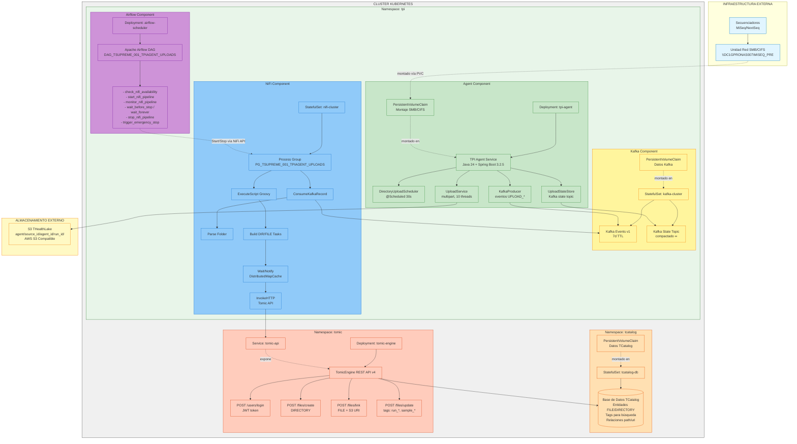
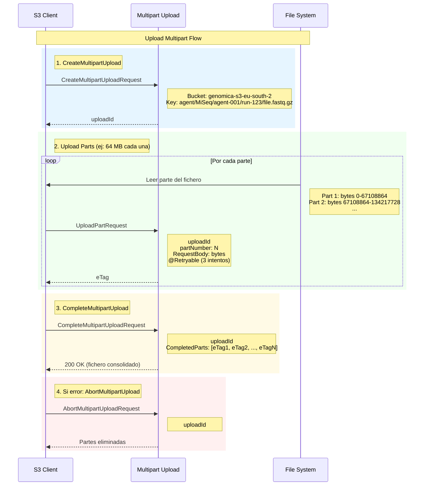

# Subida de datos de secuenciación

<!-- TOC -->
* [Subida de datos de secuenciación](#subida-de-datos-de-secuenciación)
  * [Arquitectura General](#arquitectura-general)
    * [Stack Tecnológico Completo](#stack-tecnológico-completo)
    * [Diagrama de Despliegue](#diagrama-de-despliegue)
  * [PARTE A: Diseño TPI Agent Service (UC-DS-001)](#parte-a-diseño-tpi-agent-service-uc-ds-001)
    * [Arquitectura del Servicio](#arquitectura-del-servicio)
    * [Componentes Principales](#componentes-principales)
    * [Upload Multipart a S3](#upload-multipart-a-s3)
    * [Sistema de Eventos Kafka](#sistema-de-eventos-kafka)
  * [PARTE B: Pipeline de Catalogación (UC-DS-002)](#parte-b-pipeline-de-catalogación-uc-ds-002)
    * [Arquitectura DAG Airflow](#arquitectura-dag-airflow)
    * [Pipeline de catalogación de ficheros en THealthLake](#pipeline-de-catalogación-de-ficheros-en-thealthlake)
    * [Entornos y parametrización](#entornos-y-parametrización)
    * [Contrato de datos (entrada)](#contrato-de-datos-entrada)
    * [Contrato de APIs (TomicEngine)](#contrato-de-apis-tomicengine)
    * [Requisitos funcionales (RF)](#requisitos-funcionales-rf)
    * [Requisitos no funcionales (RNF)](#requisitos-no-funcionales-rnf)
    * [Diseño NiFi (alto nivel)](#diseño-nifi-alto-nivel)
    * [Flow detallado (procesadores y relaciones)](#flow-detallado-procesadores-y-relaciones)
    * [Subflow EnsureToken (mínimos logins)](#subflow-ensuretoken-mínimos-logins)
    * [Scripts Groovy (listos para ExecuteScript)](#scripts-groovy-listos-para-executescript)
  * [Criterios de aceptación (CA)](#criterios-de-aceptación-ca)
  * [Puntos que deben quedar confirmados](#puntos-que-deben-quedar-confirmados-si-aplica-con-supuestos-por-defecto)
<!-- TOC -->

## Arquitectura General

### Stack Tecnológico Completo

| Componente | Tecnología | Versión | Responsabilidad | Despliegue |
|------------|-----------|---------|-----------------|------------|
| **TPI Agent** | Spring Boot + Java | 3.2.5 + Java 24 | Monitorización, upload S3, eventos | K8s namespace: `tpi` |
| **S3 SDK** | AWS SDK for Java | 2.25.60 | Multipart upload, reintentos | Integrado en TPI Agent |
| **Mensajería** | Apache Kafka | 3.x | Bus de eventos y estado | K8s namespace: `tpi` |
| **Orquestador** | Apache Airflow | 2.x / 3.x | Gestión ciclo vida NiFi | K8s namespace: `tpi` |
| **Pipeline ETL** | Apache NiFi | 1.27.0 | Consumo Kafka, catalogación | K8s namespace: `tpi` |
| **Catálogo** | TomicEngine | REST API v4 | Metadatos ficheros/dirs | K8s namespace: `tomic` |
| **Base de Datos** | TCatalog | - | Persistencia metadatos | K8s namespace: `tcatalog` |
| **Almacenamiento** | AWS S3 Compatible | - | Landing zone `agent/` | Externo |

### Diagrama de Despliegue



---

## PARTE A: Diseño TPI Agent Service (UC-DS-001)

### Arquitectura del Servicio

#### Estructura del Proyecto Maven

```
tpi-agent-service/
├── pom.xml                                   # Spring Boot 3.2.5, Java 24
├── src/main/java/
│   └── es/tsystems/genomics/tpiagent/
│       ├── Application.java                  # @SpringBootApplication
│       │
│       ├── config/
│       │   ├── AgentUploadProperties.java    # @ConfigurationProperties("agent.upload")
│       │   ├── StorageConfigurationProperties.java
│       │   ├── StorageBackendProperties.java
│       │   ├── S3ClientFactory.java          # Bean factory por backend
│       │   ├── RetryConfig.java              # @EnableRetry + @Retryable
│       │   └── KafkaProducerConfig.java      # Configuración Kafka
│       │
│       ├── model/
│       │   ├── UploadEvent.java              # Generado desde UploadEvent.avsc
│       │   ├── Folder.java                   # Modelo recursivo
│       │   ├── FileRef.java
│       │   ├── Source.java
│       │   ├── UploadState.java              # Estado para topic compactado
│       │   └── UploadStatus.java             # Enum: STARTED, IN_PROGRESS, etc.
│       │
│       ├── service/
│       │   ├── DirectoryUploadScheduler.java # @Scheduled scanner
│       │   ├── UploadService.java            # Core: multipart + eventos
│       │   └── UploadStateStore.java         # Interface con Kafka state topic
│       │
│       └── util/
│           └── S3PathBuilder.java            # Helper para construir S3 keys
│
├── src/main/resources/
│   ├── application.yml                        # Configuración principal
│   ├── application-dev.yml                    # Override DEV
│   ├── application-pre.yml                    # Override PRE
│   ├── application-pro.yml                    # Override PRO
│   └── avro/
│       ├── UploadEvent.avsc                   # Esquema Avro
│       └── Folder.avsc
│
└── installer/                                 # Scripts de despliegue (K8s manifests, ConfigMaps)
    ├── k8s-dev.yaml
    ├── k8s-pre.yaml
    └── k8s-pro.yaml
```

#### Clase Principal: Application.java

```java
@SpringBootApplication
@EnableScheduling
@EnableRetry
@EnableKafka
public class Application {
    
    public static void main(String[] args) {
        SpringApplication.run(Application.class, args);
    }
    
    @Bean
    public CommandLineRunner startupRunner(UploadStateStore stateStore) {
        return args -> {
            log.info("TPI Agent Service starting...");
            stateStore.initialize(); // Recuperar uploads IN_PROGRESS
            log.info("Recovered {} upload(s) from state topic", 
                     stateStore.getRecoveredCount());
        };
    }
}
```

---

### Componentes Principales

#### DirectoryUploadScheduler

**Responsabilidad**: Escanear periódicamente el directorio configurado, detectar runs completos y delegarlos a `UploadService`.

```java
@Service
@Slf4j
public class DirectoryUploadScheduler {
    
    @Autowired
    private UploadService uploadService;
    
    @Autowired
    private UploadStateStore stateStore;
    
    @Autowired
    private AgentUploadProperties properties;
    
    private final Set<String> processedRuns = ConcurrentHashMap.newKeySet();
    
    /**
     * Escanea el directorio source cada X ms (configurable).
     * Default: 30000 ms (30 segundos)
     */
    @Scheduled(fixedDelayString = "${agent.upload.scan-interval-ms:30000}")
    public void scanAndUpload() {
        Path sourceDir = Paths.get(properties.getSourceDirectory());
        
        if (!Files.isDirectory(sourceDir)) {
            log.warn("Configured source directory {} is not a directory", sourceDir);
            return;
        }
        
        try (Stream<Path> entries = Files.list(sourceDir)) {
            List<Path> candidateRuns = entries
                .filter(Files::isDirectory)
                .filter(this::isRunComplete)        // Tiene RunCompletionStatus.xml
                .filter(this::notAlreadyProcessing)  // No hay upload activo
                .collect(Collectors.toList());
            
            if (!candidateRuns.isEmpty()) {
                log.info("Scan found {} completed run(s)", candidateRuns.size());
                candidateRuns.forEach(this::processRun);
            }
        } catch (IOException e) {
            log.error("Error scanning source directory", e);
        }
    }
    
    private boolean isRunComplete(Path runDir) {
        // Buscar RunCompletionStatus.xml en raíz o subcarpetas
        try {
            return Files.walk(runDir, 2) // Máximo 2 niveles de profundidad
                .anyMatch(p -> p.getFileName().toString()
                                 .equals("RunCompletionStatus.xml"));
        } catch (IOException e) {
            log.warn("Cannot check completion for {}", runDir, e);
            return false;
        }
    }
    
    private boolean notAlreadyProcessing(Path runDir) {
        String runId = runDir.getFileName().toString();
        return !stateStore.hasActiveUpload(runId) 
            && !processedRuns.contains(runId);
    }
    
    private void processRun(Path runDir) {
        String runId = runDir.getFileName().toString();
        processedRuns.add(runId);
        
        try {
            // Mover a zona de trabajo
            Path workDir = moveToWorkArea(runDir);
            
            // Delegar upload
            uploadService.uploadRun(workDir, runId);
            
        } catch (Exception e) {
            log.error("Failed to process run {}", runId, e);
            processedRuns.remove(runId); // Permitir reintento en siguiente escaneo
        }
    }
    
    private Path moveToWorkArea(Path runDir) throws IOException {
        String runId = runDir.getFileName().toString();
        Path workDir = Paths.get(properties.getSourceDirectory(), 
                                 properties.getAgentId(), "source", runId);
        Files.createDirectories(workDir.getParent());
        Files.move(runDir, workDir, StandardCopyOption.ATOMIC_MOVE);
        log.info("Moved run to work area: {}", workDir);
        return workDir;
    }
}
```

---

#### UploadService

**Responsabilidad**: Upload multipart paralelo a S3, publicación de eventos Kafka, gestión de estado.

```java
@Service
@Slf4j
public class UploadService {
    
    @Autowired
    private S3Client s3Client;
    
    @Autowired
    private KafkaTemplate<String, UploadEvent> kafkaTemplate;
    
    @Autowired
    private UploadStateStore stateStore;
    
    @Autowired
    private AgentUploadProperties properties;
    
    private final ExecutorService uploadExecutor = Executors.newFixedThreadPool(
        Integer.parseInt(System.getenv().getOrDefault("AGENT_CONCURRENT_UPLOADS", "10"))
    );
    
    /**
     * Upload completo de un run (directorio recursivo).
     */
    public void uploadRun(Path runDir, String runId) {
        String uploadId = UUID.randomUUID().toString();
        String agentId = properties.getAgentId();
        
        try {
            // 1. Listar todos los ficheros recursivamente
            List<FileToUpload> files = listFilesRecursively(runDir, runId);
            long totalBytes = files.stream().mapToLong(FileToUpload::getSize).sum();
            
            log.info("[{}] Starting upload: {} files, {} bytes", 
                     uploadId, files.size(), totalBytes);
            
            // 2. Construir modelo Folder recursivo
            Folder folder = buildFolderModel(runDir, runId, files);
            
            // 3. Publicar UPLOAD_STARTED
            publishEvent(UploadEvent.newBuilder()
                .setEventType("UPLOAD_STARTED")
                .setUploadId(uploadId)
                .setAgentId(agentId)
                .setRunId(runId)
                .setS3Bucket(properties.getS3Bucket())
                .setS3Key(buildS3BaseKey(agentId, runId))
                .setBytesTotal(totalBytes)
                .setFolder(folder)  // ← Catálogo completo (~10 MB)
                .setOccurredAt((double) System.currentTimeMillis())
                .build());
            
            // 4. Persistir estado IN_PROGRESS
            stateStore.saveState(uploadId, UploadState.builder()
                .uploadId(uploadId)
                .runId(runId)
                .status(UploadStatus.IN_PROGRESS)
                .startedAt(Instant.now())
                .totalFiles(files.size())
                .totalBytes(totalBytes)
                .build());
            
            // 5. Upload paralelo de ficheros
            AtomicLong bytesUploaded = new AtomicLong(0);
            AtomicInteger filesCompleted = new AtomicInteger(0);
            
            List<CompletableFuture<Void>> futures = files.stream()
                .filter(f -> !f.getName().equals("RunCompletionStatus.xml")) // Ignorar
                .map(file -> CompletableFuture.runAsync(() -> {
                    uploadFile(file, uploadId, agentId, runId);
                    
                    long uploaded = bytesUploaded.addAndGet(file.getSize());
                    int completed = filesCompleted.incrementAndGet();
                    
                    // Publicar UPLOAD_PROGRESS (ligero, sin Folder)
                    publishProgressEvent(uploadId, agentId, runId, file, 
                                       uploaded, totalBytes, completed, files.size());
                }, uploadExecutor))
                .collect(Collectors.toList());
            
            // 6. Esperar a que todos los ficheros terminen
            CompletableFuture.allOf(futures.toArray(new CompletableFuture[0])).join();
            
            // 7. Publicar UPLOAD_COMPLETED
            publishEvent(UploadEvent.newBuilder()
                .setEventType("UPLOAD_COMPLETED")
                .setUploadId(uploadId)
                .setAgentId(agentId)
                .setRunId(runId)
                .setBytesTotal(totalBytes)
                .setBytesUploaded(totalBytes)
                .setProgressPercentage(100.0)
                .setFolder(folder)  // ← Catálogo completo actualizado
                .setOccurredAt((double) System.currentTimeMillis())
                .build());
            
            // 8. Mover a completed/
            moveToCompleted(runDir, runId);
            
            // 9. Actualizar estado
            stateStore.markCompleted(uploadId);
            
            log.info("[{}] Upload completed successfully", uploadId);
            
        } catch (Exception e) {
            log.error("[{}] Upload failed", uploadId, e);
            handleUploadFailure(runDir, runId, uploadId, e);
        }
    }
    
    /**
     * Upload individual de un fichero con estrategia single-part o multipart.
     */
    @Retryable(
        value = {SdkClientException.class, S3Exception.class},
        maxAttempts = 3,
        backoff = @Backoff(delay = 1000, multiplier = 2, maxDelay = 8000)
    )
    private void uploadFile(FileToUpload file, String uploadId, 
                           String agentId, String runId) {
        String s3Key = buildS3Key(agentId, runId, file.getRelativePath());
        
        try {
            if (file.getSize() == 0) {
                // Caso especial: archivos vacíos (usar PutObject simple)
                log.debug("File {} is empty (0 bytes), using single-part upload", 
                         file.getName());
                s3Client.putObject(PutObjectRequest.builder()
                    .bucket(properties.getS3Bucket())
                    .key(s3Key)
                    .build(), RequestBody.fromBytes(new byte[0]));
                
            } else if (file.getSize() < properties.getPartSizeMiB() * 1024L * 1024L) {
                // Single-part upload
                s3Client.putObject(PutObjectRequest.builder()
                    .bucket(properties.getS3Bucket())
                    .key(s3Key)
                    .build(), RequestBody.fromFile(file.getPath()));
                
            } else {
                // Multipart upload
                uploadFileMultipart(file, s3Key);
            }
            
            log.info("✓ Uploaded file ({} bytes): {}", file.getSize(), file.getName());
            
        } catch (Exception e) {
            log.error("Failed to upload file: {}", file.getName(), e);
            throw new RuntimeException("Upload failed for " + file.getName(), e);
        }
    }
    
    private void uploadFileMultipart(FileToUpload file, String s3Key) {
        // Crear multipart upload
        CreateMultipartUploadResponse initResponse = s3Client.createMultipartUpload(
            CreateMultipartUploadRequest.builder()
                .bucket(properties.getS3Bucket())
                .key(s3Key)
                .build());
        
        String s3UploadId = initResponse.uploadId();
        List<CompletedPart> completedParts = new ArrayList<>();
        
        try {
            long partSize = properties.getPartSizeMiB() * 1024L * 1024L;
            long fileSize = file.getSize();
            int partCount = (int) Math.ceil((double) fileSize / partSize);
            
            for (int partNumber = 1; partNumber <= partCount; partNumber++) {
                long startByte = (partNumber - 1) * partSize;
                long endByte = Math.min(startByte + partSize, fileSize);
                long currentPartSize = endByte - startByte;
                
                // Upload part con reintentos automáticos (@Retryable)
                UploadPartResponse partResponse = uploadPart(file, s3Key, s3UploadId, 
                                                            partNumber, startByte, 
                                                            currentPartSize);
                
                completedParts.add(CompletedPart.builder()
                    .partNumber(partNumber)
                    .eTag(partResponse.eTag())
                    .build());
            }
            
            // Completar multipart upload
            s3Client.completeMultipartUpload(CompleteMultipartUploadRequest.builder()
                .bucket(properties.getS3Bucket())
                .key(s3Key)
                .uploadId(s3UploadId)
                .multipartUpload(CompletedMultipartUpload.builder()
                    .parts(completedParts)
                    .build())
                .build());
            
        } catch (Exception e) {
            // Abortar multipart upload en caso de error
            s3Client.abortMultipartUpload(AbortMultipartUploadRequest.builder()
                .bucket(properties.getS3Bucket())
                .key(s3Key)
                .uploadId(s3UploadId)
                .build());
            throw e;
        }
    }
    
    @Retryable(
        value = {SdkClientException.class, S3Exception.class},
        maxAttempts = 3,
        backoff = @Backoff(delay = 1000, multiplier = 2, random = true)
    )
    private UploadPartResponse uploadPart(FileToUpload file, String s3Key, 
                                         String s3UploadId, int partNumber, 
                                         long startByte, long partSize) {
        try (RandomAccessFile raf = new RandomAccessFile(file.getPath().toFile(), "r")) {
            raf.seek(startByte);
            byte[] buffer = new byte[(int) partSize];
            int bytesRead = raf.read(buffer);
            
            return s3Client.uploadPart(UploadPartRequest.builder()
                .bucket(properties.getS3Bucket())
                .key(s3Key)
                .uploadId(s3UploadId)
                .partNumber(partNumber)
                .build(), RequestBody.fromBytes(buffer, 0, bytesRead));
        } catch (IOException e) {
            throw new RuntimeException("Failed to read file part", e);
        }
    }
    
    private void publishEvent(UploadEvent event) {
        String topic = properties.getEventsTopic();
        kafkaTemplate.send(topic, event.getUploadId(), event);
    }
    
    private void publishProgressEvent(String uploadId, String agentId, String runId,
                                     FileToUpload file, long bytesUploaded, 
                                     long bytesTotal, int filesCompleted, int filesTotal) {
        // Evento ligero SIN Folder (~500 bytes)
        publishEvent(UploadEvent.newBuilder()
            .setEventType("UPLOAD_PROGRESS")
            .setUploadId(uploadId)
            .setAgentId(agentId)
            .setRunId(runId)
            .setItemRelativePath(file.getRelativePath())
            .setBytesUploaded(bytesUploaded)
            .setBytesTotal(bytesTotal)
            .setProgressPercentage((double) bytesUploaded / bytesTotal * 100)
            .setOccurredAt((double) System.currentTimeMillis())
            .build());
    }
    
    // ...otros métodos: buildFolderModel, moveToCompleted, handleUploadFailure...
}
```

---

### Upload Multipart a S3

#### Estrategias de Upload

| Condición Fichero | Estrategia | Método S3 |
|-------------------|-----------|----------|
| **0 bytes** | Single-part especial | `PutObject` con `RequestBody.fromBytes(new byte[0])` |
| **< Part Size** (default 64 MB) | Single-part | `PutObject` con `RequestBody.fromFile()` |
| **≥ Part Size** | Multipart | `CreateMultipartUpload` + N× `UploadPart` + `CompleteMultipartUpload` |

#### Diagrama de Flujo Multipart



#### Optimizaciones

**Lectura de partes en memoria**:
```java
try (RandomAccessFile raf = new RandomAccessFile(file.getPath().toFile(), "r")) {
    raf.seek(startByte);
    byte[] buffer = new byte[(int) partSize];
    int bytesRead = raf.read(buffer);
    
    return s3Client.uploadPart(..., 
        RequestBody.fromBytes(buffer, 0, bytesRead));
}
```

**Ventajas**:
- No se copia fichero completo a memoria
- Lectura secuencial por partes
- Buffer reutilizable por thread

**Paralelización**:
- 10 hilos concurrentes (configurable)
- Pool compartido: `Executors.newFixedThreadPool(10)`
- Cada fichero se procesa en un thread independiente

---

### Sistema de Eventos Kafka

#### Topics Configurados

##### 1. Topic de Eventos (events.v1)

**Nombre**: `tpi.uploads.{agent-id}.events.v1`  
Ejemplo: `tpi.uploads.tsupreme-agent-001.events.v1`

**Configuración**:
```properties
retention.ms = 604800000        # 7 días
cleanup.policy = delete
compression.type = gzip
```

**Eventos publicados**:

| Evento | Cuándo | Incluye Folder | Tamaño Típico |
|--------|--------|----------------|---------------|
| `UPLOAD_STARTED` | Al iniciar run | ✅ Sí (completo) | ~10 MB |
| `UPLOAD_PROGRESS` | Por cada fichero completado | ❌ No | ~500 bytes |
| `UPLOAD_COMPLETED` | Al finalizar run | ✅ Sí (actualizado) | ~10 MB |
| `UPLOAD_FAILED` | Si falla tras reintentos | ✅ Sí | ~10 MB |

##### 2. Topic de Estado (state.v1)

**Nombre**: `tpi.uploads.{agent-id}.state.v1`  
Ejemplo: `tpi.uploads.tsupreme-agent-001.state.v1`

**Configuración**:
```properties
cleanup.policy = compact        # ← Clave: compactación
retention.ms = -1               # Infinito
min.compaction.lag.ms = 60000
delete.retention.ms = 86400000  # 1 día
```

**Uso**: Base de datos distribuida para reanudación de uploads.

**Key**: `uploadId` (String)  
**Value**: `UploadState` (JSON serializado)

```json
{
  "uploadId": "550e8400-e29b-41d4-a716-446655440000",
  "runId": "M05089_155_000000000-CT8YM",
  "status": "IN_PROGRESS",
  "startedAt": "2026-02-05T10:00:00Z",
  "totalFiles": 59541,
  "totalBytes": 21474836480,
  "filesCompleted": 12345,
  "bytesUploaded": 5368709120,
  "lastUpdatedAt": "2026-02-05T10:30:00Z"
}
```

**Compactación**: Kafka mantiene solo el último valor por `uploadId`, eliminando snapshots antiguos.

#### Producer Configuration

```yaml
spring:
  kafka:
    bootstrap-servers: ${KAFKA_BOOTSTRAP_SERVERS:kafka-tls-kafka-bootstrap:9092}
    producer:
      key-serializer: org.apache.kafka.common.serialization.StringSerializer
      value-serializer: io.confluent.kafka.serializers.KafkaAvroSerializer
      acks: all                     # Garantizar escritura en todas las réplicas
      retries: 3
      enable.idempotence: true      # Evitar duplicados en retries
      compression.type: gzip
      batch.size: 16384
      linger.ms: 10
      buffer.memory: 104857600      # 100 MB (para subida paralela)
```

---

### Reintentos y Reanudación

#### Sistema de Reintentos (Spring Retry)

**Configuración**:
```java
@Configuration
@EnableRetry
public class RetryConfig {
    
    @Bean
    public RetryTemplate retryTemplate() {
        RetryTemplate template = new RetryTemplate();
        
        // Política: 3 intentos con backoff exponencial
        ExponentialBackOffPolicy backOffPolicy = new ExponentialBackOffPolicy();
        backOffPolicy.setInitialInterval(1000);   // 1s
        backOffPolicy.setMultiplier(2.0);         // 1s → 2s → 4s
        backOffPolicy.setMaxInterval(8000);       // Máximo 8s
        
        SimpleRetryPolicy retryPolicy = new SimpleRetryPolicy();
        retryPolicy.setMaxAttempts(3);
        
        template.setBackOffPolicy(backOffPolicy);
        template.setRetryPolicy(retryPolicy);
        
        return template;
    }
}
```

**Uso con @Retryable**:
```java
@Retryable(
    value = {SdkClientException.class, S3Exception.class},
    maxAttempts = 3,
    backoff = @Backoff(delay = 1000, multiplier = 2, random = true)
)
private UploadPartResponse uploadPart(...) {
    // Lógica que puede fallar
}
```

**Excepciones reintentables**:
- `SdkClientException`: Errores de red, timeouts
- `S3Exception` con códigos 5xx, 429
- `IOException` en lectura de ficheros

**Excepciones NO reintentables**:
- `S3Exception` con códigos 400, 403, 404
- `IllegalArgumentException`: Configuración incorrecta
- `OutOfMemoryError`

#### Reanudación tras Reinicio

**UploadStateStore**:
```java
@Service
@Slf4j
public class UploadStateStore {
    
    @Autowired
    private KafkaTemplate<String, String> stateTemplate;
    
    @Autowired
    private AgentUploadProperties properties;
    
    private final Map<String, UploadState> cache = new ConcurrentHashMap<>();
    
    /**
     * Inicializar: recuperar uploads IN_PROGRESS desde topic compactado.
     */
    public void initialize() {
        String stateTopic = properties.getStateTopic();
        
        // Consumir todo el topic compactado para reconstruir estado
        try (KafkaConsumer<String, String> consumer = createConsumer(stateTopic)) {
            consumer.subscribe(Collections.singletonList(stateTopic));
            consumer.poll(Duration.ofSeconds(30))
                .forEach(record -> {
                    UploadState state = deserializeState(record.value());
                    if (state.getStatus() == UploadStatus.IN_PROGRESS) {
                        cache.put(state.getUploadId(), state);
                    }
                });
        }
        
        log.info("UploadStateStore is ready. Recovered {} upload(s) from state topic",
                 cache.size());
        
        // Evaluar si reanudar o abandonar
        cache.values().forEach(this::evaluateResumption);
    }
    
    private void evaluateResumption(UploadState state) {
        Duration age = Duration.between(state.getStartedAt(), Instant.now());
        long maxAgeHours = properties.getResumptionMaxAgeHours();
        
        if (age.toHours() > maxAgeHours) {
            log.warn("[{}] Upload too old ({} hours), marking as ABANDONED", 
                     state.getUploadId(), age.toHours());
            markAbandoned(state.getUploadId());
            
        } else {
            Path runDir = Paths.get(properties.getSourceDirectory(), 
                                   properties.getAgentId(), "source", state.getRunId());
            if (Files.exists(runDir)) {
                log.info("[{}] Resuming upload (age: {} hours)", 
                         state.getUploadId(), age.toHours());
                // El scheduler lo volverá a procesar en siguiente escaneo
            } else {
                log.warn("[{}] Run directory no longer exists, aborting", 
                         state.getUploadId());
                markAborted(state.getUploadId());
            }
        }
    }
    
    public void saveState(String uploadId, UploadState state) {
        cache.put(uploadId, state);
        stateTemplate.send(properties.getStateTopic(), uploadId, 
                          serializeState(state));
    }
    
    public boolean hasActiveUpload(String runId) {
        return cache.values().stream()
            .anyMatch(s -> s.getRunId().equals(runId) 
                        && s.getStatus() == UploadStatus.IN_PROGRESS);
    }
    
    // ...otros métodos: markCompleted, markFailed, markAborted, markAbandoned...
}
```

**Flujo de Reanudación**:
```
Reinicio del agente
       ↓
initialize() en UploadStateStore
       ↓
Consumir topic compactado state.v1
       ↓
Por cada upload IN_PROGRESS:
   ├─ ¿Edad < 24h?
   │   ├─ Sí: ¿Directorio existe?
   │   │   ├─ Sí: Reanudar (scheduler lo detectará)
   │   │   └─ No: Marcar ABORTED
   │   └─ No: Marcar ABANDONED
   └─ ...
```

---

### Configuración TPI Agent

#### application.yml (Base)

```yaml
agent:
  upload:
    agent-id: ${AGENT_ID:tpi-agent-local}
    source-directory: ${AGENT_SOURCE_DIR:/data/uploads}
    storage-backend-id: ${AGENT_STORAGE_BACKEND:DEFAULT}
    part-size-mi-b: ${AGENT_PART_SIZE_MB:64}
    scan-interval-ms: ${AGENT_SCAN_INTERVAL_MS:30000}
    concurrent-uploads: ${AGENT_CONCURRENT_UPLOADS:10}
    max-retries: ${AGENT_MAX_RETRIES:3}
    retry-backoff-ms: ${AGENT_RETRY_BACKOFF_MS:1000}
    max-retry-backoff-ms: ${AGENT_MAX_RETRY_BACKOFF_MS:30000}
    resumption-max-age-hours: ${AGENT_RESUMPTION_MAX_AGE_HOURS:24}
    events-topic: ${AGENT_EVENTS_TOPIC:tpi.uploads.${agent.upload.agent-id}.events.v1}
    state-topic: tpi.uploads.${agent.upload.agent-id}.state.v1

storage:
  backends:
    - id: DEFAULT
      type: AWS
      bucket: ${AWS_S3_BUCKET:genomica-s3-eu-south-2}
      basePath: ${AWS_S3_BASE_PATH:agent/}
      region: ${AWS_REGION:eu-south-2}
      endpoint: ${AWS_S3_ENDPOINT:}
      pathStyleAccess: false

spring:
  kafka:
    bootstrap-servers: ${KAFKA_BOOTSTRAP_SERVERS:localhost:9094}
    producer:
      key-serializer: org.apache.kafka.common.serialization.StringSerializer
      value-serializer: io.confluent.kafka.serializers.KafkaAvroSerializer
      acks: all
      enable.idempotence: true
      buffer.memory: ${KAFKA_BUFFER_MEMORY:104857600}  # 100MB

aws:
  accessKeyId: ${AWS_ACCESS_KEY_ID}
  secretAccessKey: ${AWS_SECRET_ACCESS_KEY}
```

#### application-pre.yml (Override PRE)

```yaml
agent:
  upload:
    agent-id: tsupreme-agent-001
    source-directory: \\\\Dc1gpronas007\\MISEQ_PRE

storage:
  backends:
    - id: DEFAULT
      bucket: genomica-s3-eu-south-2
      basePath: agent/
      region: eu-south-2

spring:
  kafka:
    bootstrap-servers: kafka-tls-kafka-bootstrap:9092
```

#### Variables de Entorno (Kubernetes Deployment)

```yaml
# deployment-tpi-agent-pre.yaml
apiVersion: apps/v1
kind: Deployment
metadata:
  name: tpi-agent
  namespace: tpi
spec:
  replicas: 1
  selector:
    matchLabels:
      app: tpi-agent
  template:
    metadata:
      labels:
        app: tpi-agent
    spec:
      containers:
      - name: tpi-agent
        image: registry.internal/tpi-agent-service:2026.05.03
        env:
        - name: SPRING_PROFILES_ACTIVE
          value: "pre"
        - name: AGENT_ID
          value: "tsupreme-agent-001"
        - name: AWS_S3_BUCKET
          value: "genomica-s3-eu-south-2"
        - name: AWS_ACCESS_KEY_ID
          valueFrom:
            secretKeyRef:
              name: aws-credentials
              key: access-key-id
        - name: AWS_SECRET_ACCESS_KEY
          valueFrom:
            secretKeyRef:
              name: aws-credentials
              key: secret-access-key
        - name: KAFKA_BOOTSTRAP_SERVERS
          value: "kafka-tls-kafka-bootstrap.tpi.svc.cluster.local:9092"
        volumeMounts:
        - name: source-data
          mountPath: /mnt/source
          readOnly: true
      volumes:
      - name: source-data
        persistentVolumeClaim:
          claimName: miseq-pre-pvc
          readOnly: true
```

---

## PARTE B: Pipeline de Catalogación (UC-DS-002)

### Arquitectura DAG Airflow

#### Estructura del DAG

```python
# dags/DAG_TSUPREME_001_TPIAGENT_UPLOADS.py

from airflow import DAG
from airflow.operators.python import PythonOperator
from airflow.operators.trigger_dagrun import TriggerDagRunOperator
from airflow.sensors.time_delta import TimeDeltaSensor
from airflow.utils.trigger_rule import TriggerRule
from airflow.models import Variable
from datetime import datetime, timedelta
import requests

default_args = {
    'owner': 'tsupreme',
    'depends_on_past': False,
    'email_on_failure': False,
    'email_on_retry': False,
    'retries': 1,
    'retry_delay': timedelta(minutes=5),
}

dag = DAG(
    'DAG_TSUPREME_001_TPIAGENT_UPLOADS',
    default_args=default_args,
    description='Orquestación de pipeline NiFi para catalogación de uploads',
    schedule=None,  # Manual trigger
    start_date=datetime(2026, 2, 1),
    catchup=False,
    on_success_callback=trigger_stop_dag_callback,  # Safety net capa 3
    on_failure_callback=trigger_stop_dag_callback,  # Safety net capa 3
)

# Task 1: Verificar disponibilidad de NiFi
check_nifi = PythonOperator(
    task_id='check_nifi_availability',
    python_callable=check_nifi_availability_task,
    dag=dag,
)

# Task 2: Iniciar Process Groups de NiFi
start_nifi = PythonOperator(
    task_id='start_nifi_pipeline',
    python_callable=start_nifi_processors_task,
    dag=dag,
)

# Task 3: Monitorear actividad (100s, 10 intentos)
monitor_nifi = PythonOperator(
    task_id='monitor_nifi_pipeline',
    python_callable=monitor_nifi_pipeline_task,
    dag=dag,
)

# Task 4: Esperar timeout o infinito
nifi_stop_after_minutes = Variable.get('nifi_stop_after_minutes', default_var=-1)
stop_after_int = int(nifi_stop_after_minutes)

if stop_after_int > 0:
    wait_task = StopNiFiOnKillTimeDeltaSensor(
        task_id='wait_before_stop',
        delta=timedelta(minutes=stop_after_int),
        mode='reschedule',  # No bloquear worker
        dag=dag,
    )
else:
    # Modo infinito: esperar 365 días (parada manual)
    wait_task = StopNiFiOnKillTimeDeltaSensor(
        task_id='wait_forever',
        delta=timedelta(days=365),
        mode='reschedule',
        dag=dag,
    )

# Task 5: Detener Process Groups (capa 1)
stop_nifi = PythonOperator(
    task_id='stop_nifi_pipeline',
    python_callable=stop_nifi_processors_task_wrapper,
    trigger_rule=TriggerRule.ALL_DONE,  # Se ejecuta SIEMPRE
    dag=dag,
)

# Task 6: Trigger DAG de emergencia (capa 2)
trigger_emergency = TriggerDagRunOperator(
    task_id='trigger_emergency_stop_dag',
    trigger_dag_id='STOP_NIFI_EMERGENCY',
    trigger_rule=TriggerRule.ALL_DONE,  # Se ejecuta SIEMPRE
    wait_for_completion=True,
    dag=dag,
)

# Flujo
check_nifi >> start_nifi >> monitor_nifi >> wait_task >> stop_nifi >> trigger_emergency
```

#### Sensor con on_kill() (capa 4)

```python
class StopNiFiOnKillTimeDeltaSensor(TimeDeltaSensor):
    """
    Sensor con safety net: si se cancela, detiene NiFi antes de terminar.
    """
    
    def on_kill(self) -> None:
        """
        Callback ejecutado cuando la task es cancelada por el usuario.
        Capa 4 de seguridad.
        """
        log.warning(f"[NiFi][on_kill] Task {self.task_id} KILLED. Stopping NiFi...")
        stop_nifi_processors(
            best_effort=True, 
            source=f'sensor_on_kill:{self.task_id}'
        )
        log.warning(f"[NiFi][on_kill] NiFi stop requested from on_kill()")
```

#### Callbacks del DAG (capa 3)

```python
def trigger_stop_dag_callback(context):
    """
    Callback ejecutado cuando el DAG termina (success/failure/manual mark).
    Capa 3 de seguridad.
    """
    log.warning("[DAG][callback] Triggering STOP_NIFI_EMERGENCY as safety net...")
    
    try:
        from airflow.api.common.trigger_dag import trigger_dag
        trigger_dag(
            dag_id='STOP_NIFI_EMERGENCY',
            run_id=f"emergency_stop_{context['execution_date'].isoformat()}",
            conf={},
            execution_date=None,
            replace_microseconds=False,
        )
        log.warning("[DAG][callback] ✓ Successfully triggered STOP_NIFI_EMERGENCY")
    except Exception as e:
        log.error("[DAG][callback] Failed to trigger emergency stop", exc_info=e)
```

---

### Pipeline de catalogación de ficheros en THealthLake (NiFi)

### Contexto y objetivo

Implementar **únicamente en Apache NiFi 1.27.0** la pipeline **`Agent_File_Catalog_Pipeline`** para **catalogar carpetas y ficheros** en **TomicEngine (TCatalog)** a partir de eventos Kafka Avro emitidos al completar una subida.

**Trigger**: evento en Kafka topic
`{kafka.topic} = tpi.uploads.tpi-tcatalog-pre.events.v1`
Broker: `{kafka.bootstrap} = kafka-tls-kafka-bootstrap.tpi.svc.cluster.local:9092` (sin seguridad, **PLAINTEXT**)
Consumer Group: `{kafka.group} = nifi-consumer-group`

**Entrada**: mensaje Avro con esquema `UploadEvent.avsc` (adjunto).
**Acciones por evento**:

1. **Login** en Tomic para obtener **Bearer token**, reutilizándolo **las menos veces posibles** (cache + refresh al expirar).
2. **Crear entidad directorio** del **run** y **toda la jerarquía de carpetas** en catálogo (endpoint `files/create`, `type=DIRECTORY`).
3. **Por cada fichero** del árbol de carpetas:

    * extraer `sampleId` del nombre,
    * crear entidad de fichero por **link** (endpoint `files/link`, `type=FILE` implícito),
    * añadir **tags** vía `files/update` (`tagsAction=ADD`):

        * `sample_{{sampleId}}` (si aplica)
        * `run_{{runId}}`

**Rutas de catálogo**: deben ser **exactamente las mismas** que en THealthLake/S3:
`agent/{source_id}/{agent_id}/{run_id}/.../{file_name}`
Se deben crear carpetas intermedias si no existen.

> Nota: `folder.folders[*]` es **recursivo** y puede afectar tanto al `path` como a la `uri`. La implementación debe recorrer el árbol y mantener el path/uri correctos.

---

### Entornos y parametrización

#### Parameter Context (recomendación)

Crear **2 Parameter Contexts** para despliegue (mismo flujo, distinta configuración):

**A) `Agent_File_Catalog_DEV`**

* `tomic.url = https://tomic.tsupreme.com/tomic`
* `tomic.study = demo@demo_health_service_grch38:clinical_cases`
* `tomic.version = v4`
* `tomic.user = demo` *(sensitive)*
* `tomic.password = Demo_P4ss` *(sensitive)*
* `tomic.organization = demo`

**B) `Agent_File_Catalog_PRE`**

* `tomic.url = https://pregenomica-app.admon-cfnavarra.es/tomic`
* `tomic.study = demo@SNSO:casos`
* `tomic.version = v4`
* `tomic.user = snso` *(sensitive)*
* `tomic.password = Snso2025_` *(sensitive)*
* `tomic.organization = demo`

Kafka:

* `kafka.bootstrap = kafka-tls-kafka-bootstrap:9092`
* `kafka.topic = tpi.uploads.tpi-tcatalog-pre.events.v1`
* `kafka.group = nifi-consumer-group`
* `kafka.max.poll.records = 50` (ajustable)
* `kafka.poll.timeout.ms = 1000` (ajustable)

Operativa:

* `token.cache.key = tomic:${tomic.url}:${tomic.user}:${tomic.organization}`
* `token.expiry.skew.seconds = 60` (margen para renovar antes de expirar)
* `http.retry.count = 5`
* `http.retry.backoff.ms = 2000`

DLQ / trazabilidad:

* `dlq.enabled = true/false`
* `dlq.kafka.topic = tpi.uploads.tpi-tcatalog.dlq.v1` (si se usa)
* `dlq.include.payload = true`

---

### Contrato de datos (entrada)

#### Esquema Avro (UploadEvent)

* Se asume que el valor Kafka está serializado como **Avro “plain”** (sin Confluent wire-format).
* El RecordReader `AvroReader` usará **Schema Text** con el contenido de `UploadEvent.avsc`. ([Apache NiFi][1])

**Schema Text (cargar en el AvroReader):**

```json
{
  "type": "record",
  "name": "UploadEvent",
  "namespace": "es.tsystems.genomics.tpiagent.upload.model",
  "doc": "Event published by agent-service upload subsystem.",
  "fields": [
    { "name": "eventType", "type": "string" },
    { "name": "uploadId", "type": "string" },
    { "name": "agentId", "type": "string" },
    { "name": "sourceId", "type": ["null","string"], "default": null },
    { "name": "runId", "type": ["null","string"], "default": null },
    { "name": "itemRelativePath", "type": ["null","string"], "default": null },
    { "name": "filePath", "type": ["null","string"], "default": null },
    { "name": "sizeBytes", "type": ["null","long"], "default": null },
    { "name": "bytesTotal", "type": ["null","long"], "default": null },
    { "name": "bytesUploaded", "type": ["null","long"], "default": null },
    { "name": "storageBackend", "type": ["null","string"], "default": null },
    { "name": "s3Bucket", "type": ["null","string"], "default": null },
    { "name": "s3Key", "type": ["null","string"], "default": null },
    { "name": "s3UploadId", "type": ["null","string"], "default": null },
    { "name": "occurredAt", "type": ["null","double"], "default": null },
    { "name": "errorCode", "type": ["null","string"], "default": null },
    { "name": "errorMessage", "type": ["null","string"], "default": null },
    { "name": "partNumber", "type": ["null","int"], "default": null },
    { "name": "partEtag", "type": ["null","string"], "default": null },
    { "name": "partsCompleted", "type": ["null","int"], "default": null },
    { "name": "partsTotal", "type": ["null","int"], "default": null },
    { "name": "progressPercentage", "type": ["null","double"], "default": null },
    { "name": "metadata", "type": ["null", { "type": "map", "values": "string" }], "default": null },
    {
      "name": "folder",
      "type": ["null",
        {
          "type": "record",
          "name": "Folder",
          "doc": "Model to catalog folders (runs) and their contents.",
          "fields": [
            { "name": "name", "type": ["null","string"], "default": null },
            { "name": "url", "type": ["null","string"], "default": null },
            {
              "name": "source",
              "type": ["null",
                { "type": "record", "name": "Source",
                  "fields": [
                    { "name": "name", "type": ["null","string"], "default": null },
                    { "name": "description", "type": ["null","string"], "default": null }
                  ]
                }
              ],
              "default": null
            },
            {
              "name": "files",
              "type": { "type": "array",
                "items": { "type": "record", "name": "FileRef",
                  "fields": [
                    { "name": "name", "type": ["null","string"], "default": null },
                    { "name": "url", "type": ["null","string"], "default": null }
                  ]
                }
              },
              "default": []
            },
            { "name": "folders", "type": { "type": "array", "items": "Folder" }, "default": [] }
          ]
        }
      ],
      "default": null
    }
  ]
}
```

---

### Contrato de APIs (TomicEngine)

#### Login (token)

`POST {tomic.url}/webservices/rest/{tomic.version}/users/login`
Body (DEV/PRE según parámetros):

```json
{ "user": "...", "password": "...", "organization": "..." }
```

Extracción de token: `responses[0].results[0].token` (según ejemplo proporcionado por Postman).
Se asume token tipo **JWT** (para extraer `exp` y cachear con caducidad).

#### Crear carpetas

`POST {tomic.url}/webservices/rest/{tomic.version}/files/create?study={tomic.study}`
Headers:

* `Authorization: Bearer {token}`
* `Content-Type: application/json`
  Body:

```json
{ "path": "agent/{sourceId}/{agentId}/{runId}/...", "type": "DIRECTORY", "tags": ["..."] }
```

#### Link de ficheros

`POST {tomic.url}/webservices/rest/{tomic.version}/files/link?study={tomic.study}`
Body:

```json
{ "path": "agent/{sourceId}/{agentId}/{runId}/.../{file}", "uri": "s3://bucket/agent/{sourceId}/{agentId}/{runId}/.../{file}" }
```

#### Update tags

`POST {tomic.url}/webservices/rest/{tomic.version}/files/update?study={tomic.study}&tagsAction=ADD&files={fileRef}`
Donde `fileRef = path` con `/` reemplazado por `:` (ej.: `agent:agentId:runId:file.ext`)
Body:

```json
{ "tags": ["sample_...", "run_..."] }
```

---

### Requisitos funcionales (RF)

**RF-1** Consumir eventos Kafka Avro del topic configurado y convertir a JSON. ([Apache NiFi][3])
**RF-2** Filtrar y procesar únicamente `eventType == "UPLOAD_COMPLETED"`.
**RF-3** Validar campos mínimos: `uploadId`, `agentId`, `runId`, `folder != null`. Si no, enviar a DLQ/failure.
**RF-4** Implementar **cache de token** para minimizar logins:

* Guardar en DistributedMapCache: `{token, exp}`.
* Reusar mientras `exp > now + token.expiry.skew.seconds`.
* Si no existe o expirado → login.
  **RF-5** Recorrer recursivamente `folder` y sus `folders[]` para construir:
* lista **deduplicada** de directorios necesarios (incluyendo `agent`, `agent/{sourceId}/{agentId}`, `agent/{sourceId}/{agentId}/{runId}`, subcarpetas).
* lista de ficheros (con `path` y `uri` basadas en S3).
  **RF-6** Crear directorios (`files/create`) **en orden padre→hijo** y tratar “already exists” como éxito.
  **RF-7** Por cada fichero:
* Derivar `path` catálogo desde S3:

    * si `FileRef.url` existe: `path = <key>` de `s3://{bucket}/{key}`.
    * si no existe: `path = {s3Key}/{relativeFolders...}/{fileName}`.
* `uri = FileRef.url` o `s3://{s3Bucket}/{path}`.
* Extraer `sampleId` (ver RF-8).
* Ejecutar `files/link`.
* Ejecutar `files/update` con tags (`run_...` y `sample_...` si aplica).
  **RF-8** Extracción `sampleId` desde nombre de fichero:
* Regla principal: si coincide `^(.+?)_S\d+_` → `sampleId = group(1)`
* fallback: si contiene `_` → `sampleId = substring antes de primer '_'`
* si no hay match → `sampleId = null` (no se añade tag sample).
  **RF-9** Tags en directorios:
* `agent` y `agent/{sourceId}/{agentId}`: sin tags.
* `agent/{sourceId}/{agentId}/{runId}`: `["run_{runId}"]`
* subcarpetas bajo run: `["run_{runId}", "sample_{sampleId}" ...]` (deduplicados; solo sampleIds presentes en su subtree).
  **RF-10** Idempotencia:
* Si ya existe directorio / fichero linkado, tratar como éxito funcional (sin romper el pipeline).
* Reintentos ante 5xx/429 y timeouts.

---

### Requisitos no funcionales (RNF)

* **RNF-1** Tolerancia a reintentos: diseño “at-least-once” (Kafka + NiFi), evitando fallos por duplicados.
* **RNF-2** Observabilidad:

    * contadores por run (dirs creados, files linkados, tags actualizados),
    * logs con `uploadId`, `agentId`, `runId`, `file path`.
* **RNF-3** Rendimiento:

    * Paralelizar ficheros tras crear directorios.
    * Backpressure configurada en conexiones a InvokeHTTP.
* **RNF-4** Seguridad:

    * credenciales en parámetros sensibles,
    * TLS validado para `{tomic.url}` (opcional `SSLContextService` si CA interna).

---

## Diseño NiFi (alto nivel)

### Controller Services

1. **AvroReader_UploadEvent**

    * Schema Access Strategy: `Use 'Schema Text' Property`
    * Schema Text: (UploadEvent.avsc de arriba) ([Apache NiFi][1])

2. **JsonRecordSetWriter_Compact**

    * Output Grouping: `Output as JSON Array` (por defecto del writer; el flujo normaliza después)

3. **DistributedMapCacheServer** (Standard)

    * Persistence Directory: recomendado (para evitar pérdida de cache tras reinicio)

4. **DistributedMapCacheClientService**

    * Conectado al server anterior

5. (Opcional) **StandardSSLContextService** para Tomic si se requiere truststore corporativo.

---

## Flow detallado (procesadores y relaciones)

> Nomenclatura: `Pxx_...` = Processor.

### Ingesta Kafka y normalización

**P01_ConsumeKafkaRecord (ConsumeKafkaRecord_2_6)**

* `Bootstrap Servers = ${kafka.bootstrap}`
* `Topic Name = ${kafka.topic}`
* `Group ID = ${kafka.group}`
* `Security Protocol = PLAINTEXT`
* `Record Reader = AvroReader_UploadEvent`
* `Record Writer = JsonRecordSetWriter_Compact` ([Apache NiFi][4])
* Auto-terminate: none

**P02_NormalizeAndExtract (ExecuteScript - Groovy)**

* Convierte JSON Array → JSON Object (si aplica)
* Extrae atributos: `eventType, uploadId, agentId, sourceId, runId, s3Bucket, s3Key`
  Relaciones: `success`, `failure`

**P03_RouteEventType (RouteOnAttribute)**

* `is_upload_completed = ${eventType:equals('UPLOAD_COMPLETED')}`
* `has_min_fields = ${uploadId:isEmpty():not():and(${agentId:isEmpty():not()}):and(${sourceId:isEmpty():not()}):and(${runId:isEmpty():not()})}`
* Ruta a `PROCESS` si ambas true, si no a `DROP/FAIL`

---

### Construcción de tareas (dirs/files) desde el árbol folder (recursivo)

**P04_BuildCatalogTasks (ExecuteScript - Groovy)**
Entrada: evento JSON (object)
Salida:

* Relación `DIR_TASK`: 1 FlowFile por directorio con content:

  ```json
  {"path":"agent/...","tags":["run_...","sample_..."]}
  ```

    * attrs: `uploadId`, `dir_count`, `file_count`
* Relación `FILE_TASK`: 1 FlowFile por fichero con attrs:

    * `tomic.file.path`
    * `tomic.file.uri`
    * `tomic.file.ref` (path con `/`→`:`)
    * `tomic.tags.json` (array JSON)
    * `uploadId`, `file_count`
* Relación `GATE`: 1 FlowFile con attrs: `uploadId`, `dir_count`, `file_count` (sin content relevante)
* Relación `failure`

**Orden y concurrencia**

* La lista de directorios debe salir ya ordenada por profundidad (padre→hijo).
* Los `DIR_TASK` deben ejecutarse en **Primary Node** con `Concurrent Tasks = 1` (para garantizar orden de creación).

---

### Gate 1: esperar a que se creen todos los directorios

**P05_WaitAllDirs (Wait)** sobre el FlowFile `GATE`

* `Release Signal Identifier = ${uploadId}`
* `Signal Counter Name = dirs_created`
* `Target Signal Count = ${dir_count}`
* `Expiration Duration = 60 min`
* `Distributed Cache Service = DistributedMapCacheClientService` ([Apache NiFi][5])

**P06_CreateDir (InvokeHTTP)** para cada `DIR_TASK`

* `HTTP Method = POST`
* `Remote URL = ${tomic.url}/webservices/rest/${tomic.version}/files/create?study=${tomic.study}`
* Headers:

    * `Authorization = Bearer ${tomic.token}`
    * `Content-Type = application/json`
* Body se construye desde content del FlowFile `DIR_TASK`:

    * Convertir a:

      ```text
      {"path":"<path>","type":"DIRECTORY","tags":${jsonPath("$.tags")}}
      ```

  (ver P06a abajo)

**P06a_BuildCreateDirBody (ReplaceText / UpdateAttribute)**

* Objetivo: envolver el JSON `{"path":..,"tags":[..]}` en request final.
  Ejemplo usando ReplaceText (entire text):

```text
{"path":"${jsonPath(\"$.path\")}","type":"DIRECTORY","tags":${jsonPath(\"$.tags\")}}
```

*(si se prefiere sin jsonPath, usar EvaluateJsonPath antes y construir por atributos)*

**P07_NotifyDirCreated (Notify)** en éxito de P06_CreateDir

* `Release Signal Identifier = ${uploadId}`
* `Signal Counter Name = dirs_created`
* `Signal Counter Delta = 1`
* `Distributed Cache Service = DistributedMapCacheClientService` ([Apache NiFi][6])

**Tratamiento de “already exists”**

* Tras InvokeHTTP, RouteOnAttribute por `invokehttp.status.code`:

    * `2xx` → success
    * `409` → tratar como success (exists)
    * `401` → forzar renovación token y reintentar
    * resto `4xx/5xx` → failure (con reintentos configurados)

> El patrón Wait/Notify está diseñado para esperar N señales y liberar cuando se alcanza `Target Signal Count`. ([Apache NiFi][5])

---

### Gate 2: liberar el procesamiento de ficheros cuando dirs estén listos

Al salir `GATE` por `success` desde P05_WaitAllDirs:

**P08_NotifyFilesGate (Notify)**

* `Release Signal Identifier = ${uploadId}`
* `Signal Counter Name = files_gate`
* `Signal Counter Delta = ${file_count}` *(clave: 1 señal por cada file task, evita carreras)* ([Apache NiFi][6])

**P09_WaitFilesGate (Wait)** para cada `FILE_TASK`

* `Release Signal Identifier = ${uploadId}`
* `Signal Counter Name = files_gate`
* `Target Signal Count = 1`
* `Expiration Duration = 120 min`
* `Distributed Cache Service = DistributedMapCacheClientService` ([Apache NiFi][5])

Con este diseño, cada fichero consume 1 señal y se liberan exactamente `file_count` ficheros aunque entren tarde.

---

### Link + tags por fichero

**P10_EnsureToken (subflow, ver sección 8)**

* Añade atributo `tomic.token` válido (cacheado).

**P11_LinkFile (InvokeHTTP)**

* `POST ${tomic.url}/webservices/rest/${tomic.version}/files/link?study=${tomic.study}`
* Body:

```json
{"path":"${tomic.file.path}","uri":"${tomic.file.uri}"}
```

**P12_UpdateTags (InvokeHTTP)**

* `POST ${tomic.url}/webservices/rest/${tomic.version}/files/update?study=${tomic.study}&tagsAction=ADD&files=${tomic.file.ref}`
* Body:

```text
{"tags": ${tomic.tags.json}}
```

**Routing / retries**

* 2xx y 409 → success
* 401 → renovar token y reintentar
* 5xx/429 → reintentar con backoff
* error final → DLQ/failure

---

## Subflow “EnsureToken” (mínimos logins)

### Estructura

**T01_FetchTokenCache (FetchDistributedMapCache)**

* `Cache Entry Identifier = ${token.cache.key}`
* `Put Cache Value In Attribute = tomic.token.cache` ([Apache NiFi][7])

**T02_ValidateCachedToken (ExecuteScript - Groovy)**

* Si `tomic.token.cache` existe y `exp > now + skew`:

    * set `tomic.token`
    * transfer `valid`
* Si no:

    * transfer `login`

**T03_Login (InvokeHTTP)**

* `POST ${tomic.url}/webservices/rest/${tomic.version}/users/login`
* Body:

```json
{"user":"${tomic.user}","password":"${tomic.password}","organization":"${tomic.organization}"}
```

**T04_ExtractToken (EvaluateJsonPath)**

* `tomic.token = $.responses[0].results[0].token`

**T05_DecodeJwtExpAndBuildCacheValue (ExecuteScript - Groovy)**

* Decodifica payload JWT y extrae `exp` (epoch seconds) para cachear (token típico JWT).
* Construye JSON cache:
  `{"token":"...","exp":1234567890}` en **content** para PutDistributedMapCache
* Set attrs: `tomic.token`, `tomic.token.exp`

**T06_PutTokenCache (PutDistributedMapCache)**

* `Cache Entry Identifier = ${token.cache.key}`
* Value = content (JSON anterior)

---

## Scripts Groovy (listos para ExecuteScript)

### P02_NormalizeAndExtract

```groovy
import org.apache.nifi.processor.io.StreamCallback
import groovy.json.*

def ff = session.get()
if(!ff) return

def text = ''
session.read(ff, { inp -> text = inp.getText('UTF-8') } as StreamCallback)

def obj = new JsonSlurper().parseText(text)
if(obj instanceof List) {
  if(obj.isEmpty()) { session.transfer(ff, REL_FAILURE); return }
  obj = obj[0]
}

def required = ['eventType','uploadId','agentId','sourceId','runId']
required.each { k ->
  // runId puede ser null en esquema; aquí se exige para catalogación
}

def uploadId = obj.uploadId?.toString()
def agentId  = obj.agentId?.toString()
def sourceId = obj.sourceId?.toString()
def runId    = obj.runId?.toString()
def eventType= obj.eventType?.toString()

ff = session.putAttribute(ff, 'eventType', eventType ?: '')
ff = session.putAttribute(ff, 'uploadId', uploadId ?: '')
ff = session.putAttribute(ff, 'sourceId', sourceId ?: '')
ff = session.putAttribute(ff, 'agentId', agentId ?: '')
ff = session.putAttribute(ff, 'runId', runId ?: '')
ff = session.putAttribute(ff, 's3Bucket', (obj.s3Bucket ?: '').toString())
ff = session.putAttribute(ff, 's3Key', (obj.s3Key ?: '').toString())

// reescribir como objeto JSON (no array)
def out = JsonOutput.toJson(obj)
ff = session.write(ff, { outStream -> outStream.write(out.getBytes('UTF-8')) } as StreamCallback)

session.transfer(ff, REL_SUCCESS)
```

### P04_BuildCatalogTasks (dirs/files/gate) — recursivo y deduplicado

```groovy
import org.apache.nifi.processor.io.StreamCallback
import groovy.json.*

def ff = session.get()
if(!ff) return

def txt=''
session.read(ff, {inp -> txt = inp.getText('UTF-8')} as StreamCallback)
def ev = new JsonSlurper().parseText(txt)

def uploadId = (ff.getAttribute('uploadId') ?: ev.uploadId)?.toString()
def agentId  = (ff.getAttribute('agentId')  ?: ev.agentId )?.toString()
def sourceId = (ff.getAttribute('sourceId') ?: ev.sourceId)?.toString()
def runId    = (ff.getAttribute('runId')    ?: ev.runId   )?.toString()
def s3Bucket = (ff.getAttribute('s3Bucket') ?: ev.s3Bucket)?.toString()
def s3Key    = (ff.getAttribute('s3Key')    ?: ev.s3Key   )?.toString()

if(!uploadId || !agentId || !sourceId || !runId || !ev.folder) {
  session.transfer(ff, REL_FAILURE); return
}

def runRoot = "agent/${sourceId}/${agentId}/${runId}"
def sampleTag = { sid -> sid ? "sample_${sid}" : null }
def runTagStr = "run_${runId}"

def extractSampleId = { String name ->
  if(!name) return null
  def m = (name =~ /^(.+?)_S\d+_/)
  if(m.find()) return m.group(1)
  def idx = name.indexOf('_')
  if(idx>0) return name.substring(0, idx)
  return null
}

def parseS3 = { String uri ->
  // s3://bucket/key...
  def m = (uri =~ /^s3:\/\/([^\/]+)\/(.+)$/)
  if(!m.find()) return null
  return [bucket:m.group(1), key:m.group(2)]
}

def files = []
def dirSampleTags = new LinkedHashMap<String, LinkedHashSet<String>>()
// Evita `withDefault` para que no lo marque como warning en algunos IDEs/linters
// (en NiFi ExecuteScript funciona bien usar `withDefault`, pero aquí lo dejamos explícito).
def dirs = new LinkedHashSet<String>()
dirs.add("agent")
dirs.add("agent/${sourceId}")
dirs.add("agent/${sourceId}/${agentId}")
dirs.add(runRoot)

def addParentDirs = { String keyPath ->
  def parts = keyPath.split('/')
  if(parts.size()<=1) return
  def cur = ''
  for(int i=0; i<parts.size()-1; i++){
    cur = (i==0) ? parts[i] : (cur + '/' + parts[i])
    dirs.add(cur)
  }
}

def addSampleToDirChainUnderRun = { String fileKey, String sid ->
  if(!sid) return
  if(!fileKey.startsWith(runRoot + "/")) return
  def parentDir = fileKey.substring(0, fileKey.lastIndexOf('/'))
  // añadir sample tag a cada dir bajo runRoot (excluye runRoot)
  def rel = parentDir.substring(runRoot.length()+1) // may contain subdirs
  def segs = rel ? rel.split('/') : []
  def cur = runRoot
  for(String s : segs) {
    cur = cur + "/" + s
    if(cur != runRoot) {
      def set = dirSampleTags.get(cur)
      if(set == null) {
        set = new LinkedHashSet<String>()
        dirSampleTags.put(cur.toString(), set)
      }
      set.add(sampleTag(sid))
    }
  }
}

def walk
walk = { folderNode, String relPath ->
  // relPath: path bajo runRoot (sin incluir runRoot)
  def folderFiles = folderNode.files ?: []
  folderFiles.each { fref ->
    def fname = fref?.name?.toString()
    if(!fname) return
    def furi = fref?.url?.toString()

    String keyPath
    String uri

    if(furi) {
      def p = parseS3(furi)
      if(!p) return
      uri = furi
      keyPath = p.key
    } else {
      // fallback: construir con s3Bucket + s3Key + relPath + fname
      def base = (s3Key ?: runRoot)
      def mid = relPath ? (base + "/" + relPath) : base
      keyPath = mid + "/" + fname
      uri = "s3://${s3Bucket}/${keyPath}"
    }

    def sid = extractSampleId(fname)
    def tags = new ArrayList<String>()
    tags.add(runTagStr)
    def st = sampleTag(sid)
    if(st) tags.add(st)

    files << [path:keyPath, uri:uri, ref:keyPath.replace('/' as char, ':' as char), tags:tags]

    addParentDirs(keyPath)
    addSampleToDirChainUnderRun(keyPath, sid)
  }

  def subFolders = folderNode.folders ?: []
  subFolders.each { sub ->
    def subName = sub?.name?.toString()
    if(!subName) return
    def newRel = relPath ? (relPath + "/" + subName) : subName
    dirs.add(runRoot + "/" + newRel)
    walk(sub, newRel)
  }
}

// arrancar desde folder raíz (no se usa su name para evitar duplicar runId)
walk(ev.folder, '')

// construir dir tasks ordenados padre->hijo
def dirList = dirs.toList().sort { a,b ->
  def da = a.split('/').size()
  def db = b.split('/').size()
  da == db ? a <=> b : da <=> db
}

// crear DIR_TASK flowfiles
dirList.each { d ->
  List<String> tags
  if(d == runRoot) {
    tags = [runTagStr]
  } else if(d.startsWith(runRoot + "/")) {
    tags = [runTagStr]
    tags.addAll((dirSampleTags.get(d) ?: new LinkedHashSet<String>()).findAll{it!=null})
  } else {
    tags = [] // agent y agent/{sourceId}/{agentId}
  }

  def payload = [path:d, tags:tags]
  def dff = session.create(ff)
  dff = session.putAttribute(dff, 'uploadId', uploadId)
  dff = session.putAttribute(dff, 'dir_count', String.valueOf(dirList.size()))
  dff = session.putAttribute(dff, 'file_count', String.valueOf(files.size()))
  def out = JsonOutput.toJson(payload)
  dff = session.write(dff, {os -> os.write(out.getBytes('UTF-8'))} as StreamCallback)
  session.transfer(dff, REL_DIR_TASK)
}

// crear FILE_TASK flowfiles
files.each { f ->
  def fff = session.create(ff)
  fff = session.putAttribute(fff, 'uploadId', uploadId)
  fff = session.putAttribute(fff, 'file_count', String.valueOf(files.size()))
  fff = session.putAttribute(fff, 'tomic.file.path', f.path)
  fff = session.putAttribute(fff, 'tomic.file.uri', f.uri)
  fff = session.putAttribute(fff, 'tomic.file.ref', f.ref)
  fff = session.putAttribute(fff, 'tomic.tags.json', JsonOutput.toJson(f.tags))
  session.transfer(fff, REL_FILE_TASK)
}

// crear GATE flowfile
def gate = session.create(ff)
gate = session.putAttribute(gate, 'uploadId', uploadId)
gate = session.putAttribute(gate, 'dir_count', String.valueOf(dirList.size()))
gate = session.putAttribute(gate, 'file_count', String.valueOf(files.size()))
session.transfer(gate, REL_GATE)

// consumir original
session.remove(ff)
```

### T02_ValidateCachedToken

```groovy
import groovy.json.*

def ff = session.get()
if(!ff) return

def cache = ff.getAttribute('tomic.token.cache')
def skew = (context.getProperty('token.expiry.skew.seconds')?.evaluateAttributeExpressions(ff)?.value ?: '60') as long
def now = (System.currentTimeMillis()/1000L) as long

if(cache) {
  def obj = new JsonSlurper().parseText(cache)
  def token = obj.token?.toString()
  def exp = (obj.exp ?: 0) as long
  if(token && exp > (now + skew)) {
    ff = session.putAttribute(ff, 'tomic.token', token)
    session.transfer(ff, REL_VALID)
    return
  }
}
session.transfer(ff, REL_LOGIN)
```

### T05_DecodeJwtExpAndBuildCacheValue

```groovy
import groovy.json.*
import java.util.Base64
import org.apache.nifi.processor.io.StreamCallback

def ff = session.get()
if(!ff) return

def token = ff.getAttribute('tomic.token')
if(!token || token.split('\\.').length < 2) { session.transfer(ff, REL_FAILURE); return }

def parts = token.split('\\.')
def payloadB64 = parts[1].replace('-', '+').replace('_', '/')
while(payloadB64.length() % 4 != 0) payloadB64 += '='
def payloadJson = new String(Base64.decoder.decode(payloadB64), 'UTF-8')
def payload = new JsonSlurper().parseText(payloadJson)
def exp = (payload.exp ?: 0) as long

ff = session.putAttribute(ff, 'tomic.token.exp', String.valueOf(exp))

def cacheObj = [token: token, exp: exp]
def out = JsonOutput.toJson(cacheObj)
ff = session.write(ff, {os -> os.write(out.getBytes('UTF-8'))} as StreamCallback)

session.transfer(ff, REL_SUCCESS)
```

---

## Criterios de aceptación (CA)

**CA-1** Dado un evento UPLOAD_COMPLETED con árbol de folders/files, se crean en Tomic:

* directorios `agent`, `agent/{sourceId}/{agentId}`, `agent/{sourceId}/{agentId}/{runId}` y subcarpetas (si existen),
* ficheros por `files/link` con `path` exactamente igual al `key` de S3,
* tags por `files/update` con `run_{runId}` y `sample_{sampleId}` cuando aplique.

**CA-2** Si se reprocesa el mismo evento (reintento Kafka/NiFi), el flujo no falla por duplicidad (directorios/ficheros “ya existen”).
**CA-3** El token no se solicita en cada fichero; solo cuando no existe o expiró (cache funcional).
**CA-4** Si falla la creación de un directorio, no se liberan los ficheros (gating correcto).
**CA-5** `folder.folders` recursivo: ficheros en subcarpetas resultan en paths/uris con subruta correcta.

---

## Puntos que deben quedar confirmados (si aplica, con supuestos por defecto)

1. **Formato Avro en Kafka**: se asume Avro “plain” (no Confluent). Si fuese Confluent wire-format, habría que cambiar el Reader a Confluent + Schema Registry.
2. **Errores “already exists”**: se asume `409` (o equivalente) y se tratará como éxito.
3. **sampleId**: regla propuesta basada en patrones `_S\d+_` y `_`. Si existe una convención distinta, se sustituye en P04.

Si alguno de estos 3 puntos no es correcto, indíquese y se ajusta el PRD al comportamiento real.

[1]: https://nifi.apache.org/docs/nifi-docs/components/org.apache.nifi/nifi-record-serialization-services-nar/1.28.0/org.apache.nifi.avro.AvroReader/index.html "https://nifi.apache.org/docs/nifi-docs/components/org.apache.nifi/nifi-record-serialization-services-nar/1.28.0/org.apache.nifi.avro.AvroReader/index.html"
[2]: https://nifi.apache.org/components/org.apache.nifi.kafka.processors.ConsumeKafka/ "https://nifi.apache.org/components/org.apache.nifi.kafka.processors.ConsumeKafka/"
[3]: https://nifi.apache.org/docs/nifi-docs/components/org.apache.nifi/nifi-kafka-2-6-nar/1.28.0/org.apache.nifi.processors.kafka.pubsub.ConsumeKafkaRecord_2_6/index.html "https://nifi.apache.org/docs/nifi-docs/components/org.apache.nifi/nifi-kafka-2-6-nar/1.28.0/org.apache.nifi.processors.kafka.pubsub.ConsumeKafkaRecord_2_6/index.html"
[4]: https://nifi.apache.org/docs/nifi-docs/components/org.apache.nifi/nifi-standard-nar/1.11.1/org.apache.nifi.processors.standard.Wait/index.html "https://nifi.apache.org/docs/nifi-docs/components/org.apache.nifi/nifi-standard-nar/1.11.1/org.apache.nifi.processors.standard.Wait/index.html"
[5]: https://nifi.apache.org/components/org.apache.nifi.processors.standard.Notify/ "https://nifi.apache.org/components/org.apache.nifi.processors.standard.Notify/"
[6]: https://nifi.apache.org/docs/nifi-docs/components/org.apache.nifi/nifi-standard-nar/1.5.0/org.apache.nifi.processors.standard.FetchDistributedMapCache/index.html "https://nifi.apache.org/docs/nifi-docs/components/org.apache.nifi/nifi-standard-nar/1.5.0/org.apache.nifi.processors.standard.FetchDistributedMapCache/index.html"
