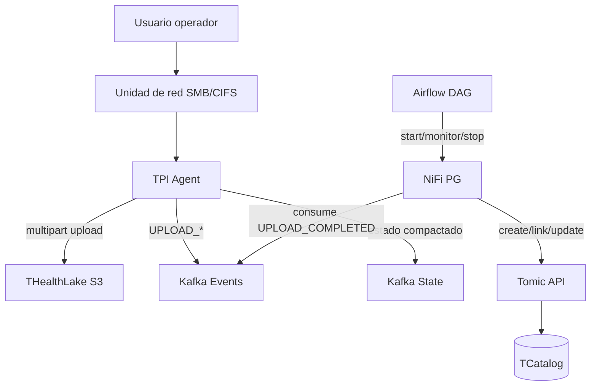
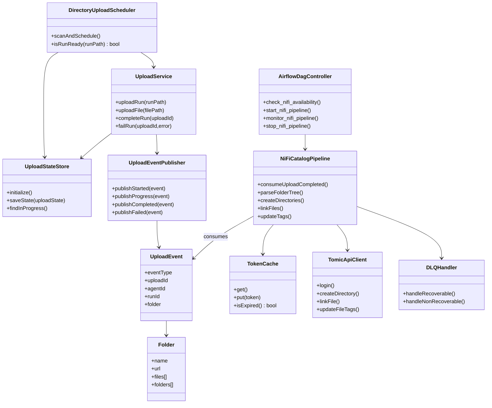
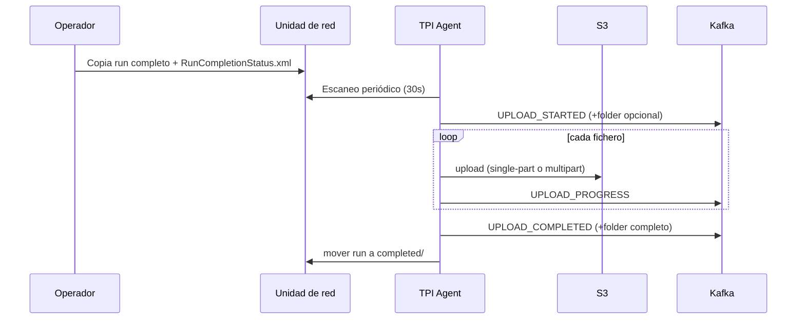
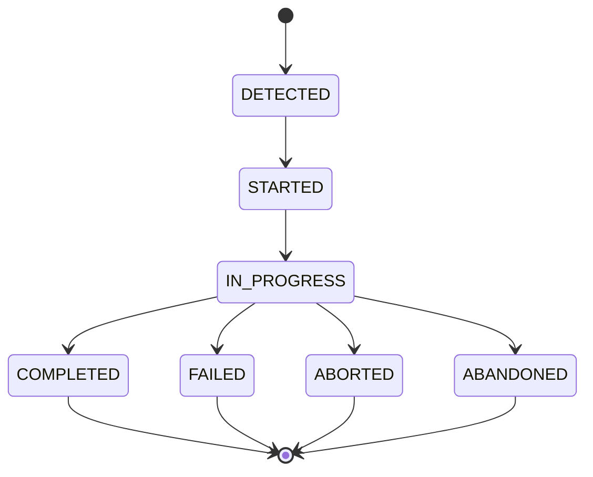
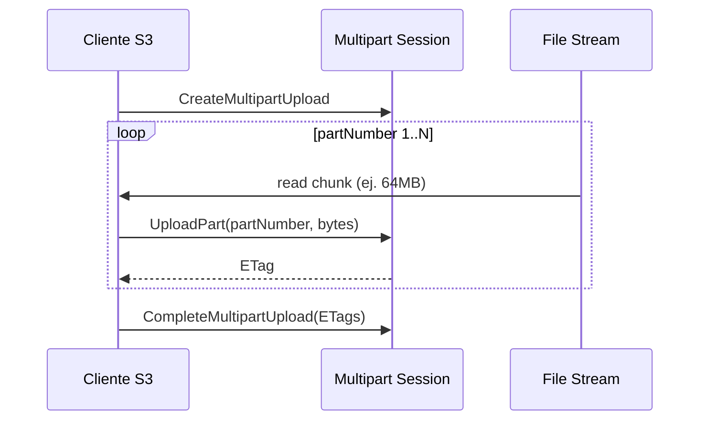
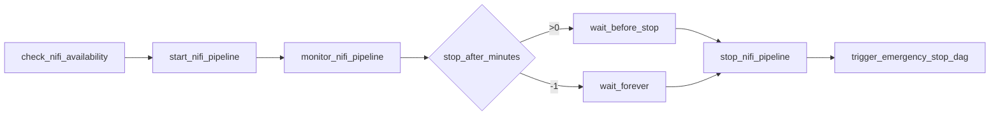
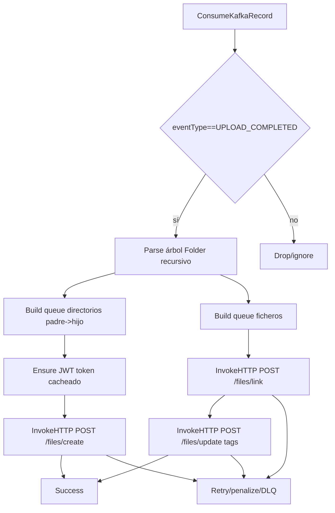
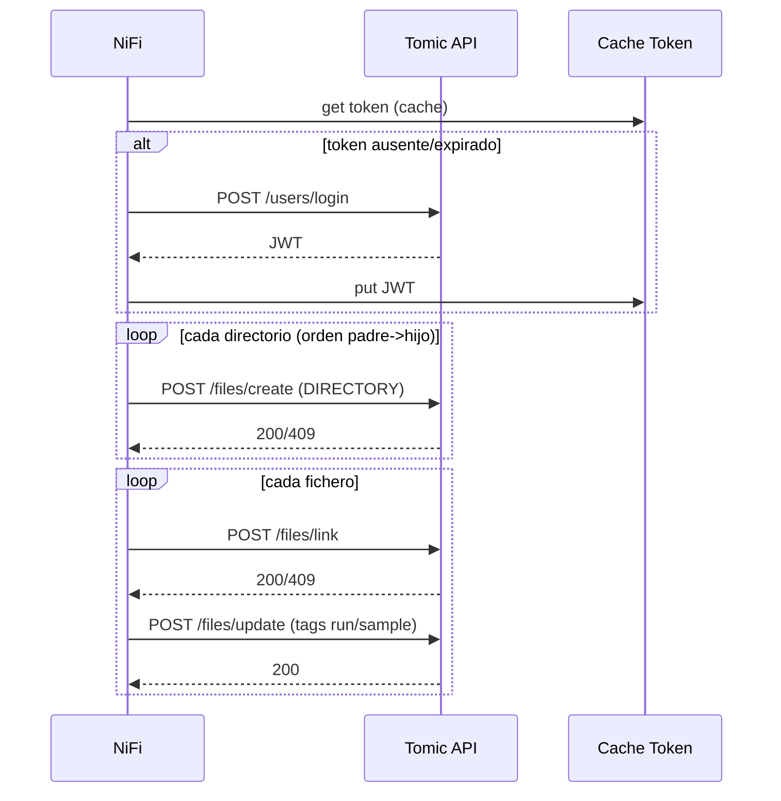
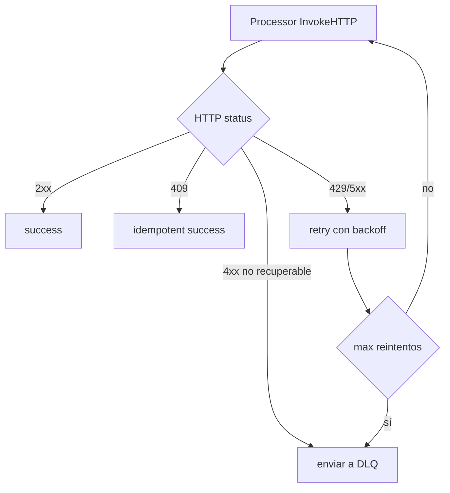

# Diseño de ingeniería de software — Subida de datos (UC-DS-001..UC-DS-007)

**Ámbito**: Este documento mantiene el catálogo completo de casos de uso de Subida de Datos (UC-DS-001..UC-DS-007), pero desarrolla técnicamente en detalle únicamente **UC-DS-001 (subida a landing zone)** y **UC-DS-002 (catalogación de ficheros)**.

<!-- TOC -->
* [Diseño de ingeniería de software — Subida de datos (UC-DS-001..UC-DS-007)](#diseño-de-ingeniería-de-software--subida-de-datos-uc-ds-001uc-ds-007)
  * [1. Objetivo y alcance](#1-objetivo-y-alcance)
  * [2. Catálogo de casos de uso](#2-catálogo-de-casos-de-uso)
  * [3. Trazabilidad funcional (UC-DS-001 y UC-DS-002)](#3-trazabilidad-funcional-uc-ds-001-y-uc-ds-002)
  * [4. Arquitectura de referencia](#4-arquitectura-de-referencia)
  * [5. Diagrama de clases (UC-DS-001 y UC-DS-002)](#5-diagrama-de-clases-uc-ds-001-y-uc-ds-002)
  * [6. UC-DS-001 — Subida de datos a landing zone](#6-uc-ds-001--subida-de-datos-a-landing-zone)
    * [6.1 Contrato de entrada](#61-contrato-de-entrada)
    * [6.2 Flujo principal](#62-flujo-principal)
    * [6.3 Máquina de estados y resiliencia](#63-máquina-de-estados-y-resiliencia)
    * [6.4 Reglas de particionado multipart](#64-reglas-de-particionado-multipart)
    * [6.5 Eventos y contrato Kafka](#65-eventos-y-contrato-kafka)
    * [6.6 Riesgos técnicos y mitigaciones](#66-riesgos-técnicos-y-mitigaciones)
  * [7. UC-DS-002 — Catalogación de ficheros](#7-uc-ds-002--catalogación-de-ficheros)
    * [7.1 Orquestación Airflow](#71-orquestación-airflow)
    * [7.2 Diseño funcional de pipeline NiFi](#72-diseño-funcional-de-pipeline-nifi)
    * [7.3 Secuencia de catalogación en Tomic](#73-secuencia-de-catalogación-en-tomic)
    * [7.4 Idempotencia, concurrencia y orden](#74-idempotencia-concurrencia-y-orden)
    * [7.5 Gestión de errores y DLQ](#75-gestión-de-errores-y-dlq)
  * [8. Arquitectura de datos](#8-arquitectura-de-datos)
  * [9. Operación, observabilidad y SRE](#9-operación-observabilidad-y-sre)
  * [10. Criterios de aceptación técnicos](#10-criterios-de-aceptación-técnicos)
  * [11. Decisiones de diseño (ADR-lite)](#11-decisiones-de-diseño-adr-lite)
<!-- TOC -->

## 1. Objetivo y alcance

Este diseño mantiene la visión documental completa del dominio y especifica en detalle cómo se implementan y operan, de extremo a extremo, los dos casos de uso actualmente productivos de la cadena de subida/catálogo:

- **UC-DS-001**: detección de runs finalizados y subida confiable a S3 compatible.
- **UC-DS-002**: consumo del evento de completitud y catalogación en Tomic/OpenCGA.

Los UC-DS-003..007 quedan listados para continuidad de trazabilidad, sin desarrollo técnico en esta versión.

## 2. Catálogo de casos de uso

> Los UC-DS-003..UC-DS-007 se mantienen para trazabilidad documental, **sin desarrollo técnico en este documento** y **sin inclusión en esquemas/diagramas**.

| Caso de uso | Estado documental en este diseño |
|---|---|
| UC-DS-001: Subida de datos a landing zone | Desarrollado |
| UC-DS-002: Catalogación de ficheros | Desarrollado |
| UC-DS-003: Asociación de ficheros a peticiones | Referenciado (sin desarrollo) |
| UC-DS-004: Transformación de resultados Nasertic | Referenciado (sin desarrollo) |
| UC-DS-005: Movimiento de ficheros a ubicación definitiva | Referenciado (sin desarrollo) |
| UC-DS-006: Creación de caso clínico/pacientes/muestras | Referenciado (sin desarrollo) |
| UC-DS-007: Gestión de errores en identificadores de muestra | Referenciado (sin desarrollo) |

## 3. Trazabilidad funcional (UC-DS-001 y UC-DS-002)

| Caso de uso | Componente principal | Componentes de soporte | Evidencia técnica |
|---|---|---|---|
| UC-DS-001 | TPI Agent Service | Kafka events/state, S3 | Scheduler + UploadService + UploadStateStore |
| UC-DS-002 | NiFi PG_TSUPREME_001_TPIAGENT_UPLOADS | Airflow DAG, Tomic API, DistributedMapCache | DAG_TSUPREME_001_TPIAGENT_UPLOADS + NiFi PG documentado |

## 4. Arquitectura de referencia

## 5. Diagrama de clases (UC-DS-001 y UC-DS-002)

## 6. UC-DS-001 — Subida de datos a landing zone

### 6.1 Contrato de entrada

**Trigger de run listo**: presencia de `RunCompletionStatus.xml` en raíz del run.

**Precondiciones**:
- El run es legible desde el punto de montaje SMB/NFS del agente.
- Existe conectividad al endpoint S3 y al broker Kafka.

### 6.2 Flujo principal

### 6.3 Máquina de estados y resiliencia

Aspectos de resiliencia:
- Persistencia de estado de subida en tópico compactado para recuperación post-restart.
- Reintentos en operaciones S3 multipart por parte.
- Abort explícito de multipart ante fallo irrecuperable.

### 6.4 Reglas de particionado multipart

Reglas:
- `size == 0`: subida simple.
- `size < threshold`: single-part.
- `size >= threshold`: multipart.

### 6.5 Eventos y contrato Kafka

Eventos funcionales de UC-DS-001:
- `UPLOAD_STARTED`
- `UPLOAD_PROGRESS`
- `UPLOAD_COMPLETED`
- `UPLOAD_FAILED`

Contrato mínimo esperado para activar UC-DS-002:
- `eventType == "UPLOAD_COMPLETED"`
- `uploadId`, `agentId`
- `folder` recursivo con `files[]` y `folders[]`

### 6.6 Riesgos técnicos y mitigaciones

| Riesgo | Impacto | Mitigación |
|---|---|---|
| Corte de red con S3 | subida incompleta | retry + resume + estado en Kafka |
| Run corrupto/incompleto | catálogo inconsistente | trigger estricto por `RunCompletionStatus.xml` |
| Volumen alto de ficheros pequeños | latencia elevada | paralelismo acotado + eventos ligeros en progreso |

## 7. UC-DS-002 — Catalogación de ficheros

### 7.1 Orquestación Airflow

La orquestación separa gobierno operativo (Airflow) de procesamiento de datos (NiFi).

### 7.2 Diseño funcional de pipeline NiFi

### 7.3 Secuencia de catalogación en Tomic

### 7.4 Idempotencia, concurrencia y orden

Reglas clave:
- Orden estricto de directorios (`padre -> hijo`) para evitar dependencias rotas.
- Manejo idempotente de respuestas `409` (recurso ya existente).
- Reintento con backoff ante errores transitorios HTTP.
- Granularidad de unidad de trabajo por run para mantener trazabilidad.

### 7.5 Gestión de errores y DLQ

## 8. Arquitectura de datos

**Evento de integración**: Avro `UploadEvent` con árbol recursivo `Folder`.

**Claves de correlación recomendadas**:
- `uploadId` (unidad técnica)
- `runId` (unidad funcional)
- `agentId` (origen)

**Taxonomía de tags de catálogo**:
- `run_id`
- `sample_id`
- tags operativos de trazabilidad (`source_id`, `agent_id`, etc.)

## 9. Operación, observabilidad y SRE

Métricas recomendadas:
- UC-001: tiempo total de subida por run, throughput MB/s, ratio de fallos por fichero.
- UC-002: lag de consumidor Kafka, tiempo de catalogación por run, tasa DLQ.

Alertas recomendadas:
- ausencia de `UPLOAD_COMPLETED` para runs detectados en ventana esperada;
- crecimiento continuo de DLQ;
- token/login failures repetidos en Tomic.

## 10. Criterios de aceptación técnicos

- Run detectado y transferido a S3 con estructura de paths preservada.
- Publicación de eventos Kafka de inicio/progreso/fin.
- Consumo de `UPLOAD_COMPLETED` y catalogación completa en Tomic.
- Reejecución segura (idempotente) sin duplicados funcionales dañinos.
- Evidencia operativa en logs/metrics para auditoría.

## 11. Decisiones de diseño (ADR-lite)

1. **Event-driven entre UC-001 y UC-002** para desacoplar tiempos de subida y catalogación.
2. **Airflow para control de ciclo de vida de NiFi**, evitando acoplar control operativo al flujo de datos.
3. **Persistencia de estado de subida en Kafka compactado** para recuperación tras reinicios.
4. **Catalogación idempotente** como criterio de robustez ante reintentos y reprocesados.
