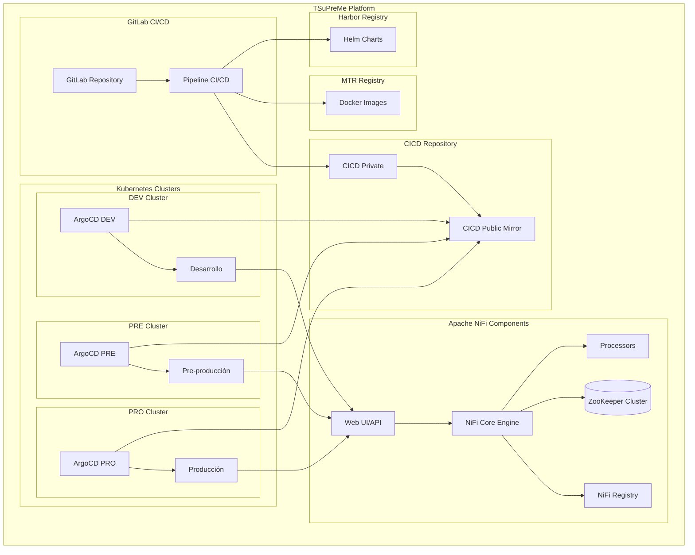
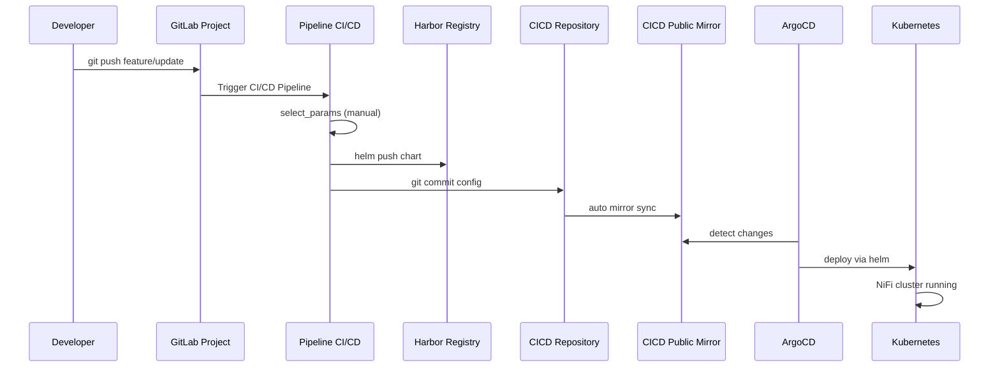
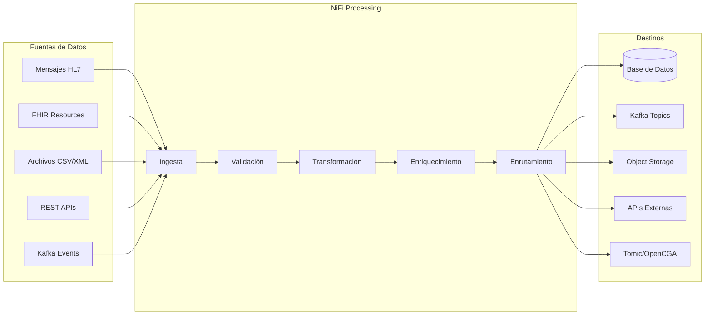
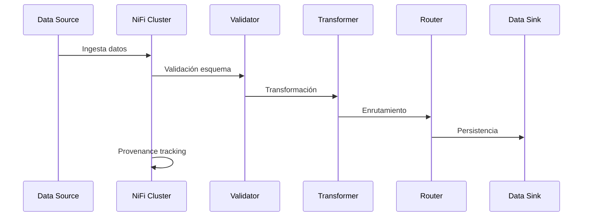
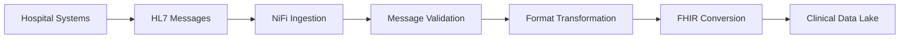
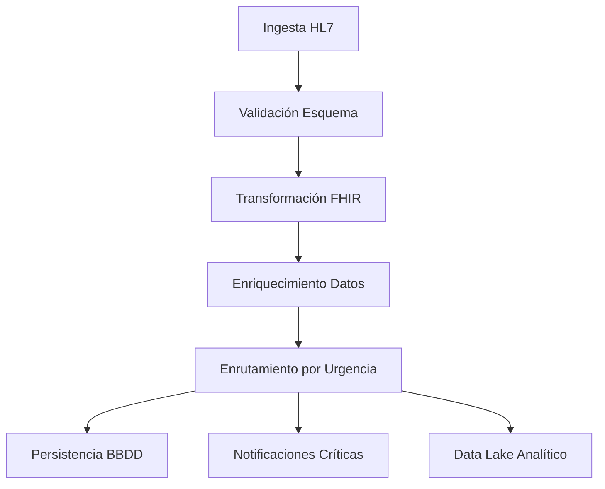

# 🌊 Apache NiFi - TSuPreMe Platform

[](https://www.t-systems.com/)
[](https://nifi.apache.org/)
[](https://helm.sh/)
[](https://kubernetes.io/)

Despliegue y configuración de **Apache NiFi** en la plataforma **TSuPreMe** de T-Systems para el procesamiento de flujos de datos en tiempo real en entornos de salud y genómica.

## 📋 Tabla de Contenidos

- [🏗️ Arquitectura del Proyecto](#️-arquitectura-del-proyecto)
- [🌍 Entornos y Clientes](#-entornos-y-clientes)
- [⚡ Inicio Rápido](#-inicio-rápido)
- [🔧 Pipeline CI/CD](#-pipeline-cicd)
- [🚀 Despliegue Local](#-despliegue-local)
- [⚙️ Configuración por Entorno](#️-configuración-por-entorno)
- [📊 Monitoreo y Observabilidad](#-monitoreo-y-observabilidad)
- [🔐 Seguridad y Accesos](#-seguridad-y-accesos)
- [🔄 Flujos de Datos (DataFlows)](#-flujos-de-datos-dataflows)
- [📁 Gestión de Contenido](#-gestión-de-contenido)
- [🛠️ Troubleshooting](#️-troubleshooting)
- [📚 Documentación Técnica](#-documentación-técnica)

## 🏗️ Arquitectura del Proyecto

### Tipo de Proyecto
Este es un **proyecto solo Helm** que despliega Apache NiFi para procesamiento de flujos de datos distribuidos, diseñado específicamente para la infraestructura TSuPreMe de T-Systems.

### Componentes Principales



### Stack Tecnológico

- **Orquestación**: Kubernetes + Helm 3.x + ArgoCD
- **CI/CD**: GitLab CI/CD
- **Registry Helm**: Harbor (harbor.apps.ocpdes.t-systems.es)
- **Registry Docker**: MTR - Magenta Trusted Registry (https://mtr.devops.telekom.de/repository/genomica)
- **Despliegue Continuo**: ArgoCD
- **CICD Repository**: https://setools.t-systems.es/gitlab/health/genomica/commons/cicd.git
- **Coordinación de Cluster**: Apache ZooKeeper
- **Gestión de Versiones**: NiFi Registry
- **Autenticación**: LDAP Corporativo T-Systems
- **Monitoreo**: Prometheus + Grafana
- **Logging**: ELK Stack integrado

## 🌍 Entornos y Clientes

### Entornos Soportados

| Entorno | Descripción | Namespace | Recursos |
|---------|-------------|-----------|----------|
| **dev** | Desarrollo y pruebas | `tcatalog` | Mínimos |
| **pre** | Pre-producción | `tcatalog` | Medios |
| **pro** | Producción | `tcatalog` | Completos |

### Clientes Configurados

#### **sns-o** - Sistema Nacional de Salud Navarra
- Procesamiento de datos sanitarios en tiempo real
- Integración con sistemas HL7 y FHIR
- Transformación y enrutamiento de mensajes de salud
- Cumplimiento normativo GDPR/LOPD

### Estructura de Configuración

```
src/main/helm/charts/nifi/
├── Chart.yaml                    # Definición del chart
├── values-common.yaml            # Valores comunes
├── helmfile.yaml.gotmpl         # Configuración Helmfile
├── clients/
│   └── sns-o/                   # Sistema Nacional de Salud
│       ├── values-dev.yaml
│       ├── values-pre.yaml
│       └── values-pro.yaml
├── configs/                     # Configuraciones NiFi
│   ├── authorizers.xml          # Autorización y permisos
│   ├── bootstrap.conf           # Configuración de bootstrap
│   ├── flow.xml                 # Flujo de datos principal
│   ├── login-identity-providers-ldap.xml  # Autenticación LDAP
│   ├── nifi.properties          # Propiedades principales
│   ├── state-management.xml     # Gestión de estado
│   └── zookeeper.properties     # Configuración ZooKeeper
├── templates/
│   ├── configmap.yaml
│   ├── statefulset.yaml
│   ├── service.yaml
│   └── ingress.yaml
└── tests/                       # Tests de validación
    ├── 01-safetyValve-values.yaml
    ├── 02-persistence-enabled-values.yaml
    ├── 03-ldap-values.yaml
    ├── 05-secure-cluster-values.yaml
    └── 06-site-to-site.bash
```

## ⚡ Inicio Rápido

### Prerrequisitos

```bash
# Herramientas necesarias
kubectl version --client  # >= 1.29
helm version              # >= 3.12
helmfile version          # >= 0.155

# Acceso a TSuPreMe
export KUBECONTEXT="tsupreme-dev"  # o tsupreme-pre, tsupreme-pro
```

### Variables de Entorno Requeridas

```bash
# Configuración del proyecto
export PROJECT_NAME="nifi"
export NAMESPACE="tcatalog"
export CLIENT="sns-o"              # sns-o
export ENVIRONMENT="dev"           # dev, pre, pro
export KUBECONTEXT="tsupreme-dev"  # Contexto K8s correspondiente
```

### Despliegue Rápido

```bash
# 1. Clonar el repositorio
git clone <repository-url>
cd nifi

# 2. Navegar al chart
cd src/main/helm/charts/nifi/

# 3. Configurar variables
export CLIENT="sns-o"
export ENVIRONMENT="dev"
export KUBECONTEXT="tsupreme-dev"

# 4. Desplegar
helmfile -f helmfile.yaml.gotmpl \
  --state-values-set client=$CLIENT \
  --state-values-set useLocalCharts=true \
  -e $ENVIRONMENT \
  sync
```

## 🔧 Pipeline CI/CD

### Arquitectura del Pipeline

Como **proyecto solo Helm**, el pipeline sigue el siguiente flujo de despliegue:

```yaml
# Stages del Pipeline (Tipo 2: Solo Helm)
1. 📋 params     - Selección manual de parámetros (CLIENT/ENVIRONMENT)
2. 🚪 gate       - Validación de parámetros
3. 📦 push-chart - Empaquetado y push a Harbor Registry
4. 🔄 sync       - Commit al repositorio CICD
```

### Flujo de Despliegue Completo



### Configuración GitLab CI/CD

#### Variables Requeridas en GitLab

```yaml
# Variables del proyecto
PROJECT_NAME: "nifi"
NAMESPACE: "tcatalog"
HELMFILEDIR: "src/main/helm/charts/nifi"

# Credenciales (GitLab Variables - Protected)
HARBOR_USERNAME: "usuario-harbor"
HARBOR_PASSWORD: "password-harbor"
GIT_TOKEN: "token-git-acceso"
```

## 🚀 Despliegue Local

### Configuración Inicial

#### 1. Verificar Conectividad

```bash
# Verificar contexto K8s
kubectl config current-context
kubectl config use-context $KUBECONTEXT

# Probar conectividad
kubectl --context=$KUBECONTEXT get nodes
kubectl --context=$KUBECONTEXT get namespaces
```

#### 2. Validar Configuración

```bash
# Verificar archivos de configuración
ls -la clients/$CLIENT/values-$ENVIRONMENT.yaml
cat values-common.yaml

# Validar sintaxis del chart
helm lint .
```

### Proceso de Despliegue

#### Despliegue Estándar

```bash
# Navegar al directorio del chart
cd src/main/helm/charts/nifi/

# Configurar variables
export CLIENT="sns-o"
export ENVIRONMENT="dev"
export KUBECONTEXT="tsupreme-dev"

# Desplegar usando charts locales
helmfile -f helmfile.yaml.gotmpl \
  --state-values-set client=$CLIENT \
  --state-values-set useLocalCharts=true \
  -e $ENVIRONMENT \
  sync
```

#### Dry-run (Simulación)

```bash
# Ver cambios sin aplicar
helmfile -f helmfile.yaml.gotmpl \
  --state-values-set client=$CLIENT \
  --state-values-set useLocalCharts=true \
  -e $ENVIRONMENT \
  diff
```

### Comandos de Gestión

#### Verificar Estado

```bash
# Estado del release
helm --kube-context=$KUBECONTEXT list -n $NAMESPACE

# Pods de NiFi
kubectl --context=$KUBECONTEXT get pods -n $NAMESPACE -l app=nifi

# Servicios
kubectl --context=$KUBECONTEXT get svc -n $NAMESPACE
```

#### Acceso a la UI de NiFi

```bash
# Obtener la URL del ingress
kubectl --context=$KUBECONTEXT get ingress -n $NAMESPACE

# Port-forward para acceso local
kubectl --context=$KUBECONTEXT port-forward svc/nifi-web 8443:8443 -n $NAMESPACE

# Acceder a: https://localhost:8443/nifi
```

## ⚙️ Configuración por Entorno

### Configuración Base (values-common.yaml)

```yaml
# Configuración común a todos los entornos
nifi:
  cluster:
    enabled: true
    nodes: 3
  
  # Configuración de red corporativa T-Systems
  web:
    https:
      port: 8443
    
# Configuración de seguridad
auth:
  ldap:
    enabled: true
    
# Recursos base
resources:
  limits:
    cpu: 2000m
    memory: 4Gi
  requests:
    cpu: 1000m
    memory: 2Gi

# ZooKeeper para coordinación de cluster
zookeeper:
  enabled: true
  replicaCount: 3
```

### Configuración por Cliente

#### sns-o (Sistema Nacional de Salud)

```yaml
# values-dev.yaml
nifi:
  cluster:
    nodes: 1  # Desarrollo con un solo nodo
    
  web:
    ingress:
      enabled: true
      hosts:
        - nifi-sns-o-dev.tsupreme.es

# Configuración específica para datos sanitarios
persistence:
  enabled: true
  size: 100Gi
  storageClass: fast-ssd

# Configuración LDAP para SNS-O
auth:
  ldap:
    host: "ldap-sns-o-dev.tsupreme.internal"
    searchBase: "ou=users,dc=sns-o,dc=es"
```

### Configuración de Producción

#### Diferencias Clave vs Desarrollo

```yaml
# Producción (values-pro.yaml)
nifi:
  cluster:
    nodes: 5                      # Cluster robusto
    
  autoscaling:
    enabled: true
    minReplicas: 3
    maxReplicas: 10

# Persistencia de alto rendimiento
persistence:
  size: 1Ti
  storageClass: premium-ssd
  
# Configuración de seguridad avanzada
security:
  tls:
    enabled: true
    keystoreType: PKCS12
    
# ZooKeeper en producción
zookeeper:
  replicaCount: 5
  persistence:
    enabled: true
    size: 20Gi
```

## 📊 Monitoreo y Observabilidad

### Métricas Integradas

#### Prometheus + Grafana

```yaml
# Configuración de métricas
monitoring:
  enabled: true
  prometheus:
    port: 9092
    
metrics:
  enabled: true
  serviceMonitor:
    enabled: true
    namespace: monitoring
```

#### Dashboard NiFi

```yaml
# Métricas específicas de NiFi
nifi:
  metrics:
    # Estadísticas de flujo de datos
    flowfile:
      enabled: true
    # Estadísticas de procesadores
    processor:
      enabled: true
    # Estadísticas de conexiones
    connection:
      enabled: true
```

### Logging Centralizado

#### Configuración ELK Stack

```yaml
# Logs enviados a ElasticSearch
logging:
  level: INFO
  persistence:
    enabled: true
    size: 50Gi
    
# Configuración de logback
logback:
  elasticsearch:
    enabled: true
    host: "elasticsearch.logging.tsupreme.internal"
```

## 🔐 Seguridad y Accesos

### Autenticación y Autorización

#### LDAP Corporativo T-Systems

```yaml
# Integración con LDAP corporativo
auth:
  ldap:
    enabled: true
    host: "ldaps://ldap.t-systems.com:636"
    searchBase: "ou=users,dc=t-systems,dc=com"
    adminIdentity: "cn=nifi-admin,ou=service-accounts,dc=t-systems,dc=com"
    
# Configuración de autorizadores
authorizers:
  file:
    enabled: true
    tenantsFile: "/opt/nifi/nifi-current/conf/authorizations.xml"
    usersFile: "/opt/nifi/nifi-current/conf/users.xml"
```

#### Gestión de Usuarios y Políticas

```xml
<!-- authorizers.xml -->
<authorizers>
    <userGroupProvider>
        <identifier>ldap-user-group-provider</identifier>
        <class>org.apache.nifi.ldap.tenants.LdapUserGroupProvider</class>
        <property name="Authentication Strategy">SIMPLE</property>
        <property name="Manager DN">cn=nifi-admin,ou=service-accounts,dc=t-systems,dc=com</property>
        <property name="Manager Password">#{LDAP_MANAGER_PASSWORD}</property>
        <property name="Url">ldaps://ldap.t-systems.com:636</property>
        <property name="User Search Base">ou=users,dc=t-systems,dc=com</property>
    </userGroupProvider>
</authorizers>
```

### Certificados TLS

```yaml
# Configuración de certificados
tls:
  enabled: true
  keystoreType: PKCS12
  
# Cert-Manager para certificados automáticos
certManager:
  enabled: true
  issuer: "letsencrypt-prod"
```

## 🔄 Flujos de Datos (DataFlows)

### 📑 Pipelines Implementadas

#### Cliente SNS-O

**Process Groups Desplegados**:

| PG | Descripción | Estado | Documentación |
|----|-------------|--------|---------------|
| **PG_TSUPREME_001_TPIAGENT_UPLOADS** | Catalogación automática de ficheros genómicos en Tomic/OpenCGA desde eventos Kafka | ✅ DEV/PRE | [📖 Documentación](src/main/helm/charts/nifi/pipelines/sns-o/PG_TSUPREME_001_TPIAGENT_UPLOADS.md) |

**Ubicación de pipelines**: [`src/main/helm/charts/nifi/pipelines/sns-o/`](src/main/helm/charts/nifi/pipelines/sns-o/)

> **Convención de Documentación**: Cada Process Group principal se documenta en un archivo `PG_{NOMBRE_COMPLETO}.md` ubicado en `pipelines/{cliente}/`. Este patrón se seguirá para futuras pipelines de otros clientes (hsc, etc.).

---

### Arquitectura de Procesamiento



### Procesadores Clave para SNS-O

#### Procesamiento HL7

```xml
<!-- flow.xml - Procesador HL7 -->
<processor>
    <id>hl7-parser</id>
    <name>ParseHL7Message</name>
    <class>org.apache.nifi.hl7.processors.RouteHL7</class>
    <property name="Routing Strategy">Route to Property name</property>
</processor>
```

#### Validación FHIR

```xml
<!-- Procesador FHIR Validation -->
<processor>
    <id>fhir-validator</id>
    <name>ValidateFHIRResource</name>
    <class>org.apache.nifi.processors.standard.ValidateRecord</class>
    <property name="Record Reader">json-tree-reader</property>
    <property name="Record Writer">json-record-set-writer</property>
</processor>
```

### Templates de Flujo

#### Template: Procesamiento de Datos Sanitarios

1. **GetFile/GetHTTP** - Ingesta de datos
2. **RouteOnAttribute** - Clasificación por tipo
3. **UpdateAttribute** - Metadatos de trazabilidad
4. **ValidateRecord** - Validación de esquemas
5. **ConvertRecord** - Transformación de formatos
6. **RouteOnContent** - Enrutamiento por contenido
7. **PutDatabaseRecord** - Persistencia

### 🔄 Importación Automática de Pipelines

El chart de Helm incluye funcionalidad para importar automáticamente las pipelines (flows) al desplegar NiFi. Esto permite tener las configuraciones de flujos versionadas en Git y desplegadas automáticamente.

#### Estructura de Pipelines

**Nota**: A partir de NiFi 1.27.0, las pipelines se exportan en formato **JSON** (Flow Definitions) en lugar de XML.

Las pipelines se almacenan en formato JSON en la carpeta:

```
src/main/helm/charts/nifi/pipelines/
├── TSuPreMe_Pipeline.json        # Pipeline principal
├── HL7_Processing_Pipeline.json  # Procesamiento HL7
└── FHIR_Validation_Pipeline.json # Validación FHIR
```

#### Configuración de Importación

Para habilitar la importación automática de pipelines, configura en tu archivo `values-*.yaml`:

```yaml
nifi:
  pipelines:
    enabled: true  # Habilitar importación automática
    job:
      backoffLimit: 5  # Reintentos en caso de fallo
      image: "curlimages/curl:latest"  # Imagen para el job de importación
```

#### Exportar Pipelines desde NiFi

Para exportar una pipeline desde la interfaz de NiFi 1.27.0:

1. En la UI de NiFi, haz clic derecho en el **Process Group** que deseas exportar
2. Selecciona **Download flow definition**
3. Guarda el archivo JSON descargado
4. Renombra el archivo con un nombre descriptivo (ej: `Mi_Pipeline.json`)
5. Coloca el archivo en `src/main/helm/charts/nifi/pipelines/`
6. Commit y push al repositorio Git

```bash
# Ejemplo: agregar nueva pipeline
cp ~/Downloads/flow_snapshot.json src/main/helm/charts/nifi/pipelines/Nueva_Pipeline.json
git add src/main/helm/charts/nifi/pipelines/Nueva_Pipeline.json
git commit -m "feat: agregar pipeline Nueva_Pipeline"
git push
```

#### Proceso de Importación Automática

Durante el despliegue de Helm, se ejecuta un **Job de Kubernetes** que:

1. 📦 Espera a que NiFi esté disponible y listo
2. 🔐 Se autentica usando las credenciales configuradas
3. 📥 Lee todos los archivos `.json` de la carpeta `pipelines/`
4. 🔄 Crea un Process Group para cada pipeline
5. ⚙️ Importa la definición del flow dentro del Process Group
6. ✅ Verifica que la importación fue exitosa

El job se ejecuta como **Helm Hook** en las fases:
- `post-install`: Después de la instalación inicial
- `post-upgrade`: Después de cada actualización

```yaml
# Ejemplo de logs del job de importación
Esperando a que NiFi esté disponible...
NiFi está disponible. Iniciando importación de pipelines...
Obteniendo token de autenticación...
Token obtenido exitosamente
Obteniendo ID del Process Group raíz...
ID del Process Group raíz: a6142959-019a-1000-0000-0000475ea066

===================================================================
Importando pipeline: TSuPreMe_Pipeline
===================================================================
Creando process group: Data Processing Pipeline
Process group creado con ID: b7253a6a-02ab-2111-1111-1111586fb177
Importando flow definition...
Request de importación iniciado con ID: req-123456
Pipeline TSuPreMe_Pipeline importada exitosamente

===================================================================
Importación completada
Exitosas: 1
Fallidas: 0
===================================================================
```

#### Estructura de un Flow JSON (NiFi 1.27.0)

```json
{
  "flowContents": {
    "identifier": "51dccd36-e866-3463-8c33-a6c6187dfd5c",
    "name": "Data Processing Pipeline",
    "processors": [
      {
        "identifier": "c02fb99b-d610-3390-81b5-1cbf9acacd88",
        "name": "ConsumeKafka",
        "type": "org.apache.nifi.processors.kafka.pubsub.ConsumeKafka_2_6",
        "properties": {
          "bootstrap.servers": "kafka-kafka-bootstrap:9092",
          "topic": "tsupreme.data.entity.input.v1",
          "group.id": "nifi-consumer-group"
        }
      }
    ],
    "connections": [
      {
        "source": {"id": "c02fb99b-d610-3390-81b5-1cbf9acacd88"},
        "destination": {"id": "0315b083-a994-3343-9e97-d21413fc0fa7"},
        "selectedRelationships": ["success"]
      }
    ],
    "controllerServices": []
  }
}
```

#### Verificación Post-Despliegue

Después del despliegue, verifica que las pipelines se importaron correctamente:

```bash
# Ver logs del job de importación
kubectl --context=$KUBECONTEXT logs -n $NAMESPACE \
  -l job=pipeline-importer --tail=100

# Verificar que el job completó exitosamente
kubectl --context=$KUBECONTEXT get jobs -n $NAMESPACE

# Acceder a NiFi UI y verificar
# Deberías ver los Process Groups creados en el canvas raíz
```

#### Troubleshooting de Importación

**Problema**: El job falla con error de autenticación

```bash
# Verificar que las credenciales estén configuradas
kubectl --context=$KUBECONTEXT get secret -n $NAMESPACE nifi-admin-credentials

# Revisar valores de autenticación
helm --kube-context=$KUBECONTEXT get values nifi -n $NAMESPACE
```

**Problema**: Las pipelines no se importan

```bash
# Verificar que los archivos JSON estén en el ConfigMap
kubectl --context=$KUBECONTEXT get configmap -n $NAMESPACE \
  nifi-pipelines -o yaml

# Verificar sintaxis JSON
cat src/main/helm/charts/nifi/pipelines/TSuPreMe_Pipeline.json | jq .
```

**Problema**: Formato incorrecto de pipeline

```bash
# Las pipelines deben ser Flow Definitions de NiFi 1.27.0
# NO usar templates XML antiguos
# La estructura debe incluir "flowContents" como clave raíz
```

#### Actualización de Pipelines

Para actualizar una pipeline existente:

1. Modifica la pipeline en NiFi UI
2. Exporta la nueva versión como JSON
3. Reemplaza el archivo en `pipelines/`
4. Haz commit y push
5. Ejecuta `helm upgrade` o espera a que ArgoCD sincronice

```bash
# Actualización manual
helmfile -f helmfile.yaml.gotmpl \
  --state-values-set client=$CLIENT \
  --state-values-set useLocalCharts=true \
  -e $ENVIRONMENT \
  apply

# El job de importación se ejecutará automáticamente
```

#### Mejores Prácticas

✅ **Recomendaciones**:
- Usa nombres descriptivos para los archivos de pipeline
- Documenta cada pipeline en comentarios del Process Group
- Versionaen Git todos los cambios de pipelines
- Prueba las pipelines en DEV antes de PRE/PRO
- Mantén las pipelines lo más modulares posible

❌ **Evita**:
- Credenciales hardcodeadas en las propiedades de procesadores
- Pipelines muy grandes (divide en Process Groups)
- Modificar pipelines directamente en PRO sin versionarlas
- Usar templates XML antiguos (< NiFi 1.27.0)
```
src/main/helm/charts/nifi/pipelines/
├── TSuPreMe_Pipeline.xml
└── [otras_pipelines].xml
```

#### Configuración de Importación

La importación automática se configura en el archivo `values.yaml`:

```yaml
nifi:
  # Configuración de importación automática de pipelines
  pipelines:
    enabled: true  # Habilita/deshabilita la importación automática
    job:
      image: "curlimages/curl:latest"  # Imagen para ejecutar el job de importación
      backoffLimit: 5  # Número de reintentos si falla el job
```

#### Cómo Funciona

1. **Almacenamiento**: Las pipelines XML se almacenan en un ConfigMap de Kubernetes
2. **Job de Importación**: Un Job de Kubernetes se ejecuta después del despliegue de NiFi
3. **Importación vía API**: El Job utiliza la API REST de NiFi para importar las pipelines
4. **Validación**: El Job verifica que las pipelines se hayan importado correctamente

#### Agregar Nuevas Pipelines

Para agregar una nueva pipeline al despliegue automático:

1. **Exportar desde NiFi UI**: 
   - Accede a la interfaz de NiFi
   - Selecciona el proceso group o template
   - Click derecho → Download flow
   - Guarda el archivo XML

2. **Agregar al repositorio**:
   ```bash
   # Copiar el archivo XML a la carpeta de pipelines
   cp mi_nueva_pipeline.xml src/main/helm/charts/nifi/pipelines/
   
   # Commit y push
   git add src/main/helm/charts/nifi/pipelines/mi_nueva_pipeline.xml
   git commit -m "feat: Agregar nueva pipeline de procesamiento"
   git push
   ```

3. **Desplegar**: La próxima vez que se despliegue el chart, la nueva pipeline se importará automáticamente

#### Verificar Importación

Después del despliegue, puedes verificar que las pipelines se importaron correctamente:

```bash
# Ver el estado del job de importación
kubectl --context=$KUBECONTEXT get jobs -n $NAMESPACE -l app=nifi-pipeline-import

# Ver los logs del job
kubectl --context=$KUBECONTEXT logs -n $NAMESPACE job/nifi-pipeline-import-job

# Verificar las pipelines en NiFi
# 1. Acceder a la UI de NiFi
# 2. Las pipelines importadas aparecerán en el canvas principal
```

#### Deshabilitar Importación Automática

Si necesitas deshabilitar la importación automática (por ejemplo, en desarrollo):

```yaml
# En tu archivo values-*.yaml
nifi:
  pipelines:
    enabled: false  # Deshabilita la importación automática
```

#### Troubleshooting

**Problema: El job de importación falla**

```bash
# Ver logs del job
kubectl --context=$KUBECONTEXT logs -n $NAMESPACE job/nifi-pipeline-import-job

# Verificar que NiFi esté listo
kubectl --context=$KUBECONTEXT get pods -n $NAMESPACE -l app=nifi

# Verificar el ConfigMap de pipelines
kubectl --context=$KUBECONTEXT get configmap -n $NAMESPACE nifi-pipelines-config
```

**Problema: Las pipelines no aparecen en NiFi**

```bash
# Verificar que el ConfigMap tiene las pipelines
kubectl --context=$KUBECONTEXT describe configmap nifi-pipelines-config -n $NAMESPACE

# Reiniciar el job de importación
kubectl --context=$KUBECONTEXT delete job nifi-pipeline-import-job -n $NAMESPACE
# El job se recreará automáticamente en el próximo despliegue
```

**Problema: Conflictos de versión de pipeline**

- Las pipelines se importan como templates o process groups nuevos
- Si ya existe una pipeline con el mismo nombre, NiFi puede generar un nombre alternativo
- Considera eliminar manualmente las pipelines antiguas antes de importar versiones nuevas

#### Mejores Prácticas

1. **Versionado**: Mantén las pipelines en Git para tener control de versiones
2. **Nomenclatura**: Usa nombres descriptivos para los archivos XML (ej: `hl7_to_fhir_converter.xml`)
3. **Documentación**: Documenta cada pipeline con comentarios dentro del XML o en archivos README
4. **Testing**: Prueba las pipelines en desarrollo antes de promoverlas a pre-producción/producción
5. **Backup**: Exporta regularmente las pipelines desde producción como backup

## 📁 Gestión de Contenido

### Repositorios de Contenido

```yaml
# Configuración de content repository
nifi:
  properties:
    contentRepository:
      implementation: "org.apache.nifi.controller.repository.FileSystemRepository"
      claims:
        maxAppendableClaimLength: "1 MB"
        maxFlowFilesPerClaim: 100
      
# Múltiples repositorios para performance
contentRepositories:
  - name: "content_repository_1"
    path: "/opt/nifi/content_repository_1"
  - name: "content_repository_2"
    path: "/opt/nifi/content_repository_2"
```

### Gestión de Provenance

```yaml
# Configuración de provenance
provenance:
  repository:
    implementation: "org.apache.nifi.provenance.WriteAheadProvenanceRepository"
    rolloverTime: "30 secs"
    rolloverSize: "100 MB"
    queryThreadPoolSize: 2
    indexThreadPoolSize: 2
```

## 🛠️ Troubleshooting

### Problemas Comunes del Pipeline

#### Error: "NiFi cluster no está sincronizado"

```bash
# Verificar estado del cluster
kubectl --context=$KUBECONTEXT exec -it nifi-0 -n $NAMESPACE -- \
  curl -k https://localhost:8443/nifi-api/controller/cluster

# Verificar logs de ZooKeeper
kubectl --context=$KUBECONTEXT logs -n $NAMESPACE -l app=zookeeper -f
```

#### Error: "Conexión LDAP fallida"

```bash
# Verificar configuración LDAP
kubectl --context=$KUBECONTEXT exec -it nifi-0 -n $NAMESPACE -- \
  cat /opt/nifi/nifi-current/conf/login-identity-providers.xml

# Probar conectividad LDAP
kubectl --context=$KUBECONTEXT exec -it nifi-0 -n $NAMESPACE -- \
  ldapsearch -H ldaps://ldap.t-systems.com:636 -D "cn=test" -W -b "dc=t-systems,dc=com"
```

### Debug de Flujos de Datos

#### Monitoreo de FlowFiles

```bash
# Acceder a NiFi Toolkit
kubectl --context=$KUBECONTEXT exec -it nifi-0 -n $NAMESPACE -- \
  /opt/nifi/nifi-current/bin/nifi.sh status

# Ver estadísticas de procesadores
curl -k -u admin:password \
  https://nifi-sns-o-dev.tsupreme.es/nifi-api/flow/process-groups/root/status
```

#### Análisis de Provenance

```bash
# Query de provenance via API
curl -k -u admin:password \
  -X POST \
  -H "Content-Type: application/json" \
  -d '{"provenance":{"request":{"maxResults":100}}}' \
  https://nifi-sns-o-dev.tsupreme.es/nifi-api/provenance
```

### Problemas de Rendimiento

#### Optimización de JVM

```yaml
# Configuración JVM para NiFi
nifi:
  jvm:
    heapSize: "4g"
    gcArgs: 
      - "-XX:+UseG1GC"
      - "-XX:+UseStringDeduplication"
      - "-XX:MaxGCPauseMillis=500"
```

#### Monitoreo de Recursos

```bash
# CPU y memoria de pods NiFi
kubectl --context=$KUBECONTEXT top pods -n $NAMESPACE -l app=nifi

# Métricas detalladas
kubectl --context=$KUBECONTEXT describe pod nifi-0 -n $NAMESPACE
```

## 📚 Documentación Técnica

### Arquitectura Detallada

#### Flujo de Procesamiento de Datos



### Configuraciones Específicas por Cliente

#### SNS-O - Sistema Nacional de Salud

**Características específicas:**
- Procesamiento de mensajes HL7 v2.x y v3.x
- Transformación FHIR R4
- Cumplimiento GDPR/LOPD estricto
- Integración con sistemas hospitalarios

```yaml
# Configuración específica SNS-O
nifi:
  properties:
    # Configuración para datos sanitarios
    security:
      encrypt:
        configuration: true
      sensitive:
        props:
          key: "${SENSITIVE_PROPS_KEY}"
    
    # Configuración HL7
    hl7:
      charset: "UTF-8"
      validate: true
      
  # Procesadores específicos de salud
  processors:
    hl7:
      enabled: true
    fhir:
      enabled: true
```

### Integración con Ecosistema TSuPreMe

#### Conectividad con Servicios Corporativos

```yaml
# Configuración de servicios T-Systems
nifi:
  properties:
    # Proxy corporativo
    http:
      proxy:
        host: "10.49.89.10"
        port: 8080
    https:
      proxy:
        host: "10.49.89.10"
        port: 8080
        
    # Time zone corporativo
    timezone: "Europe/Madrid"
```

### Casos de Uso Específicos

#### Procesamiento HL7 en Tiempo Real



**Flujo típico:**
1. `ListenHL7` - Recepción de mensajes HL7
2. `ExtractHL7Attributes` - Extracción de metadatos
3. `RouteHL7` - Enrutamiento por tipo de mensaje
4. `TransformHL7` - Transformación a FHIR
5. `ValidateRecord` - Validación de esquemas FHIR
6. `PutDatabaseRecord` - Persistencia en BBDD

#### Integración con Kafka para Streaming

```yaml
# Configuración Kafka
nifi:
  processors:
    kafka:
      bootstrap:
        servers: "kafka.tsupreme.internal:9092"
      security:
        protocol: "SASL_SSL"
      
# Flujo de streaming
streaming:
  enabled: true
  topics:
    - "health.hl7.inbound"
    - "health.fhir.outbound"
    - "health.alerts.critical"
```

## 🤝 Soporte y Contacto

### Equipo Responsable

**DevOps Team - Genómica T-Systems**
- 📧 **Email**: genomica_pipe@t-systems.com
- 🔗 **GitLab**: [NiFi Project](https://gitlab.t-systems.com/genomica/nifi)
- 📚 **Wiki**: [Wiki interno T-Systems]

### Escalación de Issues

#### Nivel 1 - Soporte Básico
- Problemas de configuración de flujos
- Dudas sobre despliegue
- Documentación de procesadores

#### Nivel 2 - Soporte Técnico
- Problemas de cluster NiFi
- Issues de conectividad LDAP
- Debugging de flujos complejos

#### Nivel 3 - Soporte Crítico
- Caídas de producción
- Problemas de seguridad
- Pérdida de datos en flujos

### Recursos Adicionales

- **[Apache NiFi Official Docs](https://nifi.apache.org/docs/)**
- **[NiFi Expression Language Guide](https://nifi.apache.org/docs/nifi-docs/html/expression-language-guide.html)**
- **[Helm Charts Documentation](https://helm.sh/docs/)**
- **[TSuPreMe Platform Guide](https://docs.tsupreme.t-systems.com/)**
- **[T-Systems DevOps Standards](https://devops.t-systems.com/standards/)**

---

## 🏥 Casos de Uso Específicos del Proyecto

### Procesamiento de Datos Sanitarios (SNS-O)



**Templates de Flujo Implementados:**
- `hl7-to-fhir-converter` - Conversión HL7 a FHIR R4
- `patient-data-harmonizer` - Armonización de datos de pacientes
- `clinical-alert-processor` - Procesamiento de alertas clínicas
- `data-quality-validator` - Validación de calidad de datos sanitarios

### Monitoreo en Tiempo Real

**KPIs Monitorizados:**
- Throughput de mensajes HL7/minuto
- Latencia promedio de procesamiento
- Tasa de errores por validación
- Disponibilidad del cluster NiFi
- Utilización de recursos (CPU/Memoria)

---

**📅 Última actualización**: 2 de octubre de 2025  
**📝 Versión del documento**: 1.0  
**👥 Mantenido por**: DevOps Team Genómica T-Systems

---

*Para contribuir a este proyecto o reportar issues, por favor utiliza el [sistema de GitLab Issues](https://gitlab.t-systems.com/genomica/nifi/-/issues) o contacta directamente con el equipo DevOps.*
