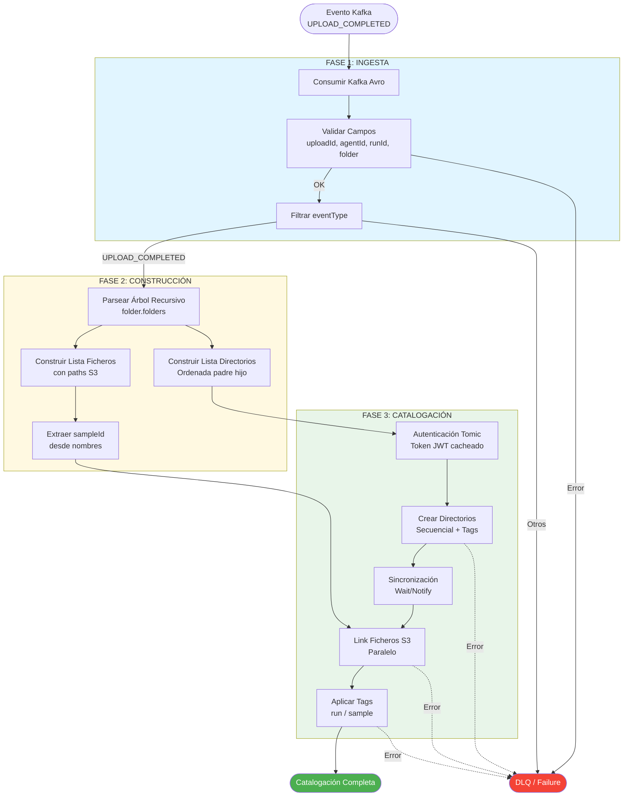
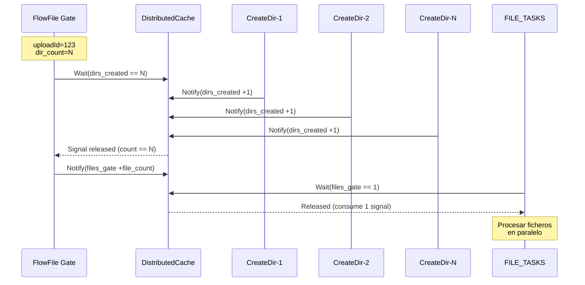

# PG_TSUPREME_001_TPIAGENT_UPLOADS

## 📋 Sobre esta documentación

> **Convención**: Este documento sigue el patrón de nomenclatura `PG_{NOMBRE_COMPLETO}.md` ubicado en `pipelines/{cliente}/` para documentar cada Process Group principal del proyecto. Para otros clientes (hsc, etc.) o nuevos flujos, seguir este mismo formato.

---

## 📖 Índice

- [Resumen Ejecutivo](#-resumen-ejecutivo)
- [Configuración por Entorno](#-configuración-por-entorno)
  - [DEV](#dev)
  - [PRE](#pre)
- [Contrato de Datos](#-contrato-de-datos)
  - [Esquema Avro UploadEvent](#esquema-avro-uploadevent)
  - [Estructura Folder (recursiva)](#estructura-folder-recursiva)
  - [Ejemplos de Payloads](#ejemplos-de-payloads)
- [Flujo Funcional](#-flujo-funcional)
  - [Diagrama de Alto Nivel](#diagrama-de-alto-nivel)
  - [Fase 1: Ingesta de Eventos](#fase-1-ingesta-de-eventos)
  - [Fase 2: Construcción de Tareas](#fase-2-construcción-de-tareas)
  - [Fase 3: Catalogación en Tomic](#fase-3-catalogación-en-tomic)
- [Reglas de Catalogación](#-reglas-de-catalogación)
  - [Jerarquía de Directorios](#jerarquía-de-directorios)
  - [Extracción de SampleId](#extracción-de-sampleid)
  - [Aplicación de Tags](#aplicación-de-tags)
  - [Idempotencia y Reintentos](#idempotencia-y-reintentos)
- [Contrato de APIs Tomic](#-contrato-de-apis-tomic)
  - [Login y Autenticación](#login-y-autenticación)
  - [Crear Directorios](#crear-directorios)
  - [Link de Ficheros](#link-de-ficheros)
  - [Actualizar Tags](#actualizar-tags)
- [Guía Operativa](#-guía-operativa)
  - [Métricas Clave](#métricas-clave)
  - [Validación Manual en Tomic](#validación-manual-en-tomic)
  - [Troubleshooting Común](#troubleshooting-común)
- [Referencias](#-referencias)

---

## 🎯 Resumen Ejecutivo

### Objetivo del Negocio

La pipeline **PG_TSUPREME_001_TPIAGENT_UPLOADS** (Agent File Catalog) implementa el proceso de **catalogación automática de carpetas y ficheros** en **Tomic/OpenCGA (TCatalog)** a partir de eventos de completitud de subida desde el sistema TPI Agent.

### Funcionalidad Principal

Cuando un agente completa la subida de datos genómicos a THealthLake/S3, se emite un evento Kafka que dispara esta pipeline para:

1. **Replicar la estructura de directorios** exacta desde S3 hacia el catálogo Tomic
2. **Registrar cada fichero** mediante enlaces (links) a las ubicaciones S3
3. **Enriquecer con metadatos** (tags) que permiten búsquedas por run y muestra (sample)

### Trigger

- **Origen**: Kafka topic `tpi.uploads.tpi-tcatalog-pre.events.v1`
- **Broker**: `kafka-tls-kafka-bootstrap:9092` (PLAINTEXT)
- **Consumer Group**: `nifi-consumer-group`
- **Formato**: Avro "plain" (sin Confluent wire-format)
- **Evento de interés**: `eventType == "UPLOAD_COMPLETED"`

### Tecnologías

- **Apache NiFi**: 1.27.0
- **Tomic/OpenCGA**: REST API v4
- **Kafka**: Avro serialization
- **Cache**: DistributedMapCache (token JWT reutilizable)

### Entornos Activos

- ✅ **DEV**: `https://tomic.tsupreme.com/tomic`
- ✅ **PRE**: `https://pregenomica-app.admon-cfnavarra.es/tomic`

### Referencias de Pipeline

- **DEV**: [`PG_TSUPREME_001_TPIAGENT_UPLOADS_DEV.json`](dev/PG_TSUPREME_001_TPIAGENT_UPLOADS_DEV.json)
- **PRE**: [`PG_TSUPREME_001_TPIAGENT_UPLOADS_PRE.json`](pre/PG_TSUPREME_001_TPIAGENT_UPLOADS_PRE.json)

---

## ⚙️ Configuración por Entorno

### DEV

#### Parameter Context: `Agent_File_Catalog_DEV`

**Tomic/OpenCGA:**
```properties
tomic.url = https://tomic.tsupreme.com/tomic
tomic.study = demo@demo_health_service_grch38:clinical_cases
tomic.version = v4
tomic.user = demo                    # (sensitive)
tomic.password = Demo_P4ss           # (sensitive)
tomic.organization = demo
```

**Kafka:**
```properties
kafka.bootstrap = kafka-tls-kafka-bootstrap:9092
kafka.topic = tpi.uploads.tpi-tcatalog-pre.events.v1
kafka.group = nifi-consumer-group
kafka.max.poll.records = 50
kafka.poll.timeout.ms = 1000
```

**Operativa:**
```properties
token.cache.key = tomic:${tomic.url}:${tomic.user}:${tomic.organization}
token.expiry.skew.seconds = 60       # Renovar token 60s antes de expirar
http.retry.count = 5
http.retry.backoff.ms = 2000
```

**DLQ/Trazabilidad:**
```properties
dlq.enabled = true
dlq.kafka.topic = tpi.uploads.tpi-tcatalog.dlq.v1
dlq.include.payload = true
```

---

### PRE

#### Parameter Context: `Agent_File_Catalog_PRE`

**Tomic/OpenCGA:**
```properties
tomic.url = https://pregenomica-app.admon-cfnavarra.es/tomic
tomic.study = demo@SNSO:casos
tomic.version = v4
tomic.user = snso                    # (sensitive)
tomic.password = Snso2025_           # (sensitive)
tomic.organization = demo
```

**Kafka, Operativa y DLQ:** _(Mismos valores que DEV)_

---

## 📊 Contrato de Datos

### Esquema Avro UploadEvent

**Namespace**: `es.tsystems.genomics.tpiagent.upload.model`

#### Campos Principales

| Campo | Tipo | Descripción |
|-------|------|-------------|
| `eventType` | `string` | Tipo de evento: **"UPLOAD_COMPLETED"** |
| `uploadId` | `string` | Identificador único de la subida |
| `agentId` | `string` | Identificador del agente que realizó la subida |
| `runId` | `string?` | Identificador del run/secuenciación |
| `s3Bucket` | `string?` | Bucket S3 donde se almacenaron los datos |
| `s3Key` | `string?` | Ruta base S3 (prefix) |
| `folder` | `Folder?` | **Árbol recursivo de carpetas y ficheros** |

#### Estructura Folder (recursiva)

```json
{
  "name": "string?",           // Nombre de la carpeta (opcional en raíz)
  "url": "string?",            // URL base S3 de la carpeta
  "source": {                  // Información de origen (opcional)
    "name": "string?",
    "description": "string?"
  },
  "files": [                   // Array de ficheros en esta carpeta
    {
      "name": "string",        // Nombre del fichero
      "url": "string?"         // URL completa S3 (s3://bucket/key)
    }
  ],
  "folders": [                 // Array recursivo de subcarpetas
    { /* Folder */ }
  ]
}
```

**Nota crítica**: El campo `folder.folders[]` es **recursivo** y puede contener múltiples niveles de anidación. La pipeline debe recorrer el árbol completo.

#### Schema Avro Completo

<details>
<summary>Ver esquema completo (click para expandir)</summary>

```json
{
  "type": "record",
  "name": "UploadEvent",
  "namespace": "es.tsystems.genomics.tpiagent.upload.model",
  "doc": "Event published by agent-service upload subsystem.",
  "fields": [
    { "name": "eventType", "type": "string" },
    { "name": "uploadId", "type": "string" },
    { "name": "agentId", "type": "string" },
    { "name": "runId", "type": ["null","string"], "default": null },
    { "name": "itemRelativePath", "type": ["null","string"], "default": null },
    { "name": "filePath", "type": ["null","string"], "default": null },
    { "name": "sizeBytes", "type": ["null","long"], "default": null },
    { "name": "bytesTotal", "type": ["null","long"], "default": null },
    { "name": "bytesUploaded", "type": ["null","long"], "default": null },
    { "name": "storageBackend", "type": ["null","string"], "default": null },
    { "name": "s3Bucket", "type": ["null","string"], "default": null },
    { "name": "s3Key", "type": ["null","string"], "default": null },
    { "name": "s3UploadId", "type": ["null","string"], "default": null },
    { "name": "occurredAt", "type": ["null","double"], "default": null },
    { "name": "errorCode", "type": ["null","string"], "default": null },
    { "name": "errorMessage", "type": ["null","string"], "default": null },
    { "name": "partNumber", "type": ["null","int"], "default": null },
    { "name": "partEtag", "type": ["null","string"], "default": null },
    { "name": "partsCompleted", "type": ["null","int"], "default": null },
    { "name": "partsTotal", "type": ["null","int"], "default": null },
    { "name": "progressPercentage", "type": ["null","double"], "default": null },
    { "name": "metadata", "type": ["null", { "type": "map", "values": "string" }], "default": null },
    {
      "name": "folder",
      "type": ["null",
        {
          "type": "record",
          "name": "Folder",
          "doc": "Model to catalog folders (runs) and their contents.",
          "fields": [
            { "name": "name", "type": ["null","string"], "default": null },
            { "name": "url", "type": ["null","string"], "default": null },
            {
              "name": "source",
              "type": ["null",
                { "type": "record", "name": "Source",
                  "fields": [
                    { "name": "name", "type": ["null","string"], "default": null },
                    { "name": "description", "type": ["null","string"], "default": null }
                  ]
                }
              ],
              "default": null
            },
            {
              "name": "files",
              "type": { "type": "array",
                "items": { "type": "record", "name": "FileRef",
                  "fields": [
                    { "name": "name", "type": ["null","string"], "default": null },
                    { "name": "url", "type": ["null","string"], "default": null }
                  ]
                }
              },
              "default": []
            },
            { "name": "folders", "type": { "type": "array", "items": "Folder" }, "default": [] }
          ]
        }
      ],
      "default": null
    }
  ]
}
```

</details>

---

### Ejemplos de Payloads

#### Ejemplo 1: Run con 2 niveles de carpetas y 3 ficheros

```json
{
  "eventType": "UPLOAD_COMPLETED",
  "uploadId": "550e8400-e29b-41d4-a716-446655440000",
  "agentId": "agent-001",
  "runId": "run-20260205-001",
  "s3Bucket": "tsupreme-genomics-data",
  "s3Key": "agent/agent-001/run-20260205-001",
  "occurredAt": 1738742400.0,
  "folder": {
    "name": "run-20260205-001",
    "url": "s3://tsupreme-genomics-data/agent/agent-001/run-20260205-001",
    "files": [
      {
        "name": "Sample123_S1_L001_R1_001.fastq.gz",
        "url": "s3://tsupreme-genomics-data/agent/agent-001/run-20260205-001/Sample123_S1_L001_R1_001.fastq.gz"
      }
    ],
    "folders": [
      {
        "name": "alignment",
        "url": "s3://tsupreme-genomics-data/agent/agent-001/run-20260205-001/alignment",
        "files": [
          {
            "name": "Sample123_aligned.bam",
            "url": "s3://tsupreme-genomics-data/agent/agent-001/run-20260205-001/alignment/Sample123_aligned.bam"
          },
          {
            "name": "Sample456_aligned.bam",
            "url": "s3://tsupreme-genomics-data/agent/agent-001/run-20260205-001/alignment/Sample456_aligned.bam"
          }
        ],
        "folders": []
      }
    ]
  }
}
```

**Resultado esperado en Tomic:**

- Directorios creados:
  - `agent` (sin tags)
  - `agent/agent-001` (sin tags)
  - `agent/agent-001/run-20260205-001` (tags: `run_run-20260205-001`)
  - `agent/agent-001/run-20260205-001/alignment` (tags: `run_run-20260205-001`, `sample_Sample123`, `sample_Sample456`)

- Ficheros linkados:
  - `agent/agent-001/run-20260205-001/Sample123_S1_L001_R1_001.fastq.gz`
    - URI: `s3://tsupreme-genomics-data/agent/agent-001/run-20260205-001/Sample123_S1_L001_R1_001.fastq.gz`
    - Tags: `run_run-20260205-001`, `sample_Sample123`
  
  - `agent/agent-001/run-20260205-001/alignment/Sample123_aligned.bam`
    - URI: `s3://tsupreme-genomics-data/agent/agent-001/run-20260205-001/alignment/Sample123_aligned.bam`
    - Tags: `run_run-20260205-001`, `sample_Sample123`
  
  - `agent/agent-001/run-20260205-001/alignment/Sample456_aligned.bam`
    - URI: `s3://tsupreme-genomics-data/agent/agent-001/run-20260205-001/alignment/Sample456_aligned.bam`
    - Tags: `run_run-20260205-001`, `sample_Sample456`

---

## 🔄 Flujo Funcional

### Diagrama de Alto Nivel



---

### Fase 1: Ingesta de Eventos

#### 1.1 Consumo Kafka Avro

- **Acción**: Consumir mensajes desde topic configurado usando AvroReader
- **Validación de esquema**: El mensaje debe cumplir con `UploadEvent.avsc`
- **Conversión**: Avro → JSON para procesamiento interno
- **Normalización**: Si el RecordReader emite array, extraer primer elemento

#### 1.2 Filtrado de Eventos

- **Condición 1**: `eventType == "UPLOAD_COMPLETED"`
- **Condición 2**: Campos obligatorios presentes y no vacíos:
  - `uploadId`
  - `agentId`
  - `runId`
  - `folder != null`

**Resultado**:
- ✅ Si cumple ambas condiciones → **Procesar**
- ❌ Si no cumple → **Enviar a DLQ** con motivo de rechazo

---

### Fase 2: Construcción de Tareas

#### 2.1 Parseo Recursivo del Árbol

La pipeline recorre recursivamente `folder` y todos sus `folders[]` anidados para:

1. **Identificar todos los directorios** necesarios en el catálogo
2. **Extraer todos los ficheros** con sus ubicaciones S3
3. **Mantener la estructura de paths** idéntica a S3

**Algoritmo**:
```
función recorrer_folder(nodo, ruta_relativa):
    por cada fichero en nodo.files:
        extraer path y uri desde FileRef.url o construir desde s3Key
        extraer sampleId desde nombre fichero
        agregar a lista_ficheros
    
    por cada subcarpeta en nodo.folders:
        nueva_ruta = ruta_relativa + "/" + subcarpeta.name
        agregar directorio a lista_directorios
        recorrer_folder(subcarpeta, nueva_ruta)  # RECURSIÓN
```

#### 2.2 Construcción de Paths Catálogo

**Regla fundamental**: Los paths en Tomic deben ser **idénticos** a las keys en S3.

**Estructura de paths**:
```
agent/{agentId}/{runId}/[subcarpetas...]/fichero
```

**Ejemplos**:
- S3: `s3://bucket/agent/agent-001/run-123/file.txt`
- Tomic: `agent/agent-001/run-123/file.txt`

- S3: `s3://bucket/agent/agent-001/run-123/alignment/sample.bam`
- Tomic: `agent/agent-001/run-123/alignment/sample.bam`

#### 2.3 Deduplicación de Directorios

La pipeline asegura que cada directorio se cree **una única vez**:

- Directorios base siempre presentes:
  - `agent`
  - `agent/{agentId}`
  - `agent/{agentId}/{runId}`

- Directorios intermedios detectados automáticamente desde paths de ficheros
- Uso de `Set` para eliminar duplicados

#### 2.4 Ordenamiento Padre → Hijo

Los directorios se ordenan por **profundidad** (número de `/` en el path) para garantizar que los padres se creen antes que los hijos:

```
1. agent                                    (profundidad 0)
2. agent/agent-001                          (profundidad 1)
3. agent/agent-001/run-123                  (profundidad 2)
4. agent/agent-001/run-123/alignment        (profundidad 3)
5. agent/agent-001/run-123/alignment/bam    (profundidad 4)
```

---

### Fase 3: Catalogación en Tomic

#### 3.1 Autenticación con Cache

**Optimización**: El token JWT se reutiliza mientras sea válido para minimizar llamadas de login.

**Flujo**:
1. Consultar cache distribuido con clave: `tomic:{url}:{user}:{org}`
2. Si existe token y `exp > (ahora + 60 segundos)` → **Reutilizar**
3. Si no existe o expiró:
   - Ejecutar `POST /users/login`
   - Extraer token desde `responses[0].results[0].token`
   - Decodificar JWT payload para obtener `exp`
   - Guardar en cache: `{"token": "...", "exp": 1234567890}`

**Beneficio**: Un token puede servir para catalogar múltiples runs sin re-autenticar.

#### 3.2 Creación Secuencial de Directorios

**Orden crítico**: Los directorios se crean **uno por uno** en orden padre→hijo.

**Por cada directorio**:
1. Determinar tags según nivel (ver sección [Aplicación de Tags](#aplicación-de-tags))
2. Ejecutar `POST /files/create`:
   ```json
   {
     "path": "agent/agent-001/run-123/alignment",
     "type": "DIRECTORY",
     "tags": ["run_run-123", "sample_Sample456"]
   }
   ```
3. Evaluar respuesta:
   - **2xx**: Directorio creado ✅
   - **409 Conflict** ("already exists"): Tratado como éxito ✅
   - **401 Unauthorized**: Renovar token y reintentar
   - **5xx / 429**: Reintento con backoff exponencial
   - **Otros 4xx**: Error irrecuperable → DLQ

#### 3.3 Sincronización Wait/Notify

**Problema**: Los ficheros necesitan que sus directorios padres existan antes de linkarlos.

**Solución**: Patrón Wait/Notify con contador distribuido:

1. **Contador `dirs_created`**: Inicia en 0
2. Por cada directorio creado exitosamente: incrementar contador
3. **Gate (barrera)**: Esperar hasta que contador == número total de directorios
4. Solo cuando todos los directorios están creados → liberar procesamiento de ficheros

**Diagrama Wait/Notify**:


#### 3.4 Link de Ficheros (Paralelo)

Una vez liberados, los ficheros se procesan **en paralelo** para maximizar throughput.

**Por cada fichero**:
1. Ejecutar `POST /files/link`:
   ```json
   {
     "path": "agent/agent-001/run-123/alignment/Sample123.bam",
     "uri": "s3://bucket/agent/agent-001/run-123/alignment/Sample123.bam"
   }
   ```
2. Evaluar respuesta (misma lógica que directorios: 2xx/409 = éxito)

#### 3.5 Aplicación de Tags

**Por cada fichero linkado**, ejecutar `POST /files/update`:

**Construcción del fileRef**:
- Path original: `agent/agent-001/run-123/alignment/Sample123.bam`
- FileRef: `agent:agent-001:run-123:alignment:Sample123.bam` (reemplazar `/` → `:`)

**Request**:
```
POST /files/update?study={tomic.study}&tagsAction=ADD&files=agent:agent-001:run-123:alignment:Sample123.bam
```

**Body**:
```json
{
  "tags": ["run_run-123", "sample_Sample123"]
}
```

---

## 🏷️ Reglas de Catalogación

### Jerarquía de Directorios

#### Estructura Base

```
agent/
└── {agentId}/
    └── {runId}/
        ├── [ficheros raíz del run]
        └── [subcarpetas]/
            └── [ficheros]
```

#### Directorios Obligatorios

Estos directorios se crean **siempre** aunque no contengan ficheros directos:

1. `agent`
2. `agent/{agentId}`
3. `agent/{agentId}/{runId}`

#### Directorios Derivados

Cualquier subcarpeta bajo `{runId}` se crea dinámicamente según el árbol `folder.folders[]`.

**Ejemplo de árbol complejo**:
```
agent/agent-001/run-123/
├── raw_data/
│   ├── fastq/
│   └── quality/
├── alignment/
│   ├── bam/
│   └── metrics/
└── variants/
    └── vcf/
```

---

### Extracción de SampleId

El `sampleId` se extrae del **nombre del fichero** usando las siguientes reglas en orden:

#### Regla 1: Patrón Illumina `_S\d+_`

**Regex**: `^(.+?)_S\d+_`

**Ejemplos**:
- `Sample123_S1_L001_R1_001.fastq.gz` → `sampleId = "Sample123"`
- `Tumor456_S12_L002_R2_001.fastq.gz` → `sampleId = "Tumor456"`
- `NA12878_S5_R1.fq.gz` → `sampleId = "NA12878"`

#### Regla 2: Fallback - Primer Underscore

Si no hay match con Regla 1, extraer substring antes del primer `_`.

**Ejemplos**:
- `Sample123_aligned.bam` → `sampleId = "Sample123"`
- `Control456_sorted.bam` → `sampleId = "Control456"`

#### Regla 3: Sin SampleId

Si no hay `_` en el nombre → `sampleId = null` (no se añade tag `sample_*`).

**Ejemplos**:
- `metadata.json` → sin sampleId
- `README.txt` → sin sampleId

---

### Aplicación de Tags

#### Tags en Directorios

| Directorio | Tags |
|------------|------|
| `agent` | `[]` (sin tags) |
| `agent/{agentId}` | `[]` (sin tags) |
| `agent/{agentId}/{runId}` | `["run_{runId}"]` |
| Subcarpetas bajo run | `["run_{runId}", "sample_{sid1}", "sample_{sid2}", ...]` |

**Nota sobre subcarpetas**: 
- Se agregan tags `sample_*` solo de los sampleIds **presentes en ficheros de esa carpeta o sus descendientes**
- Los tags de samples se deduplican (un sample aparece una sola vez aunque tenga múltiples ficheros)

**Ejemplo**:
```
agent/agent-001/run-123/alignment/
├── Sample123.bam  → sample_Sample123
├── Sample456.bam  → sample_Sample456
└── README.txt     → (sin sample)

Tags del directorio alignment: ["run_run-123", "sample_Sample123", "sample_Sample456"]
```

#### Tags en Ficheros

Cada fichero recibe:

1. **Siempre**: `run_{runId}`
2. **Si tiene sampleId**: `sample_{sampleId}`

**Ejemplos**:

| Fichero | Tags |
|---------|------|
| `Sample123_S1_R1.fastq.gz` | `["run_run-123", "sample_Sample123"]` |
| `Sample456_aligned.bam` | `["run_run-123", "sample_Sample456"]` |
| `metadata.json` | `["run_run-123"]` |

---

### Idempotencia y Reintentos

#### Idempotencia

La pipeline está diseñada para ser **idempotente**: reprocesar el mismo evento no causa errores.

**Comportamiento ante duplicados**:

1. **Directorio ya existe** (409 Conflict):
   - ✅ Tratado como éxito
   - Se incrementa contador `dirs_created` normalmente
   - No rompe el flujo

2. **Fichero ya linkeado** (409 Conflict):
   - ✅ Tratado como éxito
   - Se continúa con update de tags

3. **Tags ya aplicados**:
   - Tomic con `tagsAction=ADD` no falla si el tag ya existe
   - Se añaden solo los nuevos (operación idempotente)

**Escenarios de reintento**:
- Reintentos Kafka (offset no commiteado)
- Reintentos NiFi (failure loop con backoff)
- Reprocesamiento manual del mismo evento

#### Política de Reintentos

**Errores transitorios (reintentar)**:
- `5xx` (Server Error)
- `429` (Too Many Requests)
- Timeouts de red
- Token expirado (renovar y reintentar)

**Configuración**:
```properties
http.retry.count = 5
http.retry.backoff.ms = 2000    # Backoff exponencial: 2s, 4s, 8s, 16s, 32s
```

**Errores permanentes (enviar a DLQ)**:
- `400` Bad Request (payload inválido)
- `404` Not Found (estudio no existe)
- `403` Forbidden (sin permisos)
- Errores de validación Avro
- Campos obligatorios faltantes

---

## 🔌 Contrato de APIs Tomic

### Login y Autenticación

#### Endpoint

```
POST {tomic.url}/webservices/rest/{tomic.version}/users/login
```

#### Request

**Headers**:
```
Content-Type: application/json
```

**Body**:
```json
{
  "user": "demo",
  "password": "Demo_P4ss",
  "organization": "demo"
}
```

#### Response (200 OK)

```json
{
  "apiVersion": "v4",
  "time": 1738742400000,
  "responses": [
    {
      "time": 150,
      "results": [
        {
          "token": "eyJhbGciOiJIUzI1NiIsInR5cCI6IkpXVCJ9...",
          "refreshToken": "...",
          "type": "Bearer"
        }
      ],
      "numResults": 1
    }
  ]
}
```

#### Extracción del Token

**JSONPath**: `$.responses[0].results[0].token`

**Formato**: JWT (3 partes separadas por `.`)
- Header: `eyJhbGci...`
- **Payload**: `eyJ1c2Vy...` ← Contiene `exp` (época Unix en segundos)
- Signature: `SflKxwRJ...`

**Decodificación del payload** (Base64URL):
```json
{
  "sub": "demo",
  "iat": 1738742400,
  "exp": 1738828800,
  "organization": "demo"
}
```

---

### Crear Directorios

#### Endpoint

```
POST {tomic.url}/webservices/rest/{tomic.version}/files/create?study={tomic.study}
```

#### Request

**Headers**:
```
Authorization: Bearer {token}
Content-Type: application/json
```

**Body**:
```json
{
  "path": "agent/agent-001/run-123/alignment",
  "type": "DIRECTORY",
  "tags": ["run_run-123", "sample_Sample456"]
}
```

#### Response

**200 OK** (directorio creado):
```json
{
  "responses": [
    {
      "results": [
        {
          "id": "...",
          "name": "alignment",
          "path": "agent/agent-001/run-123/alignment",
          "type": "DIRECTORY",
          "tags": ["run_run-123", "sample_Sample456"]
        }
      ]
    }
  ]
}
```

**409 Conflict** (directorio ya existe):
```json
{
  "error": "File 'agent/agent-001/run-123/alignment' already exists"
}
```
→ **Tratado como éxito**

---

### Link de Ficheros

#### Endpoint

```
POST {tomic.url}/webservices/rest/{tomic.version}/files/link?study={tomic.study}
```

#### Request

**Headers**:
```
Authorization: Bearer {token}
Content-Type: application/json
```

**Body**:
```json
{
  "path": "agent/agent-001/run-123/alignment/Sample123.bam",
  "uri": "s3://tsupreme-genomics-data/agent/agent-001/run-123/alignment/Sample123.bam"
}
```

**Nota**: El campo `type` es implícito (`FILE`) cuando se usa `/link`.

#### Response

**200 OK** (fichero linkeado):
```json
{
  "responses": [
    {
      "results": [
        {
          "id": "...",
          "name": "Sample123.bam",
          "path": "agent/agent-001/run-123/alignment/Sample123.bam",
          "uri": "s3://tsupreme-genomics-data/agent/agent-001/run-123/alignment/Sample123.bam",
          "type": "FILE",
          "size": 1234567890
        }
      ]
    }
  ]
}
```

**409 Conflict** (fichero ya existe):
→ **Tratado como éxito**

---

### Actualizar Tags

#### Endpoint

```
POST {tomic.url}/webservices/rest/{tomic.version}/files/update?study={tomic.study}&tagsAction=ADD&files={fileRef}
```

**Nota sobre fileRef**: Reemplazar `/` por `:` en el path.

**Ejemplo**:
- Path: `agent/agent-001/run-123/alignment/Sample123.bam`
- FileRef: `agent:agent-001:run-123:alignment:Sample123.bam`

#### Request

**Headers**:
```
Authorization: Bearer {token}
Content-Type: application/json
```

**Body**:
```json
{
  "tags": ["run_run-123", "sample_Sample123"]
}
```

#### Response

**200 OK**:
```json
{
  "responses": [
    {
      "results": [
        {
          "id": "...",
          "tags": ["run_run-123", "sample_Sample123"]
        }
      ]
    }
  ]
}
```

**Comportamiento de `tagsAction=ADD`**:
- Si el tag ya existe → no se duplica (operación idempotente)
- Si el tag es nuevo → se añade

---

## 📈 Guía Operativa

### Métricas Clave

#### Métricas por Run

Para cada evento `UPLOAD_COMPLETED` procesado, monitorear:

| Métrica | Descripción | Valor Esperado |
|---------|-------------|----------------|
| **Directorios esperados** | Atributo `dir_count` del evento | ≥ 3 (agent, agent/{id}, run) |
| **Directorios creados** | Contador `dirs_created` en cache | = `dir_count` |
| **Ficheros esperados** | Atributo `file_count` del evento | ≥ 1 |
| **Ficheros linkeados** | Contador de éxitos en LinkFile | = `file_count` |
| **Tags aplicados** | Contador de éxitos en UpdateTags | = `file_count` |

#### Latencias

| Operación | Latencia Objetivo | Alerta si > |
|-----------|-------------------|-------------|
| Login Tomic | < 500 ms | 2 s |
| Create Directory | < 200 ms | 1 s |
| Link File | < 300 ms | 1 s |
| Update Tags | < 200 ms | 1 s |
| **Catalogación completa** (1 run, 100 files) | < 2 min | 5 min |

#### Throughput

| Escenario | Throughput Esperado |
|-----------|---------------------|
| Runs pequeños (< 10 files) | 1 run cada 10 s |
| Runs medianos (10-100 files) | 1 run cada 60 s |
| Runs grandes (100-1000 files) | 1 run cada 5 min |

---

### Validación Manual en Tomic

#### Paso 1: Acceder a Tomic UI

**DEV**: https://tomic.tsupreme.com/tomic
**PRE**: https://pregenomica-app.admon-cfnavarra.es/tomic

Login:
- DEV: `demo` / `Demo_P4ss`
- PRE: `snso` / `Snso2025_`

#### Paso 2: Seleccionar Estudio

- DEV: `demo@demo_health_service_grch38:clinical_cases`
- PRE: `demo@SNSO:casos`

#### Paso 3: Navegar a File Browser

`Menú → Files → File Browser`

#### Paso 4: Verificar Jerarquía

Buscar: `agent/{agentId}/{runId}`

**Checklist**:
- ✅ Directorios `agent` y `agent/{agentId}` existen
- ✅ Directorio `agent/{agentId}/{runId}` tiene tag `run_{runId}`
- ✅ Subdirectorios tienen tags `run_*` y `sample_*` correctos
- ✅ Cantidad de ficheros = `file_count` del evento
- ✅ Cada fichero tiene URI válido apuntando a S3

#### Paso 5: Verificar Tags

**Por directorio run**:
```
Buscar por tag: run_run-123
```
→ Debe retornar el directorio raíz del run y todos sus subdirectorios/ficheros

**Por sample**:
```
Buscar por tag: sample_Sample123
```
→ Debe retornar:
- Subdirectorios que contienen ficheros de ese sample
- Todos los ficheros de ese sample

#### Paso 6: Verificar Path = S3 Key

Seleccionar un fichero → Ver detalles:
- **Path**: `agent/agent-001/run-123/alignment/Sample123.bam`
- **URI**: `s3://bucket/agent/agent-001/run-123/alignment/Sample123.bam`

**Validación**: El path (sin `s3://bucket/`) debe coincidir exactamente con el path en Tomic.

---

### Troubleshooting Común

#### Error: Token Expirado (401 Unauthorized)

**Síntoma**:
```
HTTP 401 - Unauthorized
Response: {"error": "Token expired or invalid"}
```

**Diagnóstico**:
- Token en cache expiró antes de completar el run
- Skew de 60s no fue suficiente (relojes desincronizados)

**Resolución Automática**:
- La pipeline detecta 401 y renueva token automáticamente
- El FlowFile se reintenta con nuevo token

**Resolución Manual**:
- Verificar sincronización de relojes (NTP)
- Aumentar `token.expiry.skew.seconds` a 120

**Prevención**:
- El token se cachea correctamente con `exp` válido
- Revisar logs de T05_DecodeJwtExpAndBuildCacheValue

---

#### Error: Conflicto 409 "Already Exists"

**Síntoma**:
```
HTTP 409 - Conflict
Response: {"error": "File 'agent/agent-001/run-123' already exists"}
```

**Diagnóstico**:
- **Normal**: Evento reprocesado (reintento Kafka/NiFi)
- **Normal**: Directorios intermedios ya creados por run anterior

**Resolución**:
- ✅ **Este NO es un error**: se trata como éxito
- La pipeline continúa normalmente
- El contador `dirs_created` se incrementa

**Validación**:
- Verificar en logs: `409 treated as success`
- El run completa exitosamente

**Acción**: Ninguna (comportamiento esperado)

---

#### Error: Timeout Gating (Wait Expiration)

**Síntoma**:
```
Processor Wait: Expiration reached (60 min)
Attribute: Signal counter 'dirs_created' = 8 / 10 (expected)
```

**Diagnóstico**:
- Algunos directorios **no** se crearon exitosamente
- El contador `dirs_created` no alcanzó `dir_count`
- Los ficheros quedan bloqueados esperando la señal

**Causas Posibles**:
1. Errores 5xx de Tomic no recuperables
2. CreateDir falló y no reintenó
3. Notify no ejecutó tras crear directorio

**Resolución**:
1. Revisar logs de P06_CreateDir para identificar directorios fallidos
2. Buscar respuestas HTTP != 2xx/409
3. Verificar conectividad a Tomic
4. Si es error transitorio: reprocesar evento (Kafka offset)
5. Si es error permanente: revisar permisos/estudio en Tomic

**Prevención**:
- Configurar reintentos en InvokeHTTP (Penalty Duration, Yield Duration)
- Alertar si tasa de fallos > 1% en CreateDir

---

#### Error: Validación Avro Fallida

**Síntoma**:
```
ConsumeKafkaRecord: Failed to parse Avro
Error: Field 'uploadId' is required but missing
```

**Diagnóstico**:
- El mensaje Kafka no cumple con `UploadEvent.avsc`
- Campo obligatorio faltante o tipo incorrecto

**Causas Posibles**:
1. Producer (agent-service) envió payload inválido
2. Cambio en esquema Avro sin migración
3. Mensaje corrupto

**Resolución**:
1. El mensaje se envía automáticamente a DLQ
2. Revisar payload en DLQ topic
3. Validar esquema del producer
4. Reportar a equipo de agent-service si es bug

**Prevención**:
- Implementar tests de contrato (producer/consumer)
- Versionado de esquemas Avro (Schema Registry)

---

#### Error: SampleId No Extraído

**Síntoma**:
- Ficheros catalogados correctamente
- Tag `sample_*` faltante en algunos ficheros

**Diagnóstico**:
- Nombre de fichero no cumple con reglas de extracción
- Formato no estándar

**Ejemplos**:
- ❌ `file.txt` → sin `_` → sin sampleId
- ❌ `SampleS1L001.fastq` → falta `_` antes de `S1` → sin match regex

**Resolución**:
- **Si es esperado**: Ficheros metadata/README no necesitan sampleId
- **Si es inesperdo**: Ajustar reglas de extracción en P04_BuildCatalogTasks
- Validar convención de naming con equipo genómico

**Workaround**:
- Añadir tag manualmente en Tomic UI si es crítico
- Actualizar naming de ficheros en futuros runs

---

#### Error: Latencia Alta en Tomic

**Síntoma**:
- Runs tardan > 10 min en completar
- Latencias por operación > 2 s

**Diagnóstico**:
- Sobrecarga en Tomic API
- Red lenta entre NiFi y Tomic
- Timeouts incrementados

**Resolución Inmediata**:
1. Verificar estado de Tomic (CPU, memoria, DB)
2. Revisar logs de Tomic para errores
3. Reducir concurrencia en NiFi (Concurrent Tasks)

**Optimización**:
1. Aumentar recursos de Tomic (scaling vertical/horizontal)
2. Revisar índices DB en OpenCGA
3. Considerar batching de operaciones (si API lo soporta)

**Monitoreo**:
- Alertar si p99 de latencia > 1 s
- Dashboard con latencias por endpoint

---

## 📚 Referencias

### Documentación del Proyecto

- **Pipeline DEV**: [`PG_TSUPREME_001_TPIAGENT_UPLOADS_DEV.json`](dev/PG_TSUPREME_001_TPIAGENT_UPLOADS_DEV.json)
- **Pipeline PRE**: [`PG_TSUPREME_001_TPIAGENT_UPLOADS_PRE.json`](pre/PG_TSUPREME_001_TPIAGENT_UPLOADS_PRE.json)
- **Script Sync DEV→PRE**: [`sync_pg_dev_to_pre.py`](../sync_pg_dev_to_pre.py)
- **Guía Sync**: [`README.sync_pg_dev_to_pre.md`](../README.sync_pg_dev_to_pre.md)

### Documentación Externa

- [Apache NiFi 1.27.0 Documentation](https://nifi.apache.org/docs/nifi-docs/html/user-guide.html)
- [OpenCGA REST API Documentation](https://docs.opencga.opencb.org/)
- [Avro Specification](https://avro.apache.org/docs/current/spec.html)
- [Apache Kafka Documentation](https://kafka.apache.org/documentation/)

### Componentes NiFi Clave

- [ConsumeKafkaRecord_2_6](https://nifi.apache.org/docs/nifi-docs/components/org.apache.nifi/nifi-kafka-2-6-nar/1.27.0/org.apache.nifi.processors.kafka.pubsub.ConsumeKafkaRecord_2_6/index.html)
- [AvroReader](https://nifi.apache.org/docs/nifi-docs/components/org.apache.nifi/nifi-record-serialization-services-nar/1.27.0/org.apache.nifi.avro.AvroReader/index.html)
- [Wait Processor](https://nifi.apache.org/docs/nifi-docs/components/org.apache.nifi/nifi-standard-nar/1.27.0/org.apache.nifi.processors.standard.Wait/index.html)
- [Notify Processor](https://nifi.apache.org/docs/nifi-docs/components/org.apache.nifi/nifi-standard-nar/1.27.0/org.apache.nifi.processors.standard.Notify/index.html)
- [ExecuteScript](https://nifi.apache.org/docs/nifi-docs/components/org.apache.nifi/nifi-scripting-nar/1.27.0/org.apache.nifi.processors.script.ExecuteScript/index.html)
- [InvokeHTTP](https://nifi.apache.org/docs/nifi-docs/components/org.apache.nifi/nifi-standard-nar/1.27.0/org.apache.nifi.processors.standard.InvokeHTTP/index.html)
- [DistributedMapCache](https://nifi.apache.org/docs/nifi-docs/components/org.apache.nifi/nifi-distributed-cache-services-nar/1.27.0/org.apache.nifi.distributed.cache.server.map.DistributedMapCacheServer/index.html)

---

## 📝 Notas Finales

### Supuestos y Confirmaciones

1. **Formato Avro**: Avro "plain" sin Confluent wire-format. Si cambia, actualizar AvroReader a ConfluentSchemaRegistry.

2. **Código HTTP 409**: Tratado como éxito (idempotencia). Confirmado en pruebas DEV/PRE.

3. **Regla SampleId**: Basada en patrones Illumina (`_S\d+_`) y fallback (`_`). Si hay convención diferente, ajustar en código.

### Evolución Futura

- **PRO**: Pendiente configuración Parameter Context `Agent_File_Catalog_PRO`
- **Otros clientes**: Replicar estructura para `hsc`, etc.
- **Optimizaciones**: Considerar batching de tags si API Tomic lo soporta
- **Métricas**: Integrar con Prometheus/Grafana para dashboards

### Contacto y Soporte

Para dudas operativas o incidencias:
- **Equipo**: T-Systems TSuPreMe Platform
- **Documentación adicional**: Ver `README.md` en raíz del proyecto

---

**Última actualización**: 2026-02-05  
**Versión pipeline**: 1.0 (DEV/PRE)  
**Estado**: ✅ Implementado y operativo
